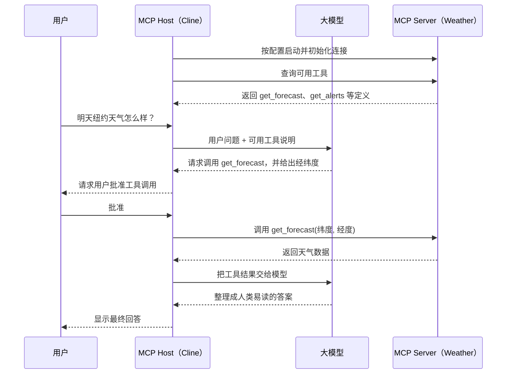

# MCP 终极指南：从原理到实战（基础篇）

> 原视频：[哔哩哔哩 BV1uronYREWR](https://www.bilibili.com/video/BV1uronYREWR/)  
> 作者：马克的技术工作坊  
> 时长：27:06  
> 发布日期：2025-04-15  
> 整理说明：本文根据视频音频转写、原视频时间轴和官方文档校对后重新组织，不是逐字稿。

## 一句话理解 MCP

**MCP（Model Context Protocol，模型上下文协议）是一套标准，让 AI 应用能够用统一方式发现并调用外部程序提供的工具、数据和提示词。**

视频把它概括成“让大模型更好地使用各种外部工具的协议”。更严谨地说，不是模型自己直接操作电脑，而是 AI 应用在模型和外部程序之间负责连接、授权、调用和结果回传。

## 1. 为什么需要 MCP

Anthropic 于 2024 年 11 月 25 日公开发布并开源 MCP，目标是用一个开放标准连接 AI 应用与数据源、业务工具和开发环境。

大模型本身主要负责理解语言、推理和生成内容。遇到下面这些任务，仅靠模型已有知识通常不够：

- 查询明天的实时天气；
- 获取网页的最新内容；
- 查询数据库或本地文件；
- 操作浏览器、Unity 或其他软件；
- 调用企业 API 完成实际动作。

过去，每个 AI 应用都要为每种外部能力单独开发接口。MCP 提供了一套共同约定，使支持 MCP 的 AI 应用可以连接不同的 MCP Server，发现它们提供的能力，再按统一格式调用。

可以把 MCP 理解成 AI 应用与外部能力之间的“通用插座”。

## 2. 三个核心角色

### 2.1 MCP Host

MCP Host 是用户直接使用的 AI 应用，例如视频中的 Cline。它负责：

- 接收用户问题；
- 调用大模型；
- 管理一个或多个 MCP Server；
- 把可用工具告诉模型；
- 根据模型请求执行工具；
- 显示审批界面和最终答案。

视频列举了 Claude Desktop、Cursor、Cline、Cherry Studio 等支持 MCP 的软件，并选择 VS Code 插件 Cline 演示。

### 2.2 MCP Client

视频为了入门，主要用“Cline 与 MCP Server 沟通”来描述流程。按当前官方架构，更准确的说法是：Host 会为每一个 MCP Server 建立一个对应的 MCP Client，由这个 Client 维护连接。

初学时可以先记住：**Host 是总管，Client 是每条连接的通信负责人。**

### 2.3 MCP Server

MCP Server 不一定是远程服务器。它本质上是一个遵守 MCP 规范的程序：

- 可以在本机由 Python、Node.js 等启动；
- 也可以部署在远程服务器上；
- 运行时可以联网，也可以完全离线；
- 向 Host 暴露工具、资源或提示词。

所以，“Server”描述的是它在协议中的角色，不代表它一定是一台远程机器。

## 3. Tool 到底是什么

视频用一个很实用的方式解释 Tool：**Tool 可以先近似理解为函数。**

一个 Tool 通常包括：

- 名称：例如 `get_forecast`；
- 描述：它能做什么、什么时候适合调用；
- 输入结构：需要哪些参数，各参数是什么类型；
- 输出结果：执行后返回什么内容。

可以把 Tool 想象成一台专用机器：输入材料，机器按固定规则处理，再输出成品。

视频中的天气 MCP Server 提供了两个工具：

| Tool           | 输入       | 输出                       |
| -------------- | ---------- | -------------------------- |
| `get_forecast` | 纬度、经度 | 对应地点未来几天的天气预报 |
| `get_alerts`   | 美国州代码 | 对应州的气象预警           |

用户问“明天纽约天气怎么样”时，模型发现 `get_forecast` 能解决问题，于是生成纽约的经纬度参数并请求调用。

> 补充：完整的 MCP 不只有 Tools。Server 还可以提供 Resources（资源）和 Prompts（提示模板）。基础视频把重点放在最直观的 Tools 上。

## 4. MCP 的完整交互流程



可以拆成两个阶段：

### 阶段 A：连接与注册

1. 用户在 Host 中保存 MCP Server 配置。
2. Host 按 `command` 和 `args` 启动 Server。
3. 双方初始化连接并交换能力信息。
4. Host 获取 Server 提供的工具列表和输入结构。
5. Host 把这些工具登记到可供模型选择的工具集合中。

### 阶段 B：选择、执行与回传

1. 用户提出问题。
2. Host 把问题和可用工具说明一起发给模型。
3. 模型判断是否需要工具，并生成工具名与参数。
4. Host 在需要时请求用户批准。
5. Host 调用对应 MCP Server 的 Tool。
6. Server 执行函数，把结果返回给 Host。
7. Host 把工具结果再交给模型。
8. 模型根据结果组织答案，Host 展示给用户。

最重要的边界是：

- **模型负责判断和生成调用意图；**
- **Host 负责连接、权限与真正的调用；**
- **MCP Server 负责执行具体功能。**

## 5. 在 Cline 中配置 MCP Server

视频演示了两种方式：

### 方式一：让模型或市场自动安装

Cline 可以读取 MCP Server 的 GitHub 说明文档，运行安装命令并修改配置。优点是省事，缺点是：

- 安装路径和版本不一定符合你的要求；
- 模型可能安装失败；
- 用户容易不知道它改了什么；
- 有些 MCP Host 不支持自动安装。

### 方式二：手动填写配置

视频更推荐这种通用、可控的方法。典型结构如下，具体字段要以你当前使用的 Host 和 Server 文档为准：

```json
{
  "mcpServers": {
    "weather": {
      "disabled": false,
      "timeout": 60,
      "command": "启动程序",
      "args": ["参数1", "参数2"],
      "transportType": "stdio",
      "env": {
        "API_KEY": "从安全位置读取的密钥"
      }
    }
  }
}
```

各字段的含义：

| 字段            | 含义                                                         |
| --------------- | ------------------------------------------------------------ |
| `weather`       | 自定义的 Server 名称，方便识别                               |
| `disabled`      | 是否禁用；`false` 表示允许启动                               |
| `timeout`       | 连接超时时间，视频中单位为秒                                 |
| `command`       | 用哪个程序启动 Server，例如 `uvx`、`npx`、`python` 或 `node` |
| `args`          | 交给启动程序的参数                                           |
| `transportType` | Host 与 Server 的通信方式                                    |
| `env`           | Server 需要的环境变量，例如 API Key                          |

注意：**绿色启用开关只代表“没有禁用”，不代表 Server 已经连接成功。** 还要检查连接状态、工具列表和错误日志。

## 6. 两类启动方式：uvx 与 npx

很多本地 MCP Server 用 Python 或 Node.js 编写，因此经常看到 `uvx` 和 `npx`。

### 6.1 uvx：运行 Python 工具

`uvx` 是 `uv tool run` 的便捷别名。它会在隔离环境中准备 Python 工具及其依赖，然后运行该工具。

视频用下面的命令验证 `uvx` 是否可用：

```bash
uvx pycowsay hello world
```

第一次运行某个包时需要下载依赖，所以可能较慢。视频演示的 Fetch MCP Server 就由 `uvx` 启动，用来抓取网页内容。

### 6.2 npx：运行 Node.js 工具

`npx` 用于运行本地或远程 npm 包提供的命令。安装 Node.js 后通常会同时获得 npm 和 npx。

视频用一个新闻 MCP Server 演示 `npx`：Server 拉取新闻数据，模型再对结果进行总结。

两者的共同点：

- 都可以在首次调用时获取并运行对应工具；
- 首次下载依赖可能触发连接超时；
- 后续调用利用缓存，通常会明显变快；
- 实际包名、参数和版本必须以 Server 自己的说明文档为准。

## 7. 视频中的两个实战案例

### 7.1 Weather：实时天气查询

用户询问纽约第二天的天气。模型自身没有实时天气，于是：

1. 发现 Weather Server 的 `get_forecast`；
2. 生成纽约经纬度；
3. 请求用户批准调用；
4. Server 调用天气 API；
5. 模型把原始数据整理成白天、夜间天气和建议。

这个案例展示的是最基本的“模型选工具 → Host 调用 → 模型总结”闭环。

### 7.2 Fetch：抓网页并写成 Markdown

用户要求抓取网页，转换为 Markdown，再保存到项目目录。Cline 的处理方式是组合多个能力：

1. 用 Fetch MCP Server 抓网页；
2. 由模型整理成 Markdown；
3. 用 Cline 自带的文件写入工具保存文件。

关键认识：**一个任务可以同时组合 MCP Tool 和 Host 自带工具。** MCP 并不要求所有步骤都由同一个 Server 完成。

## 8. 最常见的故障与排查

| 现象                         | 常见原因                                        | 处理方式                                           |
| ---------------------------- | ----------------------------------------------- | -------------------------------------------------- |
| 开关是绿色但没有工具         | 只代表未禁用，Server 尚未连接                   | 查看连接状态和错误日志                             |
| 首次启动 `request timeout`   | `uvx` 或 `npx` 正在下载包和依赖                 | 先在终端手动执行同一命令，完成下载后重新连接       |
| 终端启动后一直等待、没有输出 | stdio Server 正在等待 Host 消息                 | 这通常是正常状态；用 `Ctrl+C` 结束测试             |
| 找不到 `uvx` 或 `npx`        | 运行环境未安装，或不在 `PATH`                   | 安装 uv 或 Node.js，并重启 Host                    |
| 配置保存后无法识别           | JSON 格式错误、字段不兼容或路径转义错误         | 用 JSON 校验器检查，并参照当前 Host 文档           |
| Server 启动后立刻断开        | 命令、参数、环境变量或运行时版本错误            | 把完整启动命令放到终端运行，先看原始报错           |
| 模型不选择预期 Tool          | Tool 描述不清楚，参数不匹配，或模型判断无需调用 | 检查工具描述和输入结构，明确告诉模型要使用哪个能力 |
| Tool 一直等待批准            | Host 开启了人工确认                             | 审查工具名、参数和影响范围后批准或拒绝             |

一个特别重要的 stdio 规则是：Server 的标准输出用于 MCP 协议消息，不应随意打印普通日志；调试日志应写到标准错误，否则可能破坏通信。

## 9. 安全与可控性

视频反复强调“要知道模型在电脑里做了什么”。这是使用 MCP 时最值得保留的习惯。

安装或启用第三方 MCP Server 前，至少检查：

- 来源和仓库是否可信；
- 实际执行的 `command` 与全部 `args`；
- 包名是否可能是拼写相近的恶意包；
- 是否固定了可信版本；
- Server 能访问哪些文件、网络、数据库和账号；
- API Key 是否通过环境变量或安全存储传入；
- 写入、删除、转账、发消息等高影响操作是否需要人工确认。

不要因为它叫“工具”就降低警惕。一个本地 MCP Server 通常拥有与 Host 相近的系统权限，本质上是在你的电脑上执行第三方代码。

## 10. 2026 年阅读这期视频时要注意的变化

这期视频发布于 2025 年，原理仍然成立，但以下界面和技术细节可能已经变化：

1. **Cline 的界面、配置入口、字段名和模型列表会随版本变化。** 视频中的按钮位置只适合帮助理解，不应当作当前界面的逐像素操作手册。
2. **视频讲解了 stdio 和 SSE 两种传输。** 当前 MCP 标准传输是 stdio 与 Streamable HTTP；Streamable HTTP 已替代旧的 HTTP+SSE 传输，SSE 仍可作为 HTTP 流的一部分出现。
3. **视频中的模型价格与推荐已经过时。** 选择模型时应根据当前工具调用能力、价格、隐私和稳定性重新比较。
4. **第三方 MCP 市场是目录，不等于安全审核。** 安装前仍要回到项目仓库和官方文档核对命令、权限与维护状态。
5. **现代 MCP 的完整能力不只包括 Tools。** 还包括 Resources、Prompts，以及能力协商、通知等机制。

## 11. 真正需要记住的 12 个知识点

1. MCP 是协议，不是某个具体软件或某个模型。
2. 它解决的是 AI 应用与外部能力之间的标准化连接问题。
3. Host 管理模型、连接、权限和用户交互。
4. Host 通常为每个 MCP Server 建立一个 MCP Client。
5. MCP Server 是程序，可以本地运行，也可以远程部署。
6. Tool 是带名称、描述和输入结构的可执行函数。
7. Server 启动后，Host 会先初始化连接并发现工具。
8. 模型只提出“调用哪个工具、使用什么参数”，真正执行由 Host 和 Server 完成。
9. Tool 的结果通常还要交回模型，才能生成自然语言答案。
10. `command` 与 `args` 决定本地 Server 如何启动。
11. `uvx` 常用于 Python 工具，`npx` 常用于 Node.js 工具；首次运行可能因下载依赖而超时。
12. MCP 带来的是实际执行能力，必须保留人工审批、最小权限和来源审查。

## 12. 自测题

如果能独立回答下面的问题，就掌握了这期基础篇：

1. 为什么 MCP Server 不一定是一台远程服务器？
2. Host、Client、Server 分别负责什么？
3. 模型为什么不能直接查询实时天气？
4. Tool 与普通函数有哪些相似之处？
5. Host 在什么时候获取 Server 的工具列表？
6. 模型请求调用 Tool 后，结果经过哪些角色才回到用户？
7. `command` 和 `args` 在配置里分别代表什么？
8. 为什么绿色启用开关不等于连接成功？
9. `uvx` 与 `npx` 的主要区别是什么？
10. 为什么首次启动容易超时？
11. Fetch 案例为什么同时使用了 MCP Tool 和 Cline 自带工具？
12. 安装陌生 MCP Server 前，至少要审查哪些风险？

## 13. 原视频时间轴

| 时间  | 内容                       |
| ----- | -------------------------- |
| 00:00 | 前言                       |
| 01:05 | MCP 简要介绍               |
| 02:47 | 安装 MCP Host：Cline       |
| 03:15 | 配置 Cline 使用的 API Key  |
| 06:01 | 第一个 MCP 问题：纽约天气  |
| 06:31 | MCP Server 和 Tool         |
| 09:13 | 配置 MCP Server            |
| 14:19 | 使用 MCP Server            |
| 15:24 | MCP 交互流程详解           |
| 17:46 | 使用第三方 MCP Server：uvx |
| 23:54 | 使用第三方 MCP Server：npx |

## 14. 延伸阅读

- [Anthropic：Introducing the Model Context Protocol](https://www.anthropic.com/news/model-context-protocol)
- [MCP 官方架构说明](https://modelcontextprotocol.io/docs/learn/architecture)
- [MCP 官方传输规范](https://modelcontextprotocol.io/specification/draft/basic/transports)
- [MCP Server 核心概念](https://modelcontextprotocol.io/docs/learn/server-concepts)
- [MCP 安全最佳实践](https://modelcontextprotocol.io/docs/tutorials/security/security_best_practices)
- [Cline 的 MCP 概览](https://docs.cline.bot/mcp/mcp-overview)
- [uv 官方工具运行指南](https://docs.astral.sh/uv/guides/tools/)
- [npm 官方 npx 文档](https://docs.npmjs.com/cli/commands/npx/)

---

**最终心智模型：用户提出目标，模型决定需要什么能力，Host 负责安全地调度，MCP Server 负责真正干活，结果再交给模型解释给用户。**
