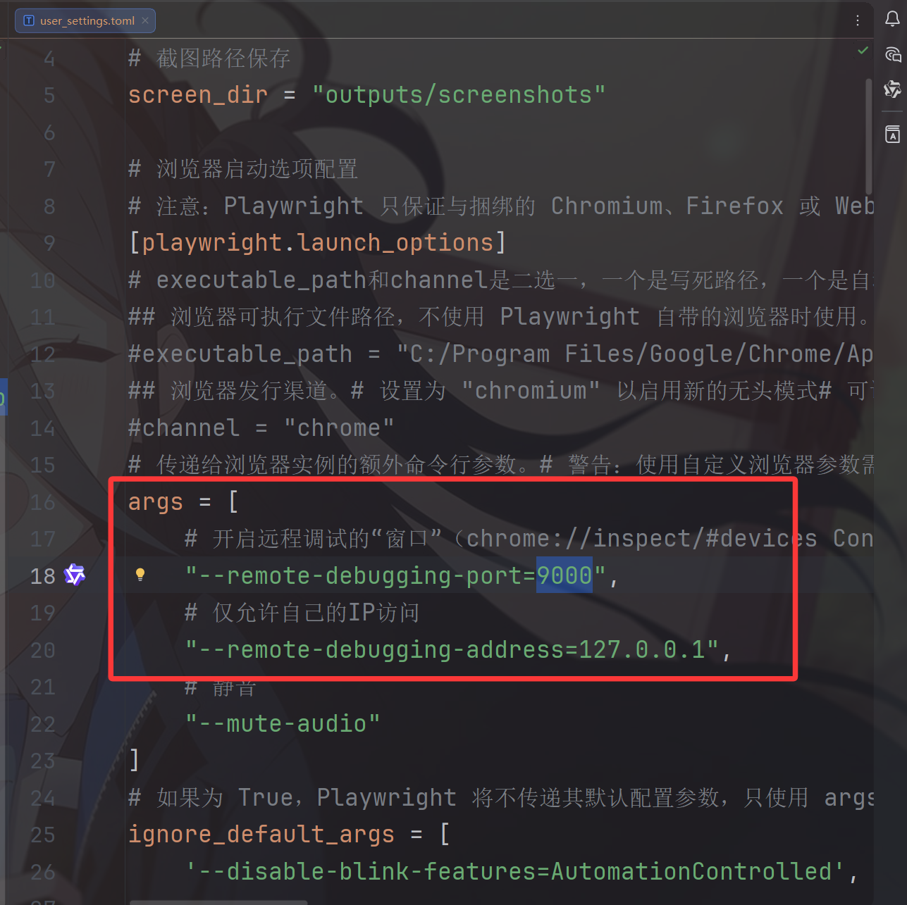
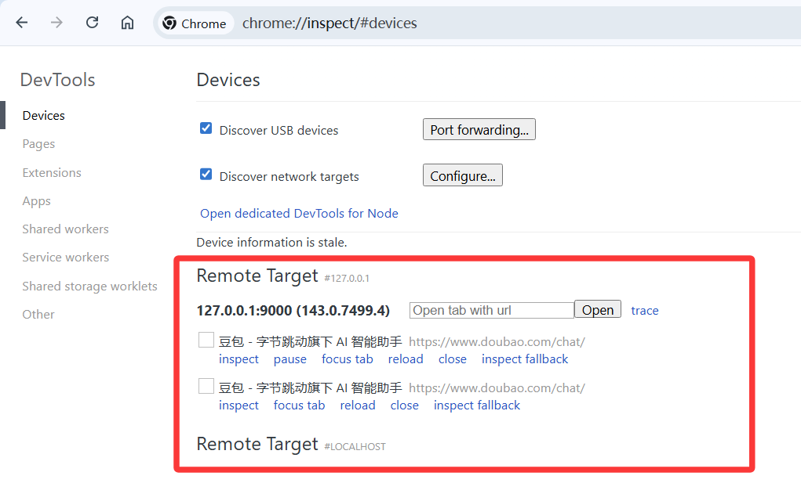
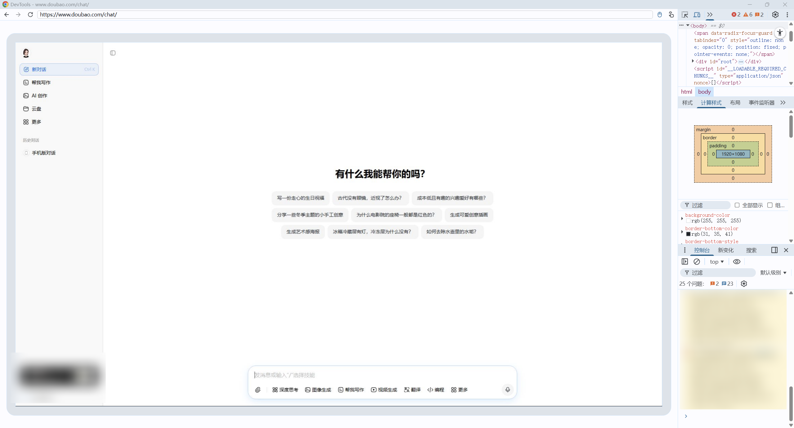
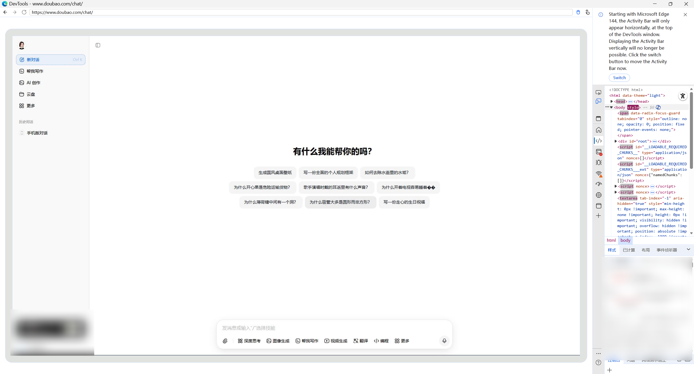

<h1>
    <center>
        WebAIPilot接口文档
    </center>
</h1>

# 前言
因为每家的AI都不同，所有这里需要设计一个方便却又需要有独特的接口

# 接口设计
## RESTful API 接口地址
- 协议 - Protocol：`http`
- 主机名/IP地址 - Host：`127.0.0.1`
- 端口号 - Port：`21325`

这些配置都能通过用户的配置文件修改，在`user_data/user_settings.toml`(开发模式是`debug_data/user_settings.toml`)的`[server]`字段中

## FastAPI文档接口
推荐运行服务器直接在浏览器中输入以下url进行访问
http://127.0.0.1:21325/docs
http://127.0.0.1:21325/openapi.json

FastAPI 交互式文档（或者更专业地被称为 Swagger UI），基于 OpenAPI 规范自动生成的文档，除了缺点是英文不能切换中文以外我真的不知道有它有什么缺点了，规范优雅还提供快速测试


## 基础接口
**因为各家网页版的AI各有不同，所以根据功能可能有些API无法使用，这里的基础接口就是无论是哪家AI都必须有的操作。**
| 分类         | 端点                          | 方法        | 描述                     | 参数                                                           | 响应                                                                      |
| ------------ | ----------------------------- | ----------- | ------------------------ | -------------------------------------------------------------- | ------------------------------------------------------------------------- |
| **系统接口** | `/`                           | `GET`       | 检查服务器运行状态       | 无                                                             | `{"服务器状态": "运行正常", "服务": "WebAIPilot API", "版本": "1.0.0"}`   |
| **系统接口** | `/screenshots`                | `GET`       | 获取当前浏览器页面截图   | 无                                                             | PNG图片文件                                                               |
| **系统接口** | `/ws/monitor`                 | `WebSocket` | 实时传输浏览器页面截图流 | 无                                                             | 二进制JPEG图像流（30帧/秒）                                               |
| **系统接口** | `/status`                     | `GET`       | 返回实时监控页面         | 无                                                             | HTML页面（包含WebSocket连接的Canvas显示）                                 |
| **对话操作** | `/ask/{question}`             | `GET`       | 通过GET方式向AI提问      | `question`：用户问题（路径参数）                               | `{"AI回复": "文本回答", "图片链接": ["图片URL1", "图片URL2"]}`            |
| **对话操作** | `/ask`                        | `POST`      | 通过POST方式向AI提问     | `AskModel`对象（请求体）                                       | `{"AI回复": "文本回答", "图片链接": ["图片URL1", "图片URL2"]}` 或错误信息 |
| **对话操作** | `/answer`                     | `GET`       | 获取指定下标的对话内容   | `answer_index`：回答下标（查询参数，默认0）                    | `{"AI回复": "文本回答", "图片链接": ["图片URL1", "图片URL2"]}`            |
| **会话管理** | `/conversations`              | `POST`      | 创建新的对话会话         | 无                                                             | 新创建的会话信息                                                          |
| **会话管理** | `/conversations`              | `DELETE`    | 删除默认会话（下标0）    | 无                                                             | `{"info": "下标为0的会话删除成功"}` 或错误信息                            |
| **会话管理** | `/conversations/{identifier}` | `DELETE`    | 删除指定标识符的会话     | `identifier`：会话标识符（路径参数，支持整数下标或字符串标题） | `{"info": "下标/标题为{identifier}的会话删除成功"}` 或错误信息            |
| **会话管理** | `/conversations`              | `PUT`       | 切换到默认会话（下标0）  | 无                                                             | `{"info": "下标为0的会话切换成功"}` 或错误信息                            |
| **会话管理** | `/conversations/{identifier}` | `PUT`       | 切换到指定标识符的会话   | `identifier`：会话标识符（路径参数，支持整数下标或字符串标题） | `{"info": "下标/标题为{identifier}的会话切换成功"}` 或错误信息            |
| **会话管理** | `/conversations/title/list`   | `GET`       | 获取所有会话标题列表     | 无                                                             | 会话标题列表                                                              |
| **会话管理** | `/conversations/count`        | `GET`       | 获取当前会话数量         | 无                                                             | 会话数量                                                                  |

&nbsp;
**cmd调用：**
```cmd
# 1. 获取状态
curl -X GET "http://127.0.0.1:21325/status"

# 2. 创建新会话
curl -X POST "http://127.0.0.1:21325/conversations"

# 3. 切换会话
curl -X PUT "http://127.0.0.1:21325/conversations"
# 或通过标题切换
curl -X PUT "http://127.0.0.1:21325/conversations/关于%20API"

# 4. 删除第一个会话
curl -X DELETE "http://127.0.0.1:21325/conversations"
# 删除指定会话（注意URL编码）
curl -X DELETE "http://127.0.0.1:21325/conversations/新对话"

# 5. 提问（带文件）
curl -X POST "http://127.0.0.1:21325/ask" \
  -H "Content-Type: application/json" \
  -d "{\"question\": \"识别验证码图片仅返回数字\", \"files\": \"data/验证码1.jpg\"}"

# 6. 固定问题
curl -X GET "http://127.0.0.1:21325/ask/你好"

# 7. 获取回答
curl -X GET "http://127.0.0.1:21325/answer"

# 8. 获取会话列表
curl -X GET "http://127.0.0.1:21325/conversations/title/list"

# 9. 获取会话总数
curl -X GET "http://127.0.0.1:21325/conversations/count"

# 10. 获取文档
curl -X GET "http://127.0.0.1:21325/docs"
curl -X GET "http://127.0.0.1:21325/openapi.json"
```

## 系统接口
| 分类         | 端点           | 方法        | 描述                     | 参数 | 响应                                                                    |
| ------------ | -------------- | ----------- | ------------------------ | ---- | ----------------------------------------------------------------------- |
| **系统接口** | `/`            | `GET`       | 检查服务器运行状态       | 无   | `{"服务器状态": "运行正常", "服务": "WebAIPilot API", "版本": "1.0.0"}` |
| **系统接口** | `/screenshots` | `GET`       | 获取当前浏览器页面截图   | 无   | PNG图片文件                                                             |
| **系统接口** | `/ws/monitor`  | `WebSocket` | 实时传输浏览器页面截图流 | 无   | 二进制JPEG图像流（30帧/秒）                                             |
| **系统接口** | `/status`      | `GET`       | 返回实时监控页面         | 无   | HTML页面（包含WebSocket连接的Canvas显示）                               |


## 对话操作
**基础操作：**
| 分类         | 端点              | 方法   | 描述                   | 参数                                        | 响应                                                                      |
| ------------ | ----------------- | ------ | ---------------------- | ------------------------------------------- | ------------------------------------------------------------------------- |
| **对话操作** | `/ask/{question}` | `GET`  | 通过GET方式向AI提问    | `question`：用户问题（路径参数）            | `{"AI回复": "文本回答", "图片链接": ["图片URL1", "图片URL2"]}`            |
| **对话操作** | `/ask`            | `POST` | 通过POST方式向AI提问   | `AskModel`对象（请求体）                    | `{"AI回复": "文本回答", "图片链接": ["图片URL1", "图片URL2"]}` 或错误信息 |
| **对话操作** | `/answer`         | `GET`  | 获取指定下标的对话内容 | `answer_index`：回答下标（查询参数，默认0） | `{"AI回复": "文本回答", "图片链接": ["图片URL1", "图片URL2"]}`            |

&nbsp;
**对话模式控制（并非所有web的AI都有这个接口，看网页版是否有）：**

| 分类         | 端点                | 方法  | 描述                   | 参数                                                              | 响应                                                                                    |
| ------------ | ------------------- | ----- | ---------------------- | ----------------------------------------------------------------- | --------------------------------------------------------------------------------------- |
| **对话操作** | `/deep_think`       | `GET` | 控制深度思考模式的开关 | `switch`：布尔值，可选路径参数，True为开启，False为关闭，默认True | 开启时返回`{"info": "已开启深度思考模式"}`，关闭时返回`{"error": "已关闭深度思考模式"}` |
| **对话操作** | `/image_generation` | `GET` | 控制图片生成模式的开关 | `switch`：布尔值，可选路径参数，True为开启，False为关闭，默认True | 开启时返回`{"info": "已开启图片生成模式"}`，关闭时返回`{"error": "已关闭图片生成模式"}` |
| **对话操作** | `/help_me_write`    | `GET` | 控制帮我写作模式的开关 | `switch`：布尔值，可选路径参数，True为开启，False为关闭，默认True | 开启时返回`{"info": "已开启帮我写作模式"}`，关闭时返回`{"error": "已关闭帮我写作模式"}` |
| **对话操作** | `/video_generation` | `GET` | 控制视频生成模式的开关 | `switch`：布尔值，可选路径参数，True为开启，False为关闭，默认True | 开启时返回`{"info": "已开启视频生成模式"}`，关闭时返回`{"error": "已关闭视频生成模式"}` |
| **对话操作** | `/translation`      | `GET` | 控制翻译模式的开关     | `switch`：布尔值，可选路径参数，True为开启，False为关闭，默认True | 开启时返回`{"info": "已开启翻译模式"}`，关闭时返回`{"error": "已关闭翻译模式"}`         |


## 会话管理
**基础操作：**
| 分类         | 端点                          | 方法     | 描述                    | 参数                                                           | 响应                                                           |
| ------------ | ----------------------------- | -------- | ----------------------- | -------------------------------------------------------------- | -------------------------------------------------------------- |
| **会话管理** | `/conversations`              | `POST`   | 创建新的对话会话        | 无                                                             | 新创建的会话信息                                               |
| **会话管理** | `/conversations`              | `DELETE` | 删除默认会话（下标0）   | 无                                                             | `{"info": "下标为0的会话删除成功"}` 或错误信息                 |
| **会话管理** | `/conversations/{identifier}` | `DELETE` | 删除指定标识符的会话    | `identifier`：会话标识符（路径参数，支持整数下标或字符串标题） | `{"info": "下标/标题为{identifier}的会话删除成功"}` 或错误信息 |
| **会话管理** | `/conversations`              | `PUT`    | 切换到默认会话（下标0） | 无                                                             | `{"info": "下标为0的会话切换成功"}` 或错误信息                 |
| **会话管理** | `/conversations/{identifier}` | `PUT`    | 切换到指定标识符的会话  | `identifier`：会话标识符（路径参数，支持整数下标或字符串标题） | `{"info": "下标/标题为{identifier}的会话切换成功"}` 或错误信息 |
| **会话管理** | `/conversations/title/list`   | `GET`    | 获取所有会话标题列表    | 无                                                             | 会话标题列表                                                   |
| **会话管理** | `/conversations/count`        | `GET`    | 获取当前会话数量        | 无                                                             | 会话数量                                                       |

置顶会话、固定会话、分享会话等等


# 状态查看（远程调试）
- 最简单的状态查看就是有头模式，`user_data/user_settings.toml`(开发模式是`debug_data/user_settings.toml`)中的`headless`字段改为`false`。
- 接下来介绍的是无头模式下的状态查看，无头模式运行速度快但是不能像有头一样显示操作就导致卡在哪一步无法进行操了或无法观测进行了错误操作。
- 2种方式进行状态查询
  - 直接访问API（简单操作，浏览器直接查看状态，强烈建议这个）
  - 远程调试模式（复杂操作且仅限于chromium内核的浏览器，进行开发者远程调试，高级状态查看和**调试**）
## 状态查看
所有浏览器通过的状态监控:http://127.0.0.1:21325/status

这个状态下仅仅能查看浏览器界面而已，不能进行任何操作
## 远程调试
**作者：“上帝视角”**
`9922`端口是谷歌（Chromium）默认的远程调试端口号，访问`chrome://inspect/#devices`能手动添加自定义的远程调试端口。
- CDP(Chrome DevTools Protocol)，这是开发者的高级调试模式，也就是playwright无头模式浏览器下能访问playwright产出的Page，并且你还能进行操作，也就是实现了无头模式下的有头模式。
- 首先确保`user_data/user_settings.toml`(开发模式是`debug_data/user_settings.toml`)中的args字段有以下参数，目的是创建浏览器的时候开启远程调试模式
    ```python
    args = [
        # 开启远程调试的“窗口”（chrome://inspect/#devices Configure添加ip和端口）
        "--remote-debugging-port=9000",
        # 仅允许自己的IP访问
        "--remote-debugging-address=127.0.0.1",
    ]
    ```
- 然后确保无头模式下启动了服务`INFO:     Uvicorn running on http://127.0.0.1:21325 (Press CTRL+C to quit)`

- 文档参考：https://developer.chrome.com/docs/devtools/remote-debugging/local-server?hl=zh-cn
- 安卓远程调试：https://developer.chrome.com/docs/devtools/remote-debugging

一般来说，访问`http://127.0.0.1:9000/json`后能拿到`devtoolsFrontendUrl`对应的url，访问能直接抵达了，但就是不行，AI回答:
1. Playwright 浏览器内核版本确实没有内置静态资源文件
2. 访问`http://127.0.0.1:9000/json`后，`devtoolsFrontendUrl`就是需要的url了，但是必须改用 wss（加密 WebSocket），把链接里的 ws= 部分改成 wss=（注意是 wss，不是 ws）
3. 因为 chrome://inspect 页面是你当前使用的浏览器提供的“翻译官”。它自己内置了所有需要的 HTML/JS 资源，它只需要从你的 9000 端口拿原始数据就行。 而当你直接在地址栏输入 http://127.0.0.1:9000/... 时，你是要求无头浏览器自己提供这些资源，它给不了，所以挂了。兄弟，你把 headless 改成 False 再跑一次试试。如果还是不行，那咱们就得看是不是你的 Playwright 用的浏览器内核版本太精简，把 devtools 资源包给阉割了。
4. 你之所以一直报错、白屏，是因为你正在尝试做一件违反浏览器安全限制的事，断连：是因为 Google 的 appspot 页面对本地 127.0.0.1 的 WebSocket 连接有极其严格的跨域校验（CORS），通常会被防火墙或代理拦截。

有用的端点：
1. http://127.0.0.1:9000/json
2. http://127.0.0.1:9000/json/version
3. http://127.0.0.1:9000/devtools/inspector.html
4. chrome://inspect/#devices
### 具体流程
**稳定的“官方路径”，edge和chrome都可以实现，下面是chrome浏览器的例子** ：

1. 访问`chrome://inspect/#devices`CDP端点进入远程调试页面，俗称“Chrome 开发者工具 - 远程设备”或 “检查设备”页面
2. 点击`Configure...`按钮，弹出Remote Targets（远程目标列表）弹窗，添加端口号和IP。

3. 端口号和IP默认是127.0.0.1:9000，具体设置是在`user_settings.toml`文件中设置的，用户自定义
4. 添加完后等待5~600秒会出现(最左侧的东西全都点一遍可能会更快出现，可能机魂不悦吧)`Remote Target`远程目标
5. 点击`inspect`后就会出现以下界面(我点击后没有反应需要等待一段时间)，谷歌浏览器（chrome）和微软浏览器(edge)都可以实现
6. 最后在这个界面playwright自动化的所有操作都可以看到并且用户还能直接在界面上进行操作。

**注意：只要是chorme内核的就是实现，比如Edge和Chrome，但是参数`user_settins.toml`参数可能有所不同。**

#### Remote Target参数解析
1. **inspect**（检查）  
   - 最常用的按钮。  
   - 点击后：会弹出一个完整的 Chrome DevTools 窗口，连接到这个具体的标签页。  
   - 你可以在里面查看 Elements（元素）、Console（控制台）、Network（网络）、Sources（源码断点）、Performance（性能）等，所有标准 DevTools 功能都可用。  
   - 用途：实时调试页面，查看 Playwright 操作后页面的状态、JS 错误、DOM 变化等。

2. **pause**（暂停）  
   - 点击后：暂停这个标签页中所有 JavaScript 的执行（相当于在 Sources 面板按 F8 暂停脚本）。  
   - 用途：调试时冻结页面 JS 执行，方便查看某个时刻的状态。再次点击或在 DevTools 里恢复即可继续运行。  
   - 注意：不是所有版本都显示这个按钮，有时只在已打开 inspect 的标签页上出现。

3. **focus tab**（聚焦标签页）  
   - 点击后：把这个标签页切换到前台（激活它，让它成为当前可见的标签页）。  
   - 用途：如果你浏览器有多个标签页，这个按钮能快速把目标页面切到最前面，方便你手动查看或操作。

4. **reload**（重新加载）  
   - 点击后：刷新这个标签页（相当于 F5 或 Ctrl+R）。  
   - 用途：手动强制刷新页面，常用于调试缓存问题或重现某个状态。

5. **close**（关闭）  
   - 点击后：直接关闭这个标签页。  
   - 用途：清理多余的标签页（比如你现在有两个豆包页面，可以点一个的 close 关掉一个）。

6. **inspect fallback**（备用检查）  
   - 这个按钮不常用，通常只在某些情况下出现。  
   - 作用：如果正常的 inspect 失败，它会尝试用另一种方式打开 DevTools（fallback 机制）。  
   - 一般不需要点它，直接用第一个 inspect 即可。
7. **Open tab with url** + **Open** 按钮  
   - 在 Remote Target 标题旁边有一个输入框和 Open 按钮。  
    - 功能：在这个远程浏览器实例中新建一个标签页并打开你输入的 URL。  
    - 用途：不用改 Playwright 脚本，就能手动在这个浏览器里再开一个新页面测试。
8. **trace**  
    - 点击后：开启 Performance Trace（性能追踪），会自动录制一段时间的页面性能数据，然后打开 Timeline/Performance 面板查看。  
    - 用途：分析页面加载速度、JS 执行耗时等。
9. 点击 inspect 按钮后弹出的那个窗口叫：Chrome DevTools（Chrome 开发者工具）更具体地说，是 一个独立的 Chrome DevTools 窗口（Detached DevTools Window），或者叫 远程连接的 DevTools 实例（Remote DevTools Instance）。


# 基础设计核心点

## 已实现方法

| 分类           | 方法名                        | 功能描述                                                    |
| -------------- | ----------------------------- | ----------------------------------------------------------- |
| **初始化相关** | `__init__`                    | 构造函数，初始化页面对象和相关属性                          |
|                | `_async_init`                 | 异步初始化页面，访问豆包对话网页并等待加载完成              |
| **问答相关**   | `ask`                         | 执行提问操作，支持文本和文件上传，返回文本回答和图片URL列表 |
|                | `get_last_answer`             | 获取最后对话的回复内容                                      |
|                | `get_imgs_urls`               | 获取当前对话中所有图片无水印下载链接                        |
|                | `img_hook`                    | 从聊天完成请求中获取图片无水印链接                          |
|                | `img_all_hook`                | 从单个请求中获取所有图片无水印链接                          |
| **会话管理**   | `create_conversation`         | 创建新对话                                                  |
|                | `del_conversation`            | 删除指定会话（支持索引或标题）                              |
|                | `switch_conversation`         | 切换到指定会话（支持索引或标题）                            |
|                | `get_conversation_count`      | 获取当前会话数量                                            |
|                | `get_conversation_title_list` | 获取当前会话标题列表                                        |
|                | `get_all_conversation_tags`   | 获取所有会话标签                                            |
| **模式控制**   | `deep_thinking_mode`          | 控制深度思考模式开关                                        |
|                | `image_generation_mode`       | 控制图片生成模式开关                                        |
|                | `help_me_write_mode`          | 控制帮我写作模式开关                                        |
|                | `video_generation_mode`       | 控制视频生成模式开关                                        |
|                | `translation_mode`            | 控制翻译模式开关                                            |

## 待补充方法（按功能分类）

### 会话管理相关
| 方法名                       | 功能描述             |
| ---------------------------- | -------------------- |
| `rename_conversation`        | 重命名会话           |
| `clear_conversation_history` | 清空指定会话历史记录 |
| `export_conversation`        | 导出会话内容         |
| `search_conversations`       | 搜索会话             |
| `get_conversation_info`      | 获取会话详细信息     |

### 消息操作相关
| 方法名                 | 功能描述           |
| ---------------------- | ------------------ |
| `edit_message`         | 编辑历史消息       |
| `delete_message`       | 删除指定消息       |
| `retry_message`        | 重新发送失败的消息 |
| `get_message_history`  | 获取消息历史记录   |
| `get_message_by_index` | 获取指定索引的消息 |

### 文件操作相关
| 方法名                    | 功能描述           |
| ------------------------- | ------------------ |
| `upload_multiple_files`   | 批量上传文件       |
| `get_uploaded_files_list` | 获取已上传文件列表 |
| `delete_uploaded_file`    | 删除已上传文件     |
| `get_file_upload_status`  | 获取文件上传状态   |

### 设置相关
| 方法名                 | 功能描述                 |
| ---------------------- | ------------------------ |
| `set_temperature`      | 设置AI响应温度参数       |
| `set_response_length`  | 设置回复长度（短/中/长） |
| `toggle_auto_save`     | 控制自动保存开关         |
| `get_page_settings`    | 获取当前页面设置         |
| `set_model_parameters` | 设置模型参数             |

### 对话控制相关
| 方法名                    | 功能描述           |
| ------------------------- | ------------------ |
| `stop_generation`         | 停止当前AI生成过程 |
| `pause_conversation`      | 暂停当前对话       |
| `resume_conversation`     | 恢复对话           |
| `get_conversation_status` | 获取当前对话状态   |
| `check_ai_busy_status`    | 检查AI是否忙碌     |

### 数据统计相关
| 方法名                      | 功能描述             |
| --------------------------- | -------------------- |
| `get_usage_statistics`      | 获取使用统计信息     |
| `get_conversation_duration` | 获取会话持续时间     |
| `get_message_count`         | 获取会话中的消息数量 |
| `get_daily_usage`           | 获取当日使用量       |

### 导入导出相关
| 方法名                        | 功能描述           |
| ----------------------------- | ------------------ |
| `import_conversation`         | 导入会话           |
| `backup_all_conversations`    | 备份所有会话       |
| `restore_conversations`       | 恢复会话           |
| `export_conversation_as_json` | 导出会话为JSON格式 |

### 图片操作相关
| 方法名                      | 功能描述                   |
| --------------------------- | -------------------------- |
| `download_image_by_url`     | 根据URL下载图片            |
| `get_generated_images_list` | 获取当前对话生成的图片列表 |
| `batch_download_images`     | 批量下载对话中的图片       |

### 错误处理相关
| 方法名                     | 功能描述       |
| -------------------------- | -------------- |
| `handle_captcha_challenge` | 处理验证码挑战 |
| `check_login_status`       | 检查登录状态   |
| `renew_session`            | 续期会话       |
| `handle_rate_limiting`     | 处理频率限制   |

### 高级功能相关
| 方法名                     | 功能描述           |
| -------------------------- | ------------------ |
| `get_ai_model_info`        | 获取当前AI模型信息 |
| `switch_ai_model`          | 切换AI模型         |
| `get_available_models`     | 获取可用模型列表   |
| `set_conversation_context` | 设置对话上下文     |
| `get_system_prompt`        | 获取系统提示词     |
