# FastAPI 通用项目脚手架

一个从 Web 自动化实践中逐步演进出来的 **FastAPI 通用脚手架**。最初服务于浏览器自动化场景，经过多轮重构提炼为可复用的项目骨架——消除了硬编码耦合，实现了日志解耦、配置层叠、UI 模板分离和环境变量自动加载，适合作为任何 FastAPI 项目的起点。

---

## 项目目录树

```
FastAPI通用脚手架/
│
├── config/                              # 📁 全局配置文件目录
│   ├── .env                             #   环境变量（APP_NAME、SMTP 授权码、发件人邮箱）
│   ├── settings.toml                    #   框架默认设置配置（服务器 host/port/protocol）
│   ├── logging_config.yaml              #   框架默认日志配置（兜底配置，保证日志系统永远可用）
│   ├── logo.ico                         #   网站 favicon 图标
│   └── logo.png                         #   邮件内嵌 Logo 图片
│
├── data_models/                         # 📁 Pydantic 数据模型层（请求/响应/配置校验）
│   ├── __init__.py                      #   模型顶层导出（ConfigModel）
│   ├── config_model.py                  #   用户配置顶层模型
│   └── server_config.py                 #   服务器配置模型（host、port、protocol）
│
├── debug_data/                          # 📁 开发/调试模式的私有数据（debug=True 时生效）
│   ├── user_settings.toml               #   调试模式的用户设置（优先级最高，覆盖 user_data）
│   └── logging_config.yaml              #   调试模式的日志配置（覆盖 user_data）
│
├── logger/                              # 📁 日志子系统 ★核心模块★
│   ├── __init__.py                      #   暴露便捷函数（debug/info/warning/error/critical/exception）
│   ├── logger.py                        #   LoggerManager 单例 + 全局异常钩子 + 彩色日志 + 便捷函数封装
│   └── logging_configurator.py          #   LoggingConfigurator 单例，负责解析 YAML 日志配置文件
│
├── outputs/                             # 📁 运行时产物目录（.gitignore 忽略实际内容）
│   ├── downloads/                       #   下载文件目录
│   ├── har/                             #   HTTP Archive 文件目录
│   ├── logs/                            #   日志文件输出目录（主日志 + 错误日志）
│   ├── pyinstaller/                     #   PyInstaller 打包产物目录
│   ├── reports/                         #   运行报告目录
│   ├── screenshots/                     #   截图目录
│   ├── traces/                          #   Playwright trace 目录
│   └── videos/                          #   录屏目录
│
├── templates/                           # 📁 模板文件目录（渲染层，与业务逻辑解耦）
│   └── email/
│       └── verification_code_email.html #   验证码邮件 HTML 模板（支持变量替换）
│
├── user_data/                           # 📁 用户私有数据目录（不提交 git）
│   ├── user_settings.toml               #   用户个人设置（覆盖 config/settings.toml）
│   └── logging_config.yaml              #   用户自定义日志配置（覆盖 config/logging_config.yaml）
│
├── utils/                               # 📁 工具模块
│   ├── __init__.py                      #   公共 API 导出 + 自动加载 config/.env 环境变量
│   ├── config_manager.py                #   ConfigManager 单例，配置层叠加载（核心配置引擎）
│   ├── message_util.py                  #   邮件发送工具（SMTP 验证码邮件，HTML 模板渲染）
│   ├── path_utils.py                    #   路径工具集（get_root、is_path_exist、mkdir，兼容 PyInstaller 打包）
│   └── qrcode_manager.py               #   二维码管理器（基本/样式/Logo/Base64/批量生成）
│
├── .gitignore                           # Git 忽略规则
├── .python-version                      # Python 版本指定（3.14）
├── pyproject.toml                       # 项目元数据和依赖声明
├── 打包模板.spec                         # PyInstaller 打包配置模板（含 hidden-imports）
├── 主入口模板.py                         # FastAPI 主入口模板（生命周期管理 + 静态文件挂载）
├── 软件整合打包模板.py                   # 打包后文件整合脚本（复制 exe + config + user_data + templates）
└── README.md                            # 本文件
```

---

## 项目演进历程

本框架脱胎于 [pywebauto](https://github.com/)——一个基于 Selenium 的 Web 自动化测试框架，后来逐步迁移到 Playwright + FastAPI 架构。回顾一路走来的关键重构节点：

| 阶段 | 痛点 | 解决方式 |
|------|------|----------|
| **高耦合期** | 日志、配置、业务逻辑全部揉在一个文件里 | 拆分 `logger/`、`utils/`、`data_models/` 独立模块 |
| **硬编码日志** | 日志路径写死，配置文件坏了日志系统直接崩溃 | 硬编码兜底配置 + YAML 动态加载，确保日志永不死 |
| **环境变量散落** | `.env` 到处手动加载 | `utils/__init__.py` 统一自动加载，一次导入全局可用 |
| **开发/生产混用** | 开发时要改端口、开调试日志，提交前又要改回来 | `debug_data/` 目录 + `ConfigManager(debug=True)` 一行切换 |
| **模板与逻辑耦合** | HTML 模板内嵌在 Python 字符串里 | `templates/` 目录独立管理，变量占位符替换 |
| **日志调用繁琐** | 每次打日志都要先拿 `logger` 实例再调方法 | `from logger import info, debug, error` 直接调用 |

**核心理念**：从实践中发现问题 → 在项目中解决 → 沉淀为可复用的模板代码。

---

## 核心功能

### 1. 日志系统 ★重磅特性★

日志是本框架花费心血最多的模块，围绕"永远可用、易于使用、输出好看"三个目标设计。

#### 1.1 三级兜底机制

日志配置采用**硬编码默认配置 → 框架 YAML 配置 → 用户 YAML 配置 → 调试 YAML 配置**的级联加载：

```
硬编码默认配置（logger.py 内置）
    ↓ 覆盖
config/logging_config.yaml（框架级日志配置）
    ↓ 覆盖
user_data/logging_config.yaml（用户级日志配置）
    ↓ 当 debug=True 时覆盖
debug_data/logging_config.yaml（调试级日志配置）
```

- **硬编码默认配置是最后的防线**：无论外部 YAML 文件损坏、丢失还是语法错误，日志系统都能正常工作
- 外部配置解析失败时，自动创建 `outputs/logs/` 目录，将错误同时写入日志文件和控制台
- 配置合并采用**深度合并（deep_merge）**，不会破坏原有结构

#### 1.2 动态加载，非硬编码

日志配置不是写死在代码里，而是通过 YAML 文件动态加载：

- `LoggingConfigurator` 负责解析 YAML 配置文件，捕获 `ScannerError`（语法错误）、`YAMLError`（解析错误）等各类异常
- 解析成功则通过 `logging.config.dictConfig()` 动态更新日志系统
- 解析失败则将错误信息记录到 `error_msg` 属性，供上层 `ConfigManager` 处理

#### 1.3 便捷函数——省略实例引用

传统方式打日志需要先获得 logger 实例：

```python
# 传统方式（繁琐）
logger = logging.getLogger("myapp")
logger.info("xxx")
```

本框架将常用日志方法重新包装为模块级函数，直接导入即可使用：

```python
# 本框架方式（简洁）
from logger import debug, info, warning, error, critical, exception

info("日志模块加载完成")
error("配置解析失败", exc_info=e)
```

实现原理：通过 lambda 预绑定单例 `logger_manager.logger` 的对应方法：

```python
# logger/__init__.py
info = lambda msg, *args, **kwargs: logger_manager.logger.info(msg, *args, **kwargs)
```

`exception()` 由于需要特殊的 `exc_info` 默认参数，单独封装为函数。

#### 1.4 彩色日志输出

基于 [colorlog](https://github.com/borntyping/python-colorlog) 实现终端彩色输出：

| 日志级别 | 级别颜色 | 消息正文颜色 |
|----------|----------|--------------|
| DEBUG | 青色 (cyan) | 青色 |
| INFO | 绿色 (green) | 浅绿色 |
| WARNING | 黄色 (yellow) | 浅黄色 |
| ERROR | 加粗亮红 | 红色 |
| CRITICAL | 加粗亮红 | 红色 |

#### 1.5 双文件日志轮转

- **主日志文件**（`outputs/logs/日志记录.log`）：记录 INFO 及以上级别，每天午夜轮转，保留 2 天
- **错误日志文件**（`outputs/logs/error.log`）：只记录 ERROR 及以上级别，使用详细格式（含行号、线程名），每天午夜轮转，保留 31 天
- 两者均使用 `TimedRotatingFileHandler` + `delay=True`，仅在首次写入时才创建文件

---

### 2. 配置层叠系统

实现企业级的配置管理策略，高优先级覆盖低优先级同名配置项：

```
debug_data/user_settings.toml    ← 最高优先级（仅 debug=True 时加载）
    ↓ 覆盖
user_data/user_settings.toml     ← 用户私有配置
    ↓ 覆盖
config/settings.toml             ← 框架默认配置
    ↓ 覆盖
config/.env                      ← 环境变量（通过 python-dotenv 加载）
```

- `ConfigManager` 采用**线程安全的 DCL（Double-Checked Locking）单例模式**
- `deep_merge()` 实现字典深度合并——嵌套字典逐层覆盖而非整体替换
- 加载完成后自动通过 Pydantic 模型进行**配置校验和类型转换**（`ConfigModel`）
- 日志配置和设置配置分开管理，互不干扰

#### 开发模式 vs 生产模式

```python
# 生产模式
config_manager = ConfigManager(debug=False)  # 不加载 debug_data/

# 开发模式（一行切换）
config_manager = ConfigManager(debug=True)   # 加载 debug_data/ 并覆盖所有上层配置
```

---

### 3. 全局异常捕获

在 `LoggerManager.__init__()` 中自动注册 `sys.excepthook`：

- 捕获所有未被 try/except 处理的致命异常
- 自动通过 logger 记录完整的堆栈信息
- 优雅跳过 `KeyboardInterrupt`（Ctrl+C / IDE 停止按钮），不影响正常退出

```python
def setup_exception_hook(self):
    def exception_hook(exc_type, exc_value, exc_traceback):
        if issubclass(exc_type, KeyboardInterrupt):
            sys.__excepthook__(exc_type, exc_value, exc_traceback)
        self.logger.exception("发生致命异常导致程序崩溃:",
                              exc_info=(exc_type, exc_value, exc_traceback))
    sys.excepthook = exception_hook
```

---

### 4. 环境变量自动加载

只需 `from utils import ...` 一次，无需手动调用 `load_dotenv()`：

```python
# utils/__init__.py
from dotenv import load_dotenv
load_dotenv(f"{get_root()}/config/.env")  # 模块导入时自动执行，不会覆盖系统已有环境变量
```

---

### 5. 邮件发送

封装了 SMTP 邮件发送功能，主要针对验证码场景：

- 使用 QQ 邮箱 SMTP 服务器（SSL 465 端口）
- HTML 模板渲染（`templates/email/verification_code_email.html`），占位符 `{verification_code}`、`{time}`、`{app_name}` 动态替换
- 内嵌 Logo 图片（Content-ID 引用）
- 环境变量驱动（`SENDER_EMAIL`、`SMTP` 授权码），不硬编码敏感信息

---

### 6. 二维码生成

基于 [qrcode](https://github.com/lincolnloop/python-qrcode) + [Pillow](https://python-pillow.org/) 的完整二维码方案：

| 功能 | 方法 |
|------|------|
| ASCII 控制台输出 | `create_qrcode(data)` |
| 基本图片生成 | `create_qrcode_image(data, output_path)` |
| 样式二维码（圆角/渐变） | `create_styled_qrcode(data, style="rounded", gradient_style="radial")` |
| 带 Logo 二维码 | `create_logo_qrcode(data, logo_path)` |
| 带文字说明 | `create_qrcode_with_text(data, text)` |
| Base64 编码 | `get_qrcode_base64(data)` |
| 批量生成 | `batch_create_qrcodes(data_list, output_dir)` |

---

### 7. FastAPI 主入口模板

提供标准化的 FastAPI 应用骨架：

- **生命周期管理**（`lifespan`）：启动时打印访问地址、自动打开浏览器、生成二维码；关闭时释放资源
- **静态文件挂载**：`/outputs`（日志等产物）、`/templates`（前端静态资源）
- **默认路由**：`GET /`（服务器状态）、`GET /favicon.ico`
- **PyInstaller 打包兼容**：`path_utils.py` 中自动检测 `sys._MEIPASS`

---

### 8. PyInstaller 打包支持

- `打包模板.spec`：预配置 hidden-imports（colorlog、uvicorn、websockets、starlette 等），避免打包后缺少依赖
- `软件整合打包模板.py`：将打包后的 exe 与 config、user_data、templates 等运行时目录整合为完整发布包
- `path_utils.get_root()`：自动识别打包环境（`sys._MEIPASS`）和开发环境（`__file__`）

---

---

## 启动流程图

整个框架从启动到就绪的完整链路如下（串联了日志、配置、FastAPI 三大子系统）：

```mermaid
flowchart TD
    A["🚀 python 主入口模板.py"] --> B["📦 import logger 模块"]
    B --> B1["LoggerManager 单例初始化"]
    B1 --> B2["加载硬编码默认日志配置<br/>（dictConfig）"]
    B2 --> B3["注册 sys.excepthook<br/>（全局异常捕获）"]
    B3 --> B4["暴露便捷函数<br/>debug/info/warning/error/critical/exception"]

    A --> C["📦 import utils 模块"]
    C --> C1["自动加载 config/.env<br/>（load_dotenv，不覆盖系统变量）"]

    B4 --> D["⚙️ ConfigManager(debug=True/False) 初始化"]
    C1 --> D

    D --> D1["📄 加载 config/logging_config.yaml"]
    D1 --> D1a{"YAML 解析成功？"}
    D1a -->|是| D1b["deep_merge 合并到 log_config"]
    D1a -->|否| D1c["记录 error_msg<br/>（日志系统仍用硬编码兜底）"]

    D1b --> D2["📄 加载 user_data/logging_config.yaml"]
    D1c --> D2
    D2 --> D2a{"YAML 解析成功？"}
    D2a -->|是| D2b["deep_merge 覆盖 log_config"]
    D2a -->|否| D2c["记录 error_msg"]

    D2b --> D3["📄 加载 config/settings.toml"]
    D2c --> D3
    D3 --> D3a{"TOML 解析成功？"}
    D3a -->|是| D3b["deep_merge 合并到 config_data"]
    D3a -->|否| D3c["记录 error_msg → success_flag = False"]

    D3b --> D4["📄 加载 user_data/user_settings.toml"]
    D3c --> D4
    D4 --> D4a{"TOML 解析成功？"}
    D4a -->|是| D4b["deep_merge 覆盖 config_data"]
    D4a -->|否| D4c["跳过（用户配置可选）"]

    D4b --> D5{"debug == True ?"}
    D4c --> D5

    D5 -->|是| D5a["📄 加载 debug_data/user_settings.toml"]
    D5a --> D5b["deep_merge 覆盖 config_data<br/>（调试配置优先级最高）"]
    D5b --> D6
    D5 -->|否| D6["🔍 Pydantic 模型校验<br/>ConfigModel(**config_data)"]

    D6 --> D6a{"校验通过？"}
    D6a -->|是| D6b["config_data 转为 ConfigModel 对象"]
    D6a -->|否| D6c["记录 error_msg → success_flag = False"]

    D6b --> E["🔄 config_manager.config_override()"]
    D6c --> E

    E --> E1{"success_flag == True ?"}
    E1 -->|是| E2["logger_manager.use_logging_config()<br/>用合并后的配置更新日志系统"]
    E1 -->|否| E3["用硬编码默认日志记录错误<br/>（日志系统仍然可用）"]

    E2 --> F["📖 读取服务器配置<br/>protocol / host / port"]
    E3 --> F

    F --> G["🌐 创建 FastAPI 实例<br/>app = FastAPI(lifespan=lifespan)"]
    G --> G1["挂载静态文件目录<br/>/outputs → outputs/<br/>/templates → templates/"]
    G1 --> G2["注册路由<br/>GET / → 服务器状态<br/>GET /favicon.ico"]

    G2 --> H["▶️ uvicorn.run(app, host, port)"]
    H --> H1["🔧 lifespan startup 事件"]
    H1 --> H2["打印访问地址（彩色日志）"]
    H2 --> H3["自动打开浏览器"]
    H3 --> H4["控制台输出局域网二维码"]
    H4 --> I["✅ 服务就绪，等待请求"]

    style A fill:#4a3a8f,color:#fff
    style I fill:#2d6a4f,color:#fff
    style B2 fill:#ffd166,color:#333
    style D fill:#118ab2,color:#fff
    style E fill:#118ab2,color:#fff
    style G fill:#ef476f,color:#fff
```



> **关键设计意图**：无论配置加载在哪一步失败，**硬编码默认日志配置始终有效**——日志系统是最后一道防线，绝不会因为配置文件损坏而"静默崩溃"。

---

## 快速开始

### 环境要求

- Python 3.14+
- [uv](https://github.com/astral-sh/uv)（包管理器）

### 安装依赖

```bash
uv sync
```

### 配置

1. 编辑 `config/.env`，填入你的邮件服务信息：
   ```
   APP_NAME=你的应用名称
   SMTP=你的QQ邮箱授权码
   SENDER_EMAIL=你的QQ邮箱
   ```

2. 根据需要修改 `config/settings.toml`（服务器 host/port）

3. （可选）在 `user_data/` 下放入你的私有配置，自动覆盖默认配置

### 启动开发服务器

```bash
python 主入口模板.py
```

服务启动后会自动打开浏览器，控制台打印访问二维码。

---

## 依赖

| 包名 | 用途 |
|------|------|
| fastapi[standard] | Web 框架 |
| uvicorn | ASGI 服务器 |
| pydantic | 数据模型校验 |
| python-dotenv | 环境变量加载 |
| colorlog | 终端彩色日志输出 |
| qrcode + Pillow | 二维码生成 |
| pyinstaller | 打包为可执行文件 |
| PyYAML | YAML 配置文件解析 |

---

## 设计原则总结

1. **日志永不崩溃**：硬编码兜底 → YAML 动态覆盖 → 分级兜底保证日志系统始终可用
2. **配置即代码**：TOML 配置 + Pydantic 模型校验，配置错误在加载阶段就暴露
3. **单例 + 线程安全**：LoggerManager、ConfigManager、LoggingConfigurator 全部采用 DCL 单例
4. **模块零耦合**：日志只管日志，配置只管配置，模板只管渲染——各自独立、按需组合
5. **约定优于配置**：目录结构固定、默认值合理，开箱即用无需折腾
6. **开发体验优先**：彩色日志、自动打开浏览器、一行切换 debug 模式

---

## 许可证

Apache 2.0 — 保留原作者署名，不得删除或隐藏版权信息。使用或分发即代表同意相关声明。

---

**从实践中来，到实践中去——本框架的每一个设计决策都来自真实项目的痛点和解决方案。**
