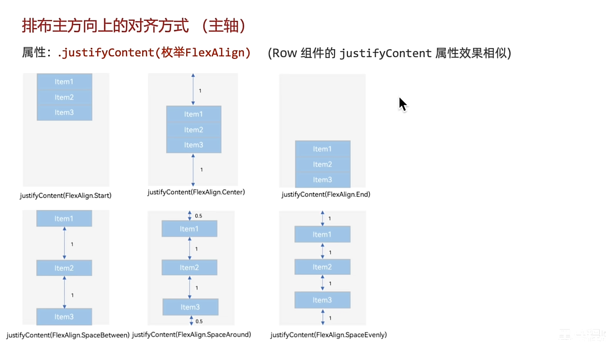

# 接触感想
这个IDE如果不是Cursor或专业版的IDEA或者是专业版的Pycharm还真是没法比。
以后9成会收费。
这里面的控件属性和方法全都已经封装好了，不得不说确实办到了开箱即用(比我在C语言里面使用Qt框架重新搓一个按钮好太多了，也不至于就一个好看炫酷的按钮写一天)
TypeScript确实是在JavaScript上仅加了静态类型检查，暂时还没有看到TypeScript其他的新特性
这个AskTS（方舟语言）的特性确实和Kotlin相识，QQ的最新框架听说也是Kotlin写的
# 黑马学习注意事项
30-背景定位-单位问题vp2px 这一集直接跳，在最新般的鸿蒙中已经修复了定位的问题（实际上就是一个bug，在css、html、qss等等都不符合开发的定义，位图怎么可能超出限定自身的容器呢？ ）
布局器

最新版的有安全距离，留白是因为安全距离的问题。设置 expandSafeArea
https://blog.csdn.net/Kousii/article/details/143335480
```c
.expandSafeArea([SafeAreaType.SYSTEM])
```
彩虹括号插件：RainbowBrackets，用来进行组件层级区分

图片组件(基础组件)的圆角大小在这里会覆盖掉容器组件的圆角的大小，所有设置圆角的时候必须设置图片圆角和容器圆角
# 吐槽
因为代码是这个IDE特有的，所以即使代码开源也没有什么意义，开源社区需要的不是AskTS开发的东西(版权问题，经济问题)
即使我跟着视频敲了这个代码意义也不大，我只是在学习如何用开发好的东西而已，底层实现也不懂，用网络安全来讲就是学了个kali的脚本子。黑马的最新的HarmonyNext视频就是在做这个无意义的事情，没有所谓的编程思想和编程技巧而言，仅仅是教我使用工具罢了。
并没有所谓真的创新，仅仅是在TS的基础上进行了进一步的扩展罢了
隐私安全必须尤其注意，从我入门开始我就知道了这个所谓的鸿蒙开发者(以及它的认证)，非局内人员就是会肆无忌惮的索取你的个人信息（开发认证不仅仅要你的身份证还要你的现居住位置且必须具体到门牌号。它自己的AI也是，你的所有提问和它的说有回答都会被记录且被使用在AI训练以及广告推广之类的，就算我在DevEco中使用我自己的DeepSeek付费的API它也毫无人性拿走我的数据），有空必须看看它的开发协议(已经看到有大坑了)
【全网首发黑马程序员鸿蒙 HarmonyOS NEXT星河版零基础入门到实战，零基础也能快速入门鸿蒙开发教程】https://www.bilibili.com/video/BV14t421W7pA?p=22&vd_source=298465310cd98e6ceddf1afe7d72e7ec 这个黑马太搞我心态了，能保证自己学完整套视频后内心会有一个超级大的空洞（我学了了鸡毛啊！！！的感觉）。
# 值得好奇的地方
JavaScript在浏览器中神奇的线程（进程特性般的线程）不知道有没有被移植到AskTS中
好奇能不能在虚拟机里面下载软件
好奇能不能在虚拟机里面写脚本，写个京东抢购的脚本
或者写个手机版本的鸣潮脚本
好奇写好之后能不能直接安装到系统的手机中
能不能封装成APP给鸿蒙手机（我深知这里面的难度和不可能性）
# 学习原则
**跟着黑马敲一遍，熟悉这个所谓的工具就立马滚蛋**
没有决心和实力就绝对不能入门鸿蒙开发，学完这个黑马的基础讨口饭吃没绝对没可能
必须学习或挖掘里面的编程思想（靠AI，靠积累的几门编程语言开发的经验）
对于这个AskTS语言绝对不能深深的入坑，知识实在是垄断太严重了，各种类和方法只能在官网查询(首先要登陆，看一个类的细节(我去看高并发编程内容被拦截了)需要开发者认证)，最新的特性也没有详细说明


