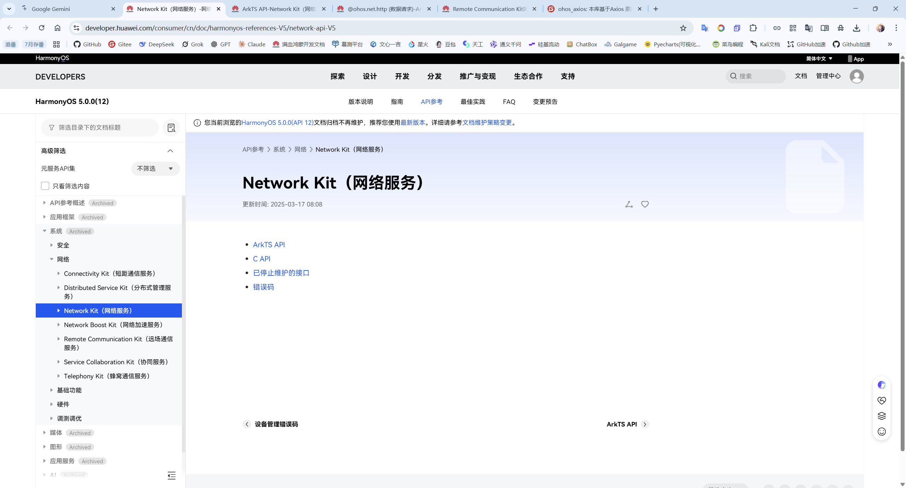

# 为什么写？
想着能不能直接嵌入deepseek，既然是网络请求就意味着只要使用官网的api就可以实现了
本来想搞谷歌的，能直接生成图片和文本，我还有免费的key没用上。但是谷歌的gemini访问有限制，虽然Github有通过购买域名进行二级跳转方式调用gemini但是综合考虑下来还是deepseek吧

# 资料参考
https://developer.huawei.com/consumer/cn/doc/

手册第一个方法：https://developer.huawei.com/consumer/cn/doc/harmonyos-guides/http-request

手册的第二个方法：https://developer.huawei.com/consumer/cn/doc/harmonyos-guides/remote-communication-introduction

deepseek api：https://api-docs.deepseek.com/zh-cn/

# 开发随笔
晚上找老师要了一份实验指导手册发现手册的第一个方案的内容已经过时了


其中的Remote Communication Kit也显示不再维护，这使得我不得不去找最新的文档


官方请求示例
```ArkTS
httpRequest.request(
  // 填写HTTP请求的URL地址，可以带参数或不带参数。URL地址由开发者自定义。请求的参数可以在extraData中指定。
  "EXAMPLE_URL",
  {
    method: http.RequestMethod.POST, // 可选，默认为http.RequestMethod.GET，用于从服务器获取数据，而POST方法用于向服务器上传数据。
    // 开发者根据自身业务需要添加header字段。
    header: {
      'Content-Type': 'application/json'
    },
    // 当使用POST请求时此字段用于传递请求体内容，具体格式与服务端协商确定。
    extraData: "data to send",
    expectDataType: http.HttpDataType.STRING, // 可选，指定返回数据的类型。
    usingCache: true, // 可选，默认为true。
    priority: 1, // 可选，默认为1。
    connectTimeout: 60000, // 可选，默认为60000ms。
    readTimeout: 60000, // 可选，默认为60000ms。
    usingProtocol: http.HttpProtocol.HTTP1_1, // 可选，协议类型默认值由系统自动指定。
    usingProxy: false, // 可选，默认不使用网络代理，自API 10开始支持该属性。
    caPath:'/path/to/cacert.pem', // 可选，默认使用系统预制证书，自API 10开始支持该属性。
    clientCert: { // 可选，默认不使用客户端证书，自API 11开始支持该属性。
      certPath: '/path/to/client.pem', // 默认不使用客户端证书，自API 11开始支持该属性。
      keyPath: '/path/to/client.key', // 若证书包含Key信息，传入空字符串，自API 11开始支持该属性。
      certType: http.CertType.PEM, // 可选，默认使用PEM，自API 11开始支持该属性。
      keyPassword: "passwordToKey" // 可选，输入key文件的密码，自API 11开始支持该属性。
    },
    multiFormDataList: [ // 可选，仅当Header中，'content-Type'为'multipart/form-data'时生效，自API 11开始支持该属性，该属性用于支持向服务器上传二进制数据，根据上传的具体数据类型进行选择。
      {
        name: "Part1", // 数据名，自API 11开始支持该属性。
        contentType: 'text/plain', // 数据类型，自API 11开始支持该属性，上传的数据类型为普通文本文件。
        data: 'Example data', // 可选，数据内容，自API 11开始支持该属性。
        remoteFileName: 'example.txt' // 可选，自API 11开始支持该属性。
      }, {
        name: "Part2", // 数据名，自API 11开始支持该属性。
        contentType: 'text/plain', // 数据类型，自API 11开始支持该属性，上传的数据类型为普通文本文件。
        // data/app/el2/100/base/com.example.myapplication/haps/entry/files/fileName.txt。
        filePath: `${context.filesDir}/fileName.txt`, // 可选，传入文件路径，自API 11开始支持该属性。
        remoteFileName: 'fileName.txt' // 可选，自API 11开始支持该属性。
      }, {
        name: "Part3", // 数据名，自API 11开始支持该属性。
        contentType: 'image/png', // 数据类型，自API 11开始支持该属性，上传的数据类型为png格式的图片。
        // data/app/el2/100/base/com.example.myapplication/haps/entry/files/fileName.png。
        filePath: `${context.filesDir}/fileName.png`, // 可选，传入文件路径，自API 11开始支持该属性。
        remoteFileName: 'fileName.png' // 可选，自API 11开始支持该属性。
      }, {
        name: "Part4", // 数据名，自API 11开始支持该属性。
        contentType: 'audio/mpeg', // 数据类型，自API 11开始支持该属性，上传的数据类型为mpeg格式的音频。
        // data/app/el2/100/base/com.example.myapplication/haps/entry/files/fileName.mpeg。
        filePath: `${context.filesDir}/fileName.mpeg`, // 可选，传入文件路径，自API 11开始支持该属性。
        remoteFileName: 'fileName.mpeg' // 可选，自API 11开始支持该属性。
      }, {
        name: "Part5", // 数据名，自API 11开始支持该属性。
        contentType: 'video/mp4', // 数据类型，自API 11开始支持该属性，上传的数据类型为mp4格式的视频。
        // data/app/el2/100/base/com.example.myapplication/haps/entry/files/fileName.mp4。
        filePath: `${context.filesDir}/fileName.mp4`, // 可选，传入文件路径，自API 11开始支持该属性。
        remoteFileName: 'fileName.mp4' // 可选，自API 11开始支持该属性。
      }
    ]
  }, (err: BusinessError, data: http.HttpResponse) => {
    if (!err) {
      // data.result为HTTP响应内容，可根据业务需要进行解析。
      console.info('Result:' + JSON.stringify(data.result));
      console.info('code:' + JSON.stringify(data.responseCode));
      // data.header为HTTP响应头，可根据业务需要进行解析。
      console.info('header:' + JSON.stringify(data.header));
      console.info('cookies:' + JSON.stringify(data.cookies)); // 8+
      // 当该请求使用完毕时，调用destroy方法主动销毁。
      httpRequest.destroy();
    } else {
      console.error('error:' + JSON.stringify(err));
      // 取消订阅HTTP响应头事件。
      httpRequest.off('headersReceive');
      // 当该请求使用完毕时，调用destroy方法主动销毁。
      httpRequest.destroy();
    }
  }
);
```
上面的一坨东西，我只看必要参数，非必要我都不动的。
删了一堆参数，密钥也没填错，返回错误代码是404
https://developer.huawei.com/consumer/cn/doc/harmonyos-references/js-apis-http#request
在这里似乎找到了答案，实验报告也说要权限，我还以为新版不用权限。
所幸找到了资料

接下来要进行权限配置了
https://developer.huawei.com/consumer/cn/doc/harmonyos-guides/declare-permissions
`应用必须在module.json5配置文件的requestPermissions标签中声明权限。`
B:\HarmonyStudy\deepseek_api2\entry\src\main\module.json5
官方模板
```
{
  "module" : {
    // ...
    "requestPermissions":[
      {
        "name" : "ohos.permission.PERMISSION1",
        "reason": "$string:reason",
        "usedScene": {
          "abilities": [
            "FormAbility"
          ],
          "when":"inuse"
        }
      }
    ]
  }
}
```
改`"name" : "ohos.permission.INTERNET"`
`"reason": "$string:网络请求"`字段可选，尊重他我就写上吧
剩下的就不动了（申请user_grant权限时，usedScene必填，其他情况下选填。）
写上`reason`发现不行，给我报错，神人啊！
https://developer.huawei.com/consumer/cn/doc/harmonyos-guides/resource-categories-and-access#%E8%B5%84%E6%BA%90%E6%96%87%E4%BB%B6%E7%A4%BA%E4%BE%8B

直接给你删了，看你可选以为简单居然还对格式有严格要求，跟默认参数过日子去吧你
写完点


笑了，原来是api端点写错了
```
  // 填入DeepSeek的api地址
  "https://api.deepseek.com/chat/completions",
  写成了"https://api.deepseek.com"
```
神奇的是写完后回去把module.json5文件的权限添加给删了居然还能进行网络请求服务？上一秒官网写着httpRequest.request方法在9+版本需要
服务，下一秒给他删了居然请求成功了。
```
"requestPermissions":[
      {
        "name" : "ohos.permission.INTERNET",
        "usedScene": {
          "abilities": [
            "FormAbility"
          ],
          "when":"inuse"
        }
      }
    ]
```

不管了，能跑就行，不需要额外配置权限更好，省事了，到时候直接用就行了，麻烦的就是还得找方法保护好我的密钥

JSON处理
https://developer.huawei.com/consumer/cn/doc/harmonyos-guides/arkts-json#json%E6%89%A9%E5%B1%95%E8%AF%B4%E6%98%8E
官方在JSON上给了2个方法，一个是把对象转为JSON文本，另一个是把JSON文本转为对象。
我定义这这个请求对象都快抡冒烟了

HTTP请求返回数据类型为JSON文件时如何读取data
https://developer.huawei.com/consumer/cn/doc/architecture-guides/news-v1_2-ts_3-0000002298124757

我去，给返回的JSON文本做接口定义太累了，我都想上正则了


我原来用的是异步网络请求操作，我笑了，异步的网络请求导致无法解析json格式，他解析了寂寞

我算是知道为什么httpRequest.request这个方法给我一个函数回调了

在不同存储路径下如何读取JSON文件
https://developer.huawei.com/consumer/cn/doc/search?val=pandas%E7%9A%84%E6%96%87%E4%BB%B6%E8%AF%BB%E5%8F%96%E5%92%8C%E4%BF%9D%E5%AD%98&type=guides&nextSubType=1&versionValue=hmos-503


奇怪，跟我要权限欸，但是仅仅是警告


JSON这个方法解析似乎更快？

https://developer.huawei.com/consumer/cn/doc/harmonyos-references/js-apis-json

为了处理异步请求，直接给他进一步包装

异步请求封装好了，可以同时提出不同问题和处理回应


在嵌入UI中使用同步处理，由我来手动给他进行同步处理

多行输入，普通输入文本框就有一行
https://developer.huawei.com/consumer/cn/doc/harmonyos-guides/arkts-common-components-text-input


我的按钮只需要2个状态，请求中和可以请求 == 切换按钮 (Toggle)
https://developer.huawei.com/consumer/cn/doc/harmonyos-guides/arkts-common-components-switch#%E5%88%9B%E5%BB%BA%E5%88%87%E6%8D%A2%E6%8C%89%E9%92%AE

per.huawei.com/consumer/cn/doc/harmonyos-guides/scenario-component-status-change

控件状态变化场景
https://developer.huawei.com/consumer/cn/doc/harmonyos-guides/scenario-component-status-change


# 结果展示


给他开个权限看看

笑死，真的就是权限问题


加了模糊背景和改了下人设（不改人设傻傻的）

# 防伪标识
author：雁低飞