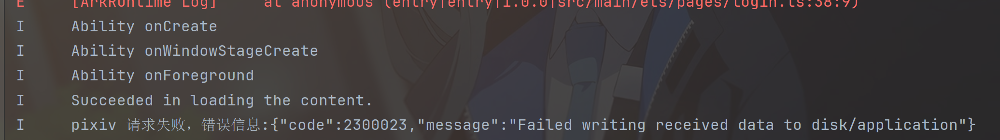
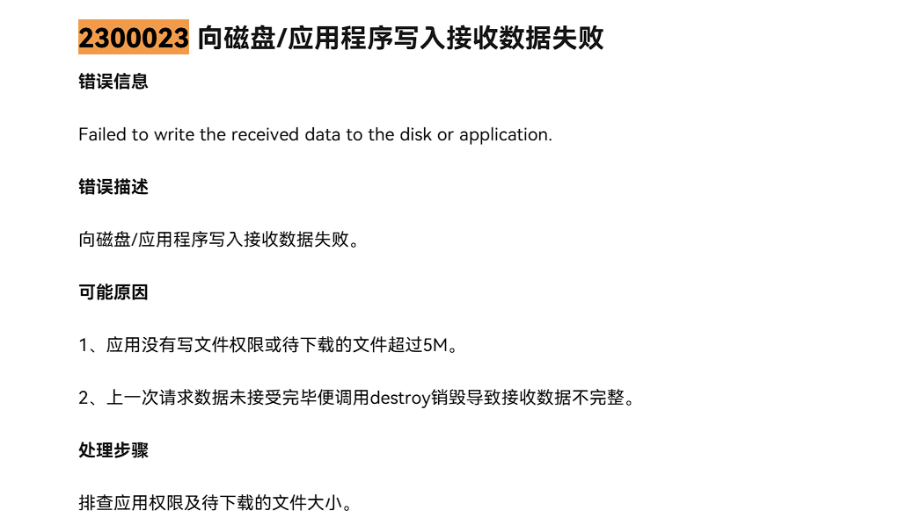
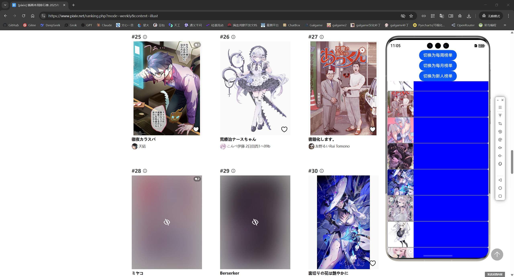

<center>
    <h1>
        P站爬虫
    </h1>
</center>

# 原则(每次开DevEco Studio看一遍)
- 原型开发
  - 基于自己python的P站排行榜爬虫转到鸿蒙里面去
- 优先追求核心功能，功能开发完成前没有必要上`奇技淫巧`
- 优化先滚一边去（赶时间2025.12.22 17:09）
- 文档别写太好，记录要点就行，没必要把软件工程或其他开发的全套流程搬过来，**Real developers ship.**

# 外部问题
如果没有图片有2种情况，1图片是r18需要cookie，2当前IP被禁止了（短时间爬太多了）

单次图片加载网络请求就50次，确实感觉会爆炸，这也是移动端要注意了，待优化，限制并发，比如一次最多 6～8 个请求。
UI 卡顿（JSON parse + push + sort）
## 额外下载
`ohpm install @ohos/imageknife`
666，这个库必须真机，而且不演了，pixiv在chrome无痕下是无法显示部分图的，但是鸿蒙的请求通过了，也就是imageknife不是无痕，他会自动管理cookie和session绕过pixiv的反爬机制。

## 权限
module.json5（这里其实就是网络请求权限）
```json
{
  "module": {
    "requestPermissions": [
      { "name": "ohos.permission.INTERNET" }
    ]
  }
}
```

# 需求建模
- 应用图标和应用名字要改
-  2个界面
   1. 插画主界面
   2. 登陆界面
- 能滚动看插画内容，能按照排行来看
- 能进行登陆后看屏蔽内容
- 数据本地存储(仅存cookies，用sqlite)
- 命名遵守编程规范

## 插画主界面
图片
排名
作者
图片名称
# 优化
P站要VPN，所以除非我是使用代理网址否则正常是不能跑这个应用的。
程序启动做一个检测是否能连通P站（启动的生命周期使用）

# 数据
https://www.pixiv.net/
https://www.pixiv.net/favicon20250122.ico


https://www.pixiv.net/ranking.php?mode=daily&content=illust&p=1&format=json
https://www.pixiv.net/ajax/illust/{作品ID}/pages?lang=zh
https://www.pixiv.net/ajax/illust/138846638?lang=zh

# 开发随笔
改兔图标和名称
B:\study\Harmony\personal_research\entry\src\main\module.json5（这个文件才有效）
B:\study\Harmony\personal_research\AppScope\app.json5（这个文件改无效）
反正都改了就行，鬼记触发条件

构建数据模型->反序列化和序列化,数据模型仅构建需要用到的就行，用不到的放一边

我靠构建完基础的http请求了，但是我忘了加权限，笑了

哈哈哈，python用BeautifulSoup实现，鸿蒙我得搞正则了，早知道就给自己挖坑了
```python
soup = BeautifulSoup(responds.text, "lxml") # 解析整个DOM
json = json.loads(soup.find("script", id="__NEXT_DATA__").text)
print(f"目前排行榜共有{len(json["props"]["pageProps"]["assign"]["contents"])}张图片")
```

涉及到联合请求我这里必须对request进行封装，反正都是get(仅适用pixiv)
```
function request(url: string, callback_function: Function) {
  httpRequest.request(
    url, // 请求URL
    {
      method: http.RequestMethod.GET, // 请求方法：GET
      header: { // 请求头（模拟浏览器请求，我这里就极致参数，其他默认）
        // 用户代理（身份用我windows的chrome模拟）
        "user-agent" : "Mozilla/5.0 (Windows NT 10.0; Win64; x64) AppleWebKit/537.36 (KHTML, like Gecko) Chrome/142.0.0.0 Safari/537.36",
        // 伪装请求来自合法来源（这个关键）
        "referer": "https://www.pixiv.net"
      }
    },
    // 请求回调函数
    (err, response) => {
      // 调用回调函数处理结果
      callback_function(err, response)
      // 在请求完成后销毁实例
      httpRequest.destroy();
    }
  );
}
```

当数据太大时，控制台输出其实是不完整的，处理方式：当数据超过1000字符时，只显示开头500字符和结尾500字符。

对于返回的json直接不做校验，解析为对象也不做异常捕获，没有必要，对于vue框架来说头部一般不改。
但是在ts中必须对正则匹配返回的数据做校验是否存在不然报错

网络请求读写资源耗尽问题

https://developer.huawei.com/consumer/cn/doc/harmonyos-references-V14/js-apis-http-V14?utm_source=chatgpt.com


换个好的吧，流式麻烦

## 图片大小解析
```
"urls": {
   "mini": "https://i.pximg.net/c/48x48/img-master/img/2025/12/21/03/55/49/138845515_p0_square1200.jpg",
   "thumb": "https://i.pximg.net/c/250x250_80_a2/img-master/img/2025/12/21/03/55/49/138845515_p0_square1200.jpg",
   "small": "https://i.pximg.net/c/540x540_70/img-master/img/2025/12/21/03/55/49/138845515_p0_master1200.jpg",
   "regular": "https://i.pximg.net/img-master/img/2025/12/21/03/55/49/138845515_p0_master1200.jpg",
   "original": "https://i.pximg.net/img-original/img/2025/12/21/03/55/49/138845515_p0.png"
}
```
| 字段       | 典型尺寸/形式                   | 是否裁切                 | 清晰度/体积   | URL 特征（你这组）                   | 最适合用在                 |
| ---------- | ------------------------------- | ------------------------ | ------------- | ------------------------------------ | -------------------------- |
| `mini`     | 48×48                           | ✅ 正方形裁切             | 最小/最糊     | `c/48x48/..._square1200.jpg`         | 极小图标、列表角标         |
| `thumb`    | 250×250                         | ✅ 正方形裁切             | 小/清晰度一般 | `c/250x250_80_a2/..._square1200.jpg` | 作品网格缩略图、作者作品墙 |
| `small`    | 540×540 框内（等比）            | ❌ 一般不裁切（保持比例） | 中/较清晰     | `c/540x540_70/..._master1200.jpg`    | 轻量预览、移动端列表       |
| `regular`  | master 级（常见长边≈1200，jpg） | ❌ 保持比例               | 大/清晰       | `img-master/..._master1200.jpg`      | 详情页主图、分享预览       |
| `original` | 原始分辨率/原格式（png/jpg等）  | ❌ 原样                   | 最大/最清晰   | `img-original/..._p0.png`            | 下载保存、二次处理、壁纸   |

如果你还想把 `sl: 4` 也放进同一个表格（解释它是什么等级/热度），我也可以再补一行。


**forEach 不支持异步等待
在 JavaScript/TypeScript 中，forEach 是一个“同步”方法。如果你在 forEach 内部使用 await，它不会等待上一个异步请求完成后再开始下一个**

使用 ArkTS（鸿蒙 HarmonyOS 开发语言）。这是一个非常关键的限制：ArkTS 不支持在 for...of 循环中使用解构声明（即不能直接写 [index, content]）。这是 ArkTS 为了追求极致的性能，对标准 TypeScript 语法做的限制（规范代码，减少运行时的开销）。

```ts
// 遍历对象保存UI需要的数据
    for (const content of rank_data.contents) {
      // console.info("pixiv", `解析的url:https://www.pixiv.net/ajax/illust/${content.illust_id}/pages?lang=zh`)
      // json请求，原图的url在里面
      let respond = await requests.get(`https://www.pixiv.net/ajax/illust/${content.illust_id}/pages?lang=zh`)
      // console.log("pivix", respond.result.toString()) // 查看json返回结果
      // 解析json成对象模型
      const illuset_detail_response: IllustDetailResponse = JSON.parse(respond.result.toString());
      // console.log("pixiv", `原图地址：${illuset_detail_response.body[0].urls.original}`)
      // //添加展示的UI视图数组
      show_model_arr.push({
        image_url: illuset_detail_response.body[0].urls.original, // 图片url
        rank: content.rank, // 排行
        user_name: content.user_name, // 作者
        title: content.title, // 图片名称
      });
    }
```

同步操作请求解析且要二次请求50次太慢了，换异步网络请求然后根据排名排序吧

果然用forEach后解析速度快多了不知道多少倍，模型图片校验也用这个方案爽呀，速度够快

创建一个图片组件，显示电影的图片
?? '' - 如果图片链接不存在，则显示空字符串（即不显示图片）
Image(this.movie.pic?.normal ?? '')
.objectFit(ImageFit.Contain) - 设置图片适应方式为"包含"模式，确保图片完整显示在指定尺寸内，不会变形

图片文档
https://developer.huawei.com/consumer/cn/doc/harmonyos-guides/arkts-graphics-display
https://developer.huawei.com/consumer/cn/doc/atomic-ascf/components-image
想要实现高级网络图片资源请求的官方推荐ImageKnife(确实牛逼，cookie自动管理，直接搬了个浏览器上下文是吧？)
https://gitcode.com/openharmony-tpc/ImageKnife


不演了，在我没有登陆状态下能访问全部图片资源数据



出问题了，设计问题，所以修改了了Requests类
```ts
Button("切换为R18")
  .onClick(() => {
    // 切换r18状态
    this.requests.r18 = !this.requests.r18
    // 根据当前URL类型重新生成URL（这里设计出问题了，我先要改this.requests.r18自动刷url）
    if (this.requests.url === this.requests.dailyUrl) {
      this.requests.url = this.requests.r18 ? this.requests.dailyUrl.replace('daily', 'daily_r18') : this.requests.dailyUrl
    } else if (this.requests.url === this.requests.weeklyUrl) {
      this.requests.url = this.requests.r18 ? this.requests.weeklyUrl.replace('weekly', 'weekly_r18') : this.requests.weeklyUrl
    }
    // 刷新网址
    this.requests.url = this.requests.url
    console.info("pixiv", this.requests.url)

    // 刷新数据（真不想用页面启动的生命周期回调函数，但是再写一个异步函数除了浪费空间没有意义）
    this.aboutToAppear()
  })
```

原来json5在鸿蒙中这个文件是当作json处理+可以重复键值对。有数据校验，我提交git commit的时候IDE给我讲键值重复了，但是又能使用且不报错，仅仅git commit才给出警告


设计图片的请求超时没有意义，直接检测有没有cookie和cookie是否有效就ok了


在第一次渲染时 show_model_arr 还是空数组，所以 this.show_model_arr[0] 是 undefined，RankItem 里一读 show_model.rank 就炸了。
没加载成功/还在加载时：界面也有内容（占位/假数据）
加载成功后：自动替换成真实数据


### 列表计算
1次请求有50个列表，那我在列表35的时候再请求后面的50个也行呀
如果说开头是超过了50我也能销毁呀
但是如果把前面的销毁了，也就是滚轮滚到前面的时候我又得请求50
如何设计呢?


我想要列表滚到35的时候进行请求，滚到85进行请求，以此类推

目标：拿到page

把50个列表当成1页`const currentPage = Math.floor(start / 50)`
还剩15个列表的时候刷新`const triggerIndex = (currentPage + 1) * 50 - 15;`
触发刷新
```
if (start >= triggerIndex) {
  // 更新网络请求url
  this.requests.update_requests(currentPage + 1)
  // 补充列表数据(下一页)
  this.show_model_arr.push(...await this.requests.get_show_model(this.requests.url))
}
```


```
.onScrollIndex(async (start, end) => {
  // console.info("pixiv", start, end, `列表：${start} - ${end}`)
  // 把50个列表当成1页
  const currentPage = Math.floor(start / 50);
  // 还剩15个列表的时候刷新
  const triggerIndex = (currentPage + 1) * 50 - 15;
  // 触发刷新
  if (start >= triggerIndex) {
    // 更新网络请求url
    this.requests.refreshUrls(currentPage + 2, false)
    console.info("pixiv", this.requests.url)
    // 补充列表数据(下一页)
    this.show_model_arr.push(...await this.requests.get_show_model(this.requests.url))
  }
})
```
不行，得否定掉，换个方法，因为排名就是列表数量，省去线程锁的问题
核心要点是触发刷新的条件：列表数-15
需要处理触发刷新条件后停止后续再次触发
        


