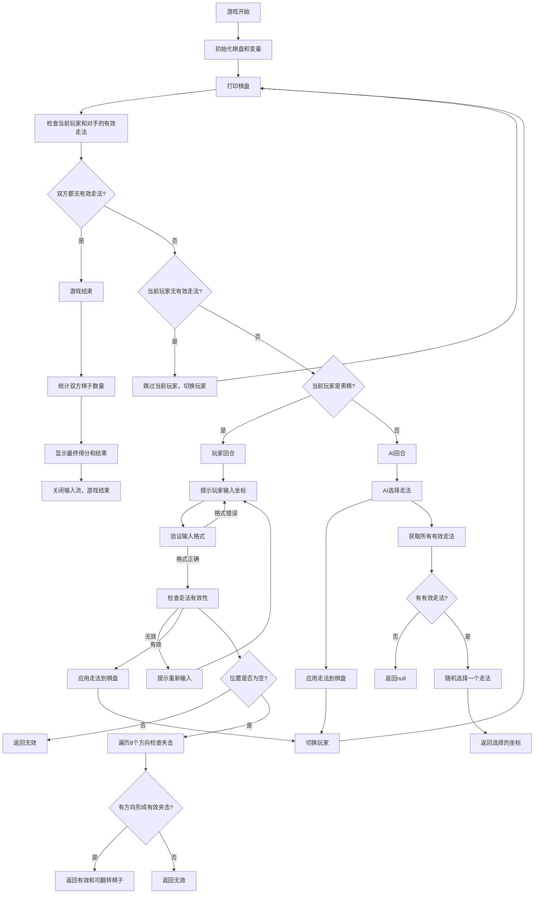

```mermaid
graph TD
    A[游戏开始] --> B[初始化棋盘和变量]
    B --> C[打印棋盘]
    C --> D[检查当前玩家和对手的有效走法]
    
    D --> E{双方都无有效走法?}
    E -->|是| F[游戏结束]
    E -->|否| G{当前玩家无有效走法?}
    
    G -->|是| H[跳过当前玩家，切换玩家]
    H --> C
    
    G -->|否| I{当前玩家是黑棋?}
    
    I -->|是| J[玩家回合]
    J --> K[提示玩家输入坐标]
    K --> L[验证输入格式]
    L -->|格式错误| K
    L -->|格式正确| M[检查走法有效性]
    M -->|无效| N[提示重新输入]
    N --> K
    M -->|有效| O[应用走法到棋盘]
    
    I -->|否| P[AI回合]
    P --> Q[AI选择走法]
    Q --> R[应用走法到棋盘]
    
    O --> S[切换玩家]
    R --> S
    S --> C
    
    F --> T[统计双方棋子数量]
    T --> U[显示最终得分和结果]
    U --> V[关闭输入流，游戏结束]
    
    %% AI决策子流程
    Q --> Q1[获取所有有效走法]
    Q1 --> Q2{有有效走法?}
    Q2 -->|否| Q3[返回null]
    Q2 -->|是| Q4[随机选择一个走法]
    Q4 --> Q5[返回选择的坐标]
    
    %% 走法有效性检查子流程
    M --> M1{位置是否为空?}
    M1 -->|否| M2[返回无效]
    M1 -->|是| M3[遍历8个方向检查夹击]
    M3 --> M4{有方向形成有效夹击?}
    M4 -->|是| M5[返回有效和可翻转棋子]
    M4 -->|否| M6[返回无效]
```