# 任务要求

## 提交形式
提交两张以上程序在虚拟机运行的完整截图。截图需要包含的内容：
1.	虚拟机中正在运行的程序界面。
2.	开发环境编辑器中打开界面对应的ets源码。

## 完成质量要求及踩分点
1.提交至少两张截图，一张开发环境的截图，一张是程序在模拟器中的截图。能提供更多其他步骤截图和开发过程信息酌情加分，总分不超过100分。
2.程序运行界面，输入框要能看到完整清晰的个人姓名，填写各位同学自己的名字，LOGO 照片可自行更换。
3.界面设计简洁美观，有商业软件的风格。
4.截图能看到 ArkUS 的源码，参考 LoginApp2.png。
5.请不要提交一团糟的界面，一团糟的界面可能会不及格。
6.如有将图片粘贴到Word、PowerPoint 文档中提交的，请注意文档中图片的清晰度。

# 开发过程

## 需求文档
1. 完成任务要求
2. 做多一个界面跳转
3. 处理界面跳转的逻辑（代码）

## 资料查找
鸿蒙开发官网
https://developer.huawei.com/consumer/cn/doc/

### 图标
鸿蒙图标资源
https://developer.huawei.com/consumer/cn/design/harmonyos-symbol/

QQ、微信图标
本地翻的

Github图标
https://github.com/logos

Gitee图标（客服对话F12扒过来的）
https://ali-s4-km-pub-std.udeskcs.com/Data/40033735/oss-km-image/MSnB6aj4iB3CfdZp8AsYdWEjZneSWNF7/%E5%BE%AE%E4%BF%A1%E5%9B%BE%E7%89%87_20201106194329.png

老师给的图标
### 文献
界面跳转
https://gitee.com/harmonyos_codelabs/PagesRouter
官网显示不推荐
https://developer.huawei.com/consumer/cn/doc/harmonyos-guides/arkts-routing
更推荐用这个组件导航
https://developer.huawei.com/consumer/cn/doc/harmonyos-guides/arkts-navigation-navigation
对于登陆界面转到另一个界面这种非浏览器隔离式的页面切换官方推荐用路由到组件导航的方式实现，我就用这种方式实现好了，效果上也是一个界面到另一个界面，但是更符合它的ArkUI开发吧，以后路由导航估计要淘汰了。
https://developer.huawei.com/consumer/cn/doc/harmonyos-guides/arkts-router-to-navigation
滚动列表
https://developer.huawei.com/consumer/cn/doc/harmonyos-guides/arkts-layout-development-create-list#%E7%A4%BA%E4%BE%8B%E4%BB%A3%E7%A0%81
## 界面分析
1. 一个图标
2. 一行文本
3. 2个输入框
4. 2个按钮
5. 一个登陆按钮
在此基础上加就行了

## 存在问题
- 登陆界面
输入框的背景颜色不知道，用脚本工具提出出来了`#f4f6f5`
- 路由切换
  Router路由的页面是一个@Entry修饰的Component，每一个页面都需要在main_page.json中声明。
  还得改转场动画，https://developer.huawei.com/consumer/cn/doc/harmonyos-guides/arkts-page-transition-animation
  界面切换动画他是Index界面退出有动画和Main界面进入有动画，即push和pop
- 搜索按钮
  内置的search控件确实没法满足需求，我想要搜索框在中间，但是没有只能手搓，但是搓出来发现焦点有问题，设置的外边距没法让有焦点定位。
- 滚动列表
  之前整的是滚动文本框，现在得搞滚动区域。https://developer.huawei.com/consumer/cn/doc/harmonyos-guides/arkts-layout-development-create-list#%E7%A4%BA%E4%BE%8B%E4%BB%A3%E7%A0%81
## 代码及结果截图
### 登陆界面
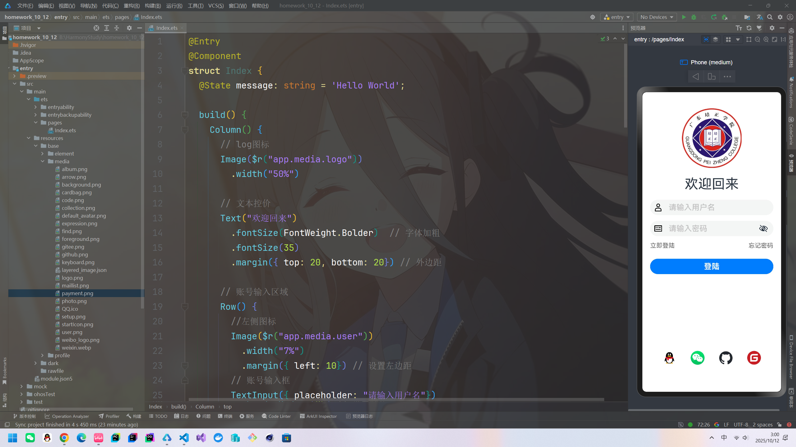
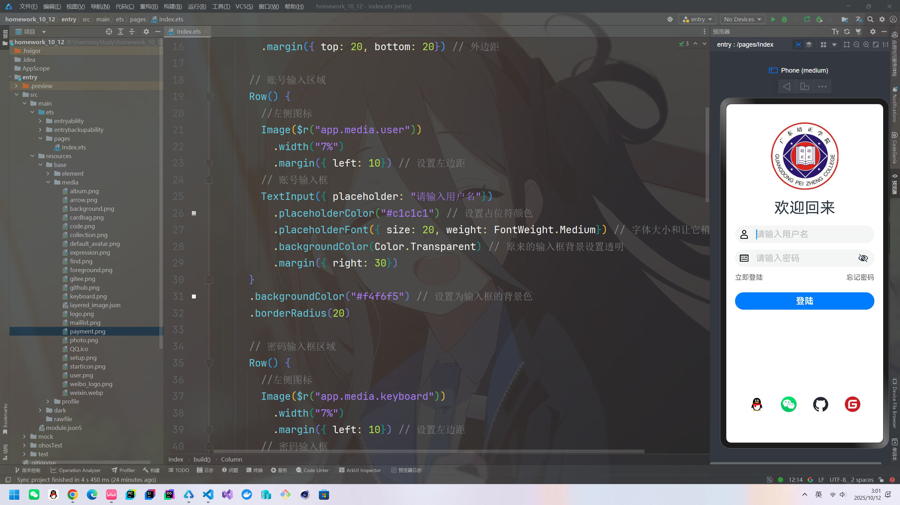
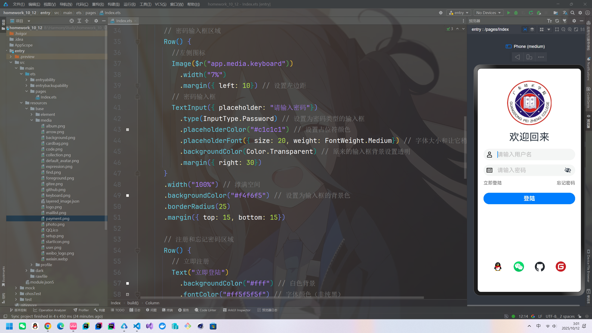
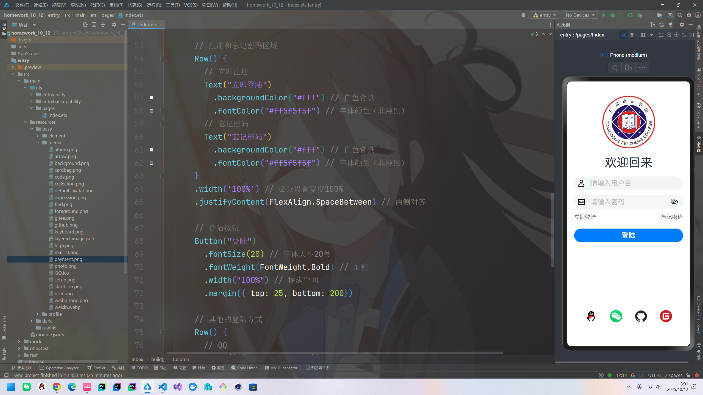
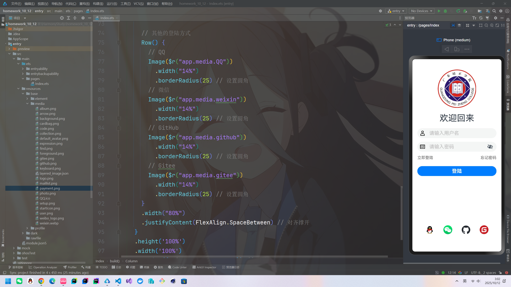
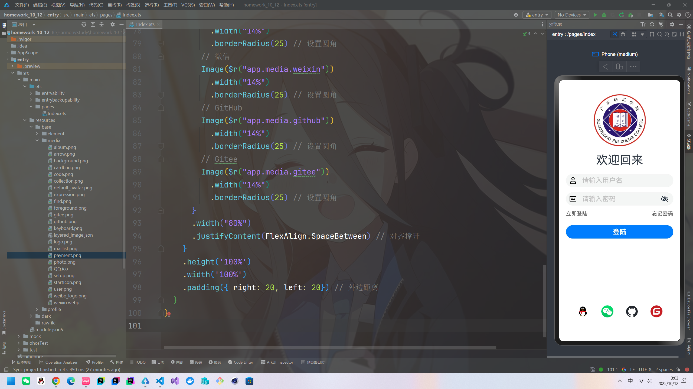
### 应用主界面
添加第二个界面，Main是第二个界面的名字，加完还得按同步
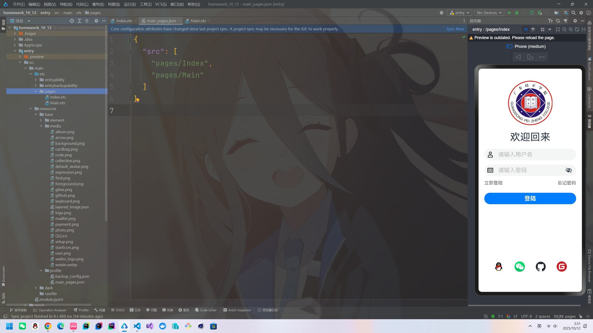
界面跳转的代码
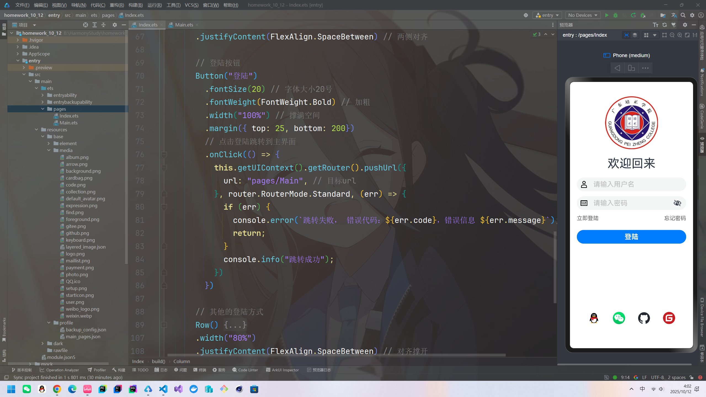
禁用界面跳转出现动画的代码
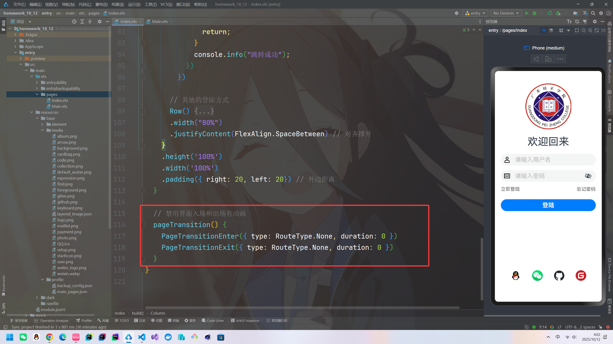

#### 基本布局
先整基础界面布局
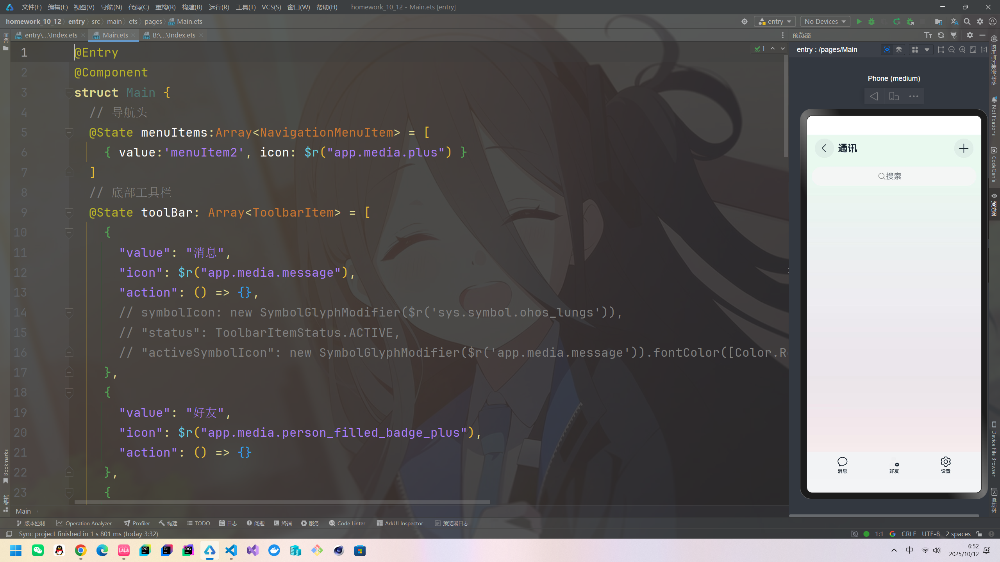
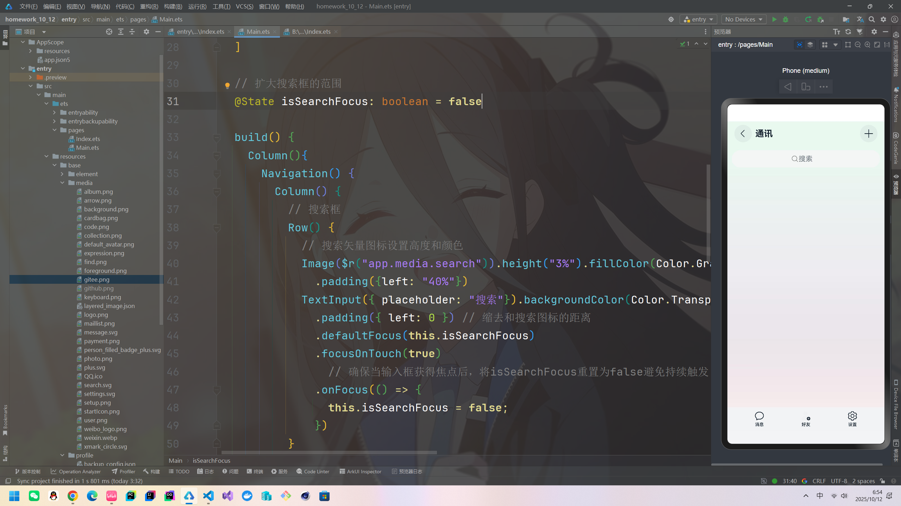
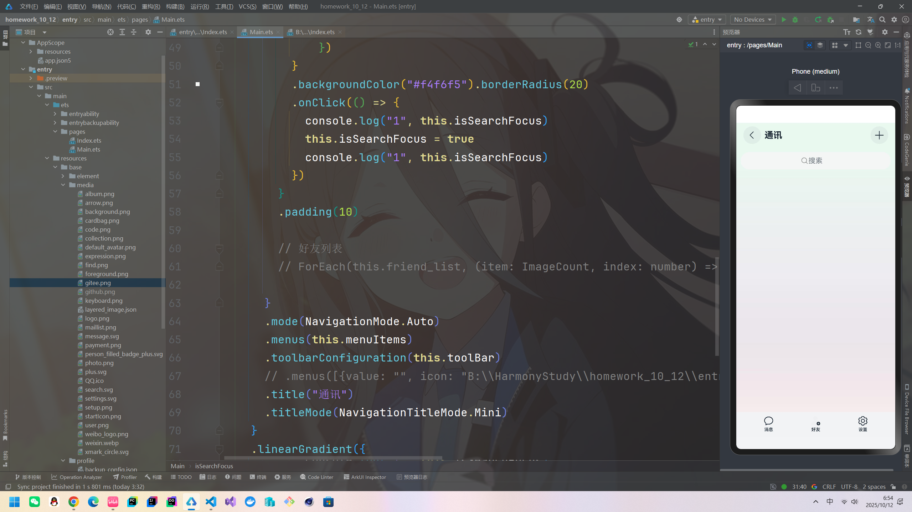
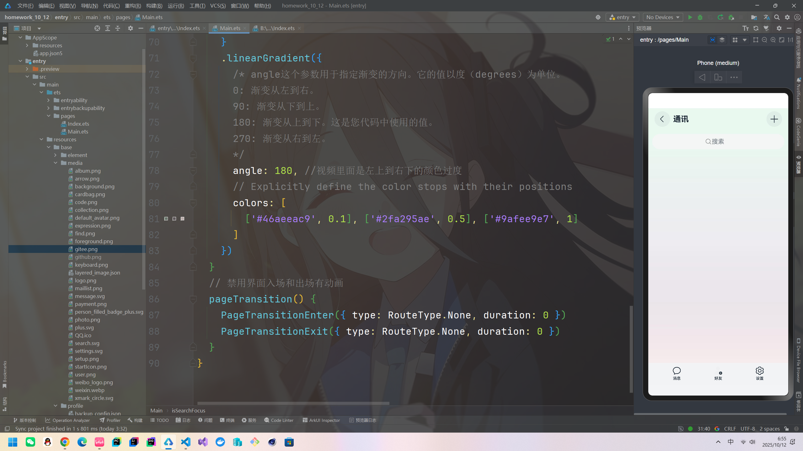

好友图标矢量图的颜色有问题，需要改，然后添加好友列表，好友列表就参考微信吧。`.rotate({ angle: 90 })`让图片旋转，这个或许有用。先定义好好友的数据结构：
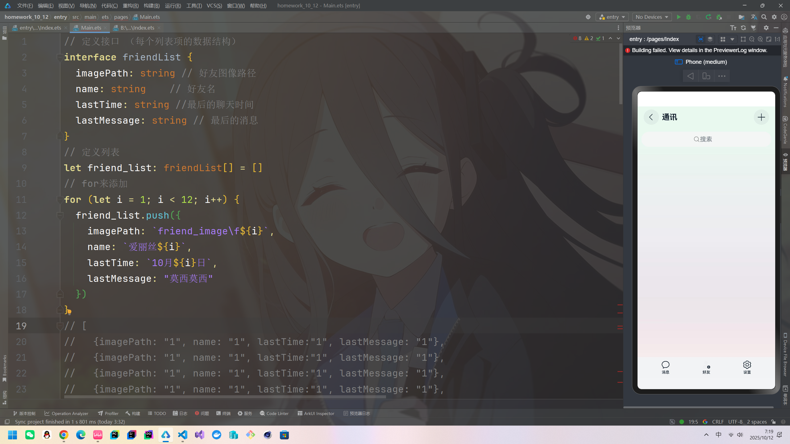

构建好单个好友列表
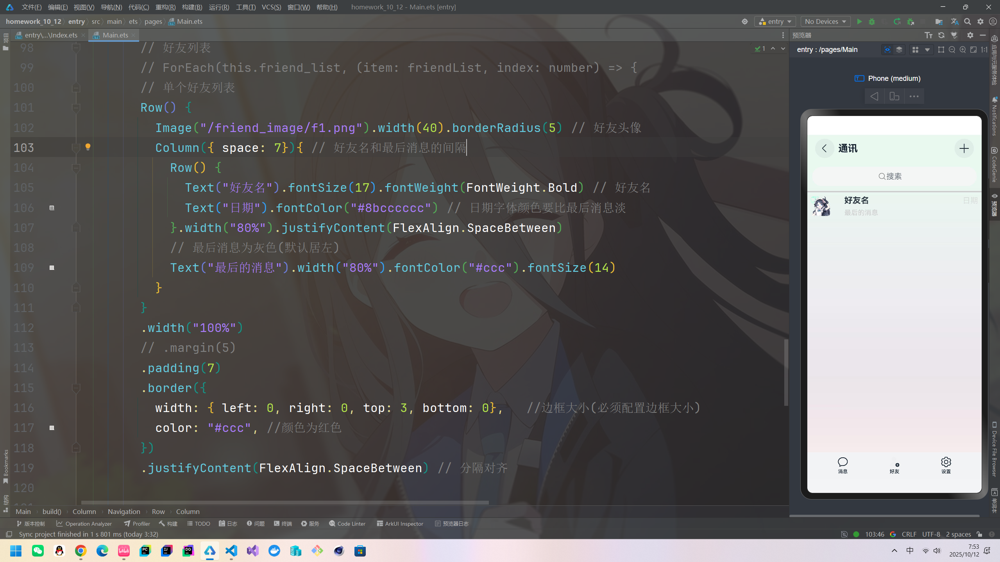

用`ForEach`和`List()`容器来实现多个好友可滚动区域
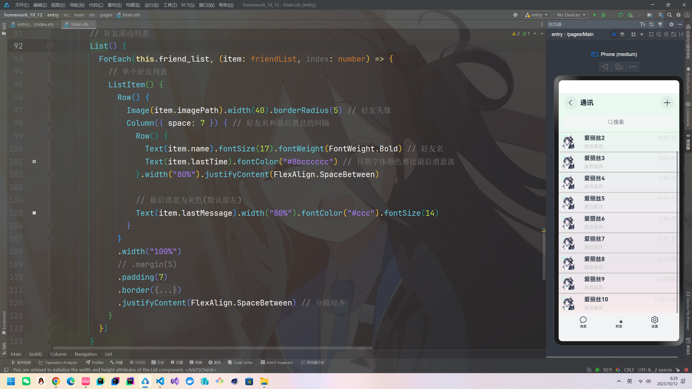

修复好友矢量图黑色问题，缩小搜索框和导航栏的边距
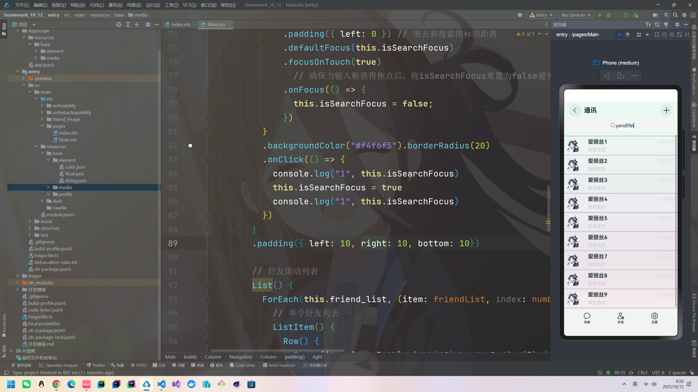

***

# 总结
1. 没有多余的复杂代码，数据交互极少，纯村的UI交互。
2. 列表的使用感觉不如Qt，原生搜索框有待升级。
3. 自定义的搜索框没有好的实现点击整伪装区域也能发生焦点事件
4. 想整个数据处理的（消息发送和回复结合网络请求实现），把好友和设置给圆了，但是组件导航10.11更新变成推荐，还在推进组件完善，按照更新计划会有新控件加入（原生聊天列表）
5. 在最新的鸿蒙中抛弃路由页面跳转确实惊人，跳出了web路由页面跳转的思维，给定模板区域打造更符合鸿蒙UI生态的APP，可惜这也限制了自定义的开放，目前来说遇到的就是**组件导航**的属性和方法的不足，如为什么不在工具栏加多一个激活事件点击后不是切换图片而是给原来的矢量图上色呢？搜索框为什么不能给个图片和文字的位置改变呢？声明式固然好但还是少了自定义的桥段。