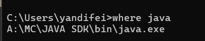
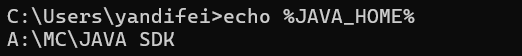

# 环境配置
视频教程：【【Java教程】Servlet+JSP快速入门JavaWeb开发】https://www.bilibili.com/video/BV1rj411u7v7?p=3&vd_source=298465310cd98e6ceddf1afe7d72e7ec

# 配置问题
1. A:\apache-tomcat-11.0.10\webapps\ROOT中的index.jsp文件有问题，一直都没有显示出来，访问网页端口有问题
2. 我的8080端口被open webui 占用了，所以没有办法访问，我在""A:\apache-tomcat-11.0.10\conf\server.xml""对这个文件进行了修改
   ```
       <Connector port="8080" protocol="HTTP/1.1"
               connectionTimeout="20000"
               redirectPort="8443" />
   ```
   port="8080"，我改为了8081
3. 点击"A:\apache-tomcat-11.0.10\bin\startup.bat"这个文件是启动Tomcat服务器
4. 点击"A:\apache-tomcat-11.0.10\bin\shutdown.bat"是关闭Tomcat服务器
5. 控制台会乱码，这是因为电脑的终端默认是GBK，但是tomcat的日志输出是utf8的，去"A:\apache-tomcat-11.0.10\conf\logging.properties"这个文件中。
   ```
   # 原来的
   java.util.logging.ConsoleHandler.encoding = UTF-8
   # 修改为以下的
   java.util.logging.ConsoleHandler.encoding = GBK
   ```
6. 我的JAVA_HOME环境变量没有配置，所以一点击startup.bat之后弹出一个终端就立闪退就是没有配置JAVA_HOME
   查看java路径来配置环境变量
   
   环境变量配置
   
   检查环境变量是否配置成功
   
7. 网页没有正常显示，去A:\apache-tomcat-11.0.10\webapps\ROOT\index.jsp
   去这个文件的末尾找到这个删除就能跑了
   ```
   <%@ page contentType="text/html;charset=UTF-8" %>
   ```

   
# 社区版IDEA创建JSP项目
要在 **IntelliJ IDEA 社区版**中创建 JSP 项目，你需要结合一个外部的 Web 服务器，比如 **Tomcat**。这是因为社区版不直接支持 Java EE (Jakarta EE) 和 Web 框架，无法像旗舰版那样一键创建 Web 项目。

你需要执行以下两个主要步骤：

1.  **创建普通的 Maven 或 Gradle 项目。**
2.  **手动配置 Web 模块和 Tomcat 服务器。**

-----

### 第 1 步：创建 Maven/Gradle 项目

1.  打开 IntelliJ IDEA 社区版。
2.  点击 **"New Project"**。
3.  在左侧选择 **Maven** 或 **Gradle**。
4.  在右侧，确保你选择了正确的 JDK 版本（推荐使用 Java 8 或更高版本）。
5.  点击 **"Next"**，输入项目的 `GroupId` 和 `ArtifactId`，然后点击 **"Create"**。

### 第 2 步：配置项目为 Web 应用

这个步骤是关键，你需要手动添加 Web 框架支持。

#### **修改 `pom.xml` 文件 (Maven)**

打开你项目根目录下的 `pom.xml` 文件，添加以下内容：

1.  **添加 `jakarta.servlet` 和 `jakarta.servlet.jsp` 依赖**

    ```xml
    <dependencies>
        <dependency>
            <groupId>jakarta.servlet</groupId>
            <artifactId>jakarta.servlet-api</artifactId>
            <version>5.0.0</version>
            <scope>provided</scope>
        </dependency>
        <dependency>
            <groupId>jakarta.servlet.jsp</groupId>
            <artifactId>jakarta.servlet.jsp-api</artifactId>
            <version>3.0.0</version>
            <scope>provided</scope>
        </dependency>
    </dependencies>
    ```

2.  **添加 `maven-war-plugin` 打包插件**
    这告诉 Maven 将项目打包成 WAR（Web Application Archive）文件，这是 Tomcat 识别的格式。

    ```xml
    <build>
        <plugins>
            <plugin>
                <groupId>org.apache.maven.plugins</groupId>
                <artifactId>maven-war-plugin</artifactId>
                <version>3.3.2</version>
            </plugin>
        </plugins>
    </build>
    ```

    **注意：** 如果你使用的是 **Java 8** 或更低版本，请将依赖的 `jakarta` 前缀改为 `javax`。

#### **创建 Web 目录结构**

手动创建 Web 应用的标准目录结构：

1.  在项目根目录下的 `src/main` 文件夹中，创建新目录 **`webapp`**。
2.  在 `webapp` 目录下，创建新目录 **`WEB-INF`**。
3.  在 `WEB-INF` 目录下，创建 **`web.xml`** 文件。
4.  在 `webapp` 目录下，创建你的 **`index.jsp`** 文件。

最终的目录结构应如下所示：

```
your-project
├── src
│   └── main
│       └── webapp
│           ├── WEB-INF
│           │   └── web.xml
│           └── index.jsp
└── pom.xml
```

#### **配置 `web.xml` 文件**

在 `WEB-INF` 文件夹中创建的 `web.xml` 文件中，添加以下基本内容：

```xml
<!DOCTYPE web-app PUBLIC "-//Sun Microsystems, Inc.//DTD Web Application 2.3//EN" "http://java.sun.com/dtd/web-application_2_3.dtd" >
<web-app>
  <display-name>Archetype Created Web Application</display-name>
</web-app>
```

#### **编写 `index.jsp` 文件**

在 `webapp` 文件夹中创建的 `index.jsp` 文件中，添加简单的内容来测试：

```jsp
<%@ page language="java" contentType="text/html; charset=UTF-8" pageEncoding="UTF-8"%>
<html>
<head>
    <title>Hello JSP</title>
</head>
<body>
    <h1><%= "Hello, from JSP!" %></h1>
</body>
</html>
```

### 第 3 步：运行项目 (使用 Tomcat)

由于社区版没有内置的 Tomcat 运行配置，你需要手动运行它。

1.  **将项目打包成 WAR 文件**：

      * 在 IDEA 的右侧工具栏中，找到 **Maven**。
      * 展开你的项目，找到 **Lifecycle**，然后双击 **`package`**。
      * Maven 会编译项目并生成一个 `.war` 文件，它通常位于 `target` 目录下。

2.  **将 WAR 文件部署到 Tomcat**：

      * 将生成的 `.war` 文件复制到你的 **Tomcat 安装目录**下的 **`webapps`** 文件夹中。
      * 如果你的 `war` 文件名为 `your-project-1.0-SNAPSHOT.war`，Tomcat 会自动将其解压为一个名为 `your-project-1.0-SNAPSHOT` 的文件夹。

3.  **启动 Tomcat 服务器**：

      * 在 Tomcat 的 `bin` 目录下，运行 **`startup.bat`** (Windows) 或 **`startup.sh`** (macOS/Linux)。

4.  **在浏览器中访问**：

      * 打开浏览器，访问 `http://localhost:8080/your-project-1.0-SNAPSHOT/`。
      * 如果你看到 `Hello, from JSP!`，那么恭喜你，项目创建并运行成功了！