# 环境配置
这个视频里面用的是专业版的IDEA，所有只需要安装好Tomca就行了
视频教程：【【Java教程】Servlet+JSP快速入门JavaWeb开发】https://www.bilibili.com/video/BV1rj411u7v7?p=3&vd_source=298465310cd98e6ceddf1afe7d72e7ec

Apache Tomcat下载官网（我下的是最新版本，最新版本需要配置java17以上的版本）
https://tomcat.apache.org/download-11.cgi
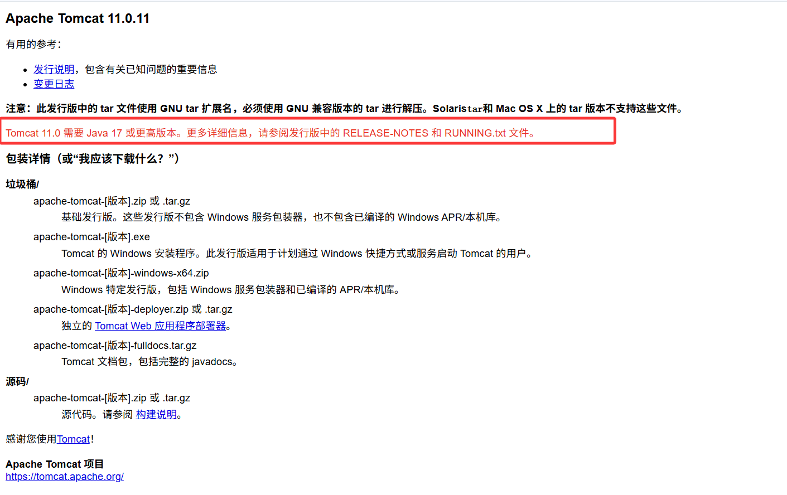

社区版配置（AI还是不大好用 ）
【IDEA社区版配置Tomcat】https://www.bilibili.com/video/BV1yS4y1C7eb?vd_source=298465310cd98e6ceddf1afe7d72e7ec

# 配置问题
1. A:\apache-tomcat-11.0.10\webapps\ROOT中的index.jsp文件有问题，一直都没有显示出来，访问网页端口有问题
2. 我的8080端口被open webui 占用了，所以没有办法访问，我在""A:\apache-tomcat-11.0.10\conf\server.xml""对这个文件进行了修改
   ```
       <Connector port="8080" protocol="HTTP/1.1"
               connectionTimeout="20000"
               redirectPort="8443" />
   ```
   port="8080"，我改为了8081
   为了课程统一我该回去了，没办法，虽然我没法调用我的专属AI但是gemnin和deepseek够我用了
3. 点击"A:\apache-tomcat-11.0.10\bin\startup.bat"这个文件是启动Tomcat服务器
4. 点击"A:\apache-tomcat-11.0.10\bin\shutdown.bat"是关闭Tomcat服务器
5. 控制台会乱码，这是因为电脑的终端默认是GBK，但是tomcat的日志输出是utf8的，去"A:\apache-tomcat-11.0.10\conf\logging.properties"这个文件中。
   ```
   # 原来的
   java.util.logging.ConsoleHandler.encoding = UTF-8
   # 修改为以下的
   java.util.logging.ConsoleHandler.encoding = GBK
   ```

   **我真服了，改完之后cmd的终端不乱码了，但是idea的终端乱码了（我又改回去UTF8了）**
6. 我的JAVA_HOME环境变量没有配置，所以一点击startup.bat之后弹出一个终端就立闪退就是没有配置JAVA_HOME
   查看java路径来配置环境变量
   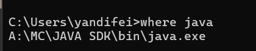
   环境变量配置
   
   检查环境变量是否配置成功
   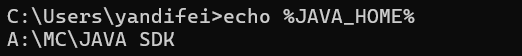
7. 网页没有正常显示，去A:\apache-tomcat-11.0.10\webapps\ROOT\index.jsp
   去这个文件的末尾找到这个删除就能跑了
   ```
   <%@ page contentType="text/html;charset=UTF-8" %>
   ```

# 有3种方案在IDEA创建JSP项目
1. IDEA专业版本
2. 社区版安装插件
   https://www.cfanz.cn/mobile/resource/detail/nlkkovqOJAAmM
   https://blog.csdn.net/qq_52057693/article/details/124274166
   【IDEA社区版配置Tomcat】https://www.bilibili.com/video/BV1yS4y1C7eb?vd_source=298465310cd98e6ceddf1afe7d72e7ec
3. 使用Maven，需要对他很了解


# 社区版IDEA创建项目配置过程
去到IEDA的设置里面，点击插件，搜索Smart Tomcat并下载。下面的Pro版本是30天免费的IDEA的Pro就是这个插件
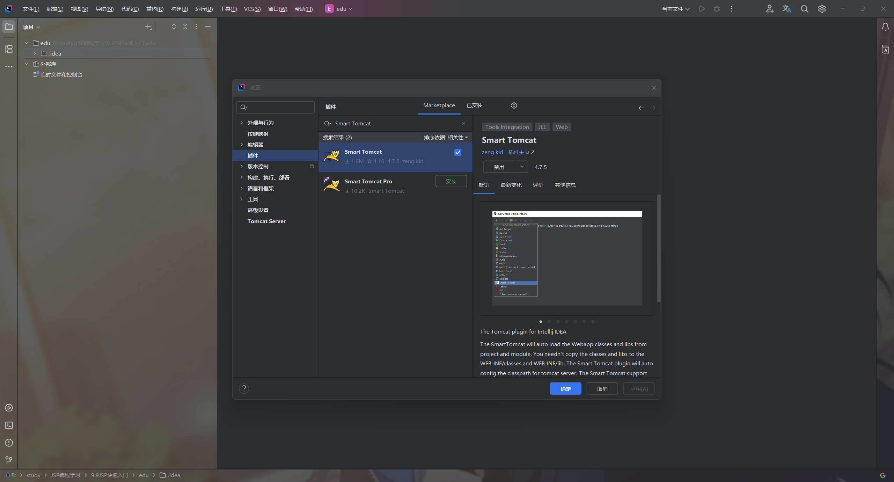
安装完成后配置Tomcat的路径，我在官网下的
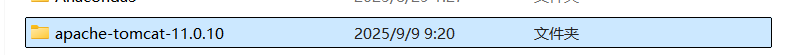
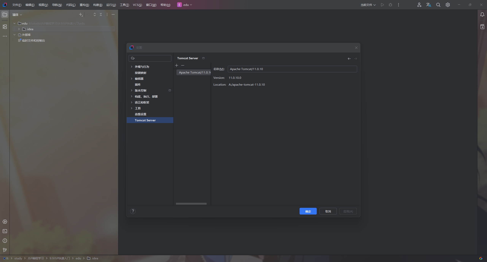

##  填写参数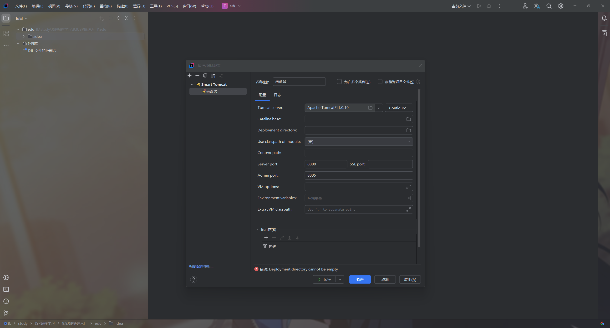
Context path: 这个参数非常重要，这是浏览器路径。例如，如果你填写 /my-app，那么在浏览器中访问你的应用时，URL 就会是 http://localhost:8080/my-app/。我直接写/

我去`A:\apache-tomcat-11.0.10\webapps`（tomcat下载路径的webapps文件夹）直接载入给Deployment directory这个参数
---

### 参数解释与获取方法
AI
#### 配置
* **名称(Name):** 你可以为这个配置取一个自定义的名字。这只是为了方便你在多个配置之间进行区分，比如你可以命名为 **JSP-Web-App**。这个参数由你自己决定，不需要从外部获取。
* **Tomcat server:** 指定你正在使用的 Tomcat 服务器版本。你的截图中显示的是 **Apache Tomcat/11.0.10**。如果你已经正确配置了 IntelliJ IDEA，它会自动识别。如果没有，你可以点击右侧的 **Configure...** 按钮，指定你本地 Tomcat 安装目录。
* **Catalina base:** 这是 Tomcat 服务器的基础工作目录。它通常指向 Tomcat 的安装目录，用于存放服务器的配置和部署文件。IntelliJ IDEA 通常会自动填充这个路径，你无需手动更改。
* **Deployment directory:** 这是你的 Web 应用要部署到 Tomcat 的目标目录。**这个参数非常重要**。你的 Web 项目编译后生成的 WAR 包或解压后的 Web 应用文件，应该放在 Tomcat 的 `webapps` 目录下。你的截图显示的是 `A:\apache-tomcat-11.0.10\conf`，这是错误的。正确的路径应该是 **`A:\apache-tomcat-11.0.10\webapps`** 或者你项目编译输出的目录。
* **Use classpath of module:** 这个下拉菜单用来指定你需要部署的 Web 项目模块。你的截图显示的是 **[无]**，这就是为什么会出现“**错误：Module is not selected**”的提示。你应该点击这个下拉菜单，选择你的 **JSP** 项目模块。这是告诉 IntelliJ IDEA 运行哪个项目。
* **Context path:** 这是你的 Web 应用在 Tomcat 上的访问路径。例如，如果你填写 **/**，那么访问你的应用 URL 就是 `http://localhost:8080/`。如果填写 **`/my-app`**，URL 就是 `http://localhost:8080/my-app/`。你应该根据自己的需求填写，最简单的就是填写斜杠 **`/`**。

#### 服务器端口
* **Server port:** Tomcat 监听 HTTP 请求的端口号，默认是 **8080**。如果这个端口被其他程序占用，你需要更改为其他未被使用的端口，比如 8081 或 9090。
* **Admin port:** 这是 Tomcat 的管理端口，默认是 **8005**。通常不需要更改。

#### 其他参数
* **VM options:** 虚拟机选项，用于调整 JVM 参数，比如设置内存大小（-Xms、-Xmx）。通常在开发初期不需要填写。
* **Environment variables:** 环境变量，用于为 Tomcat 进程设置环境变量。通常也不需要填写。
* **Extra JVM classpath:** 额外的 JVM 类路径，用于添加额外的类库。通常不需要填写。

***
# 配置成功情况
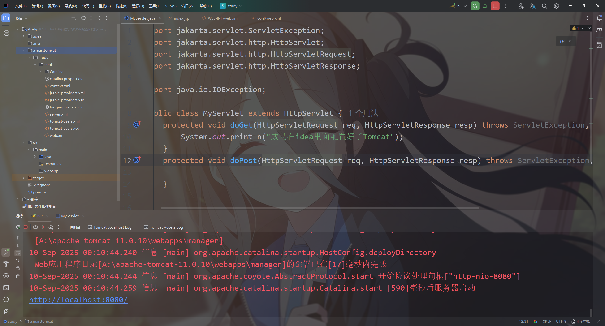
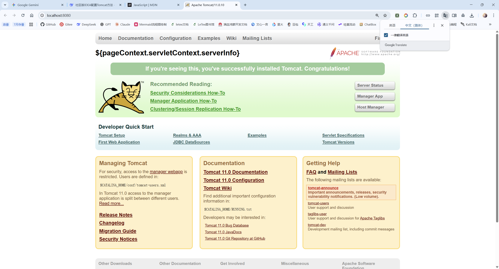
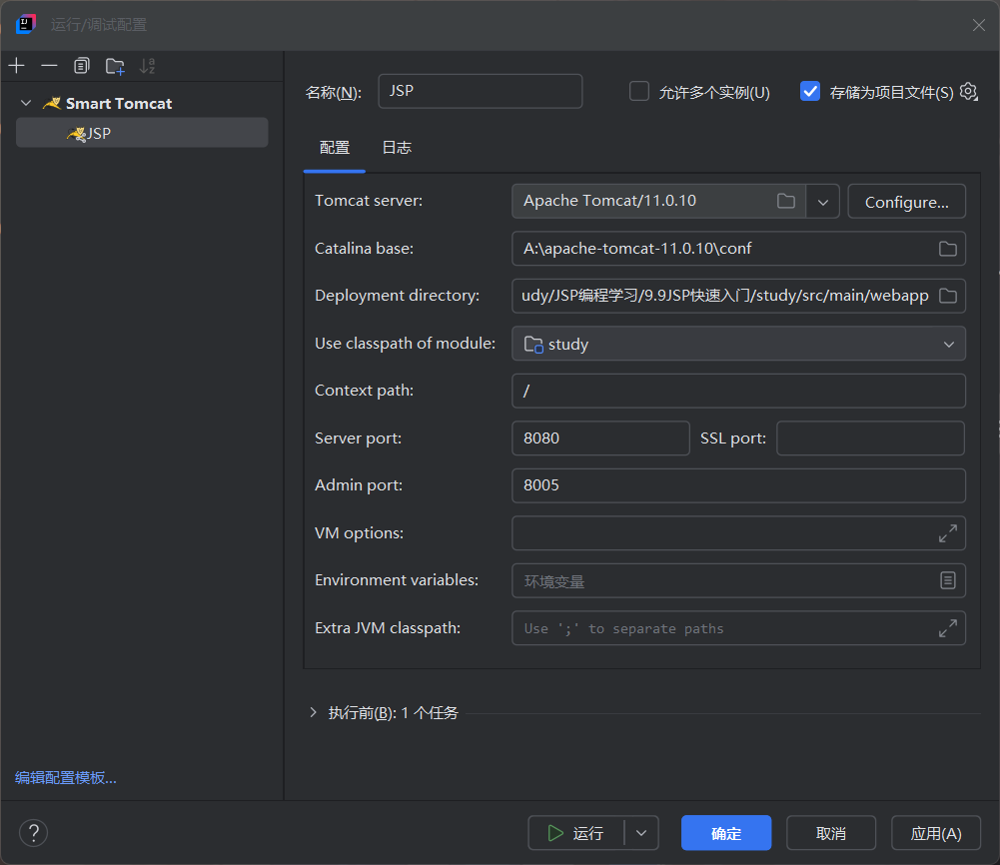
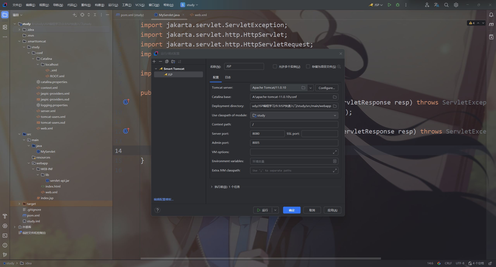