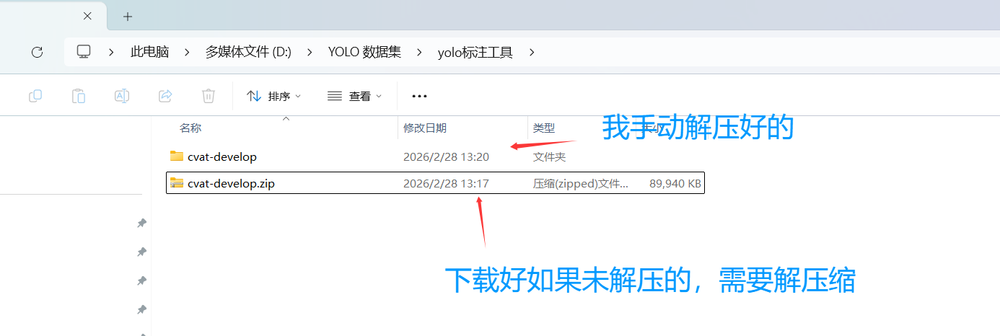
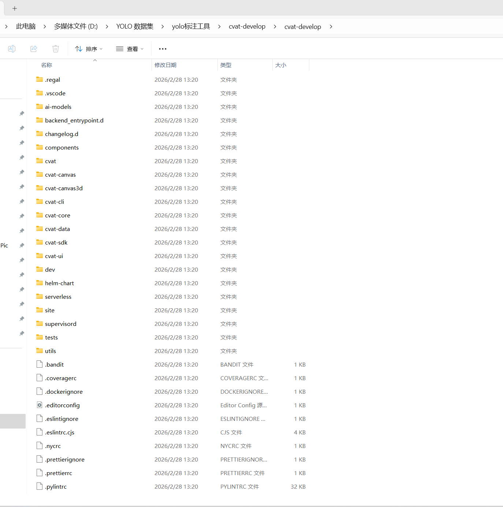
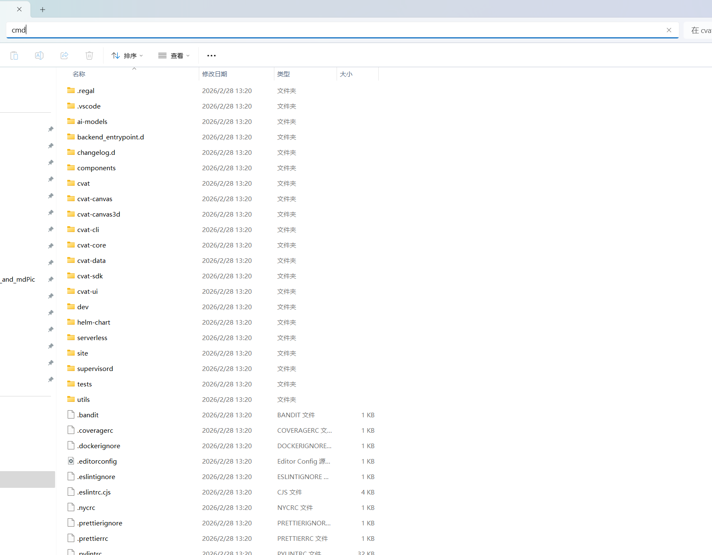
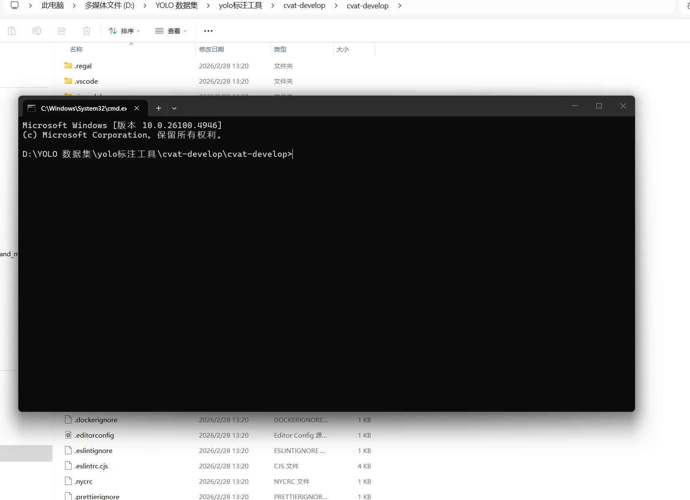
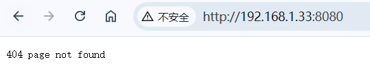
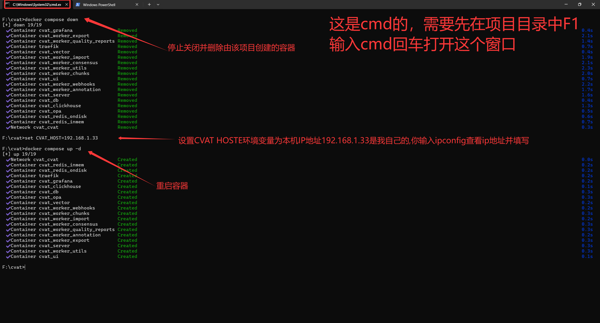
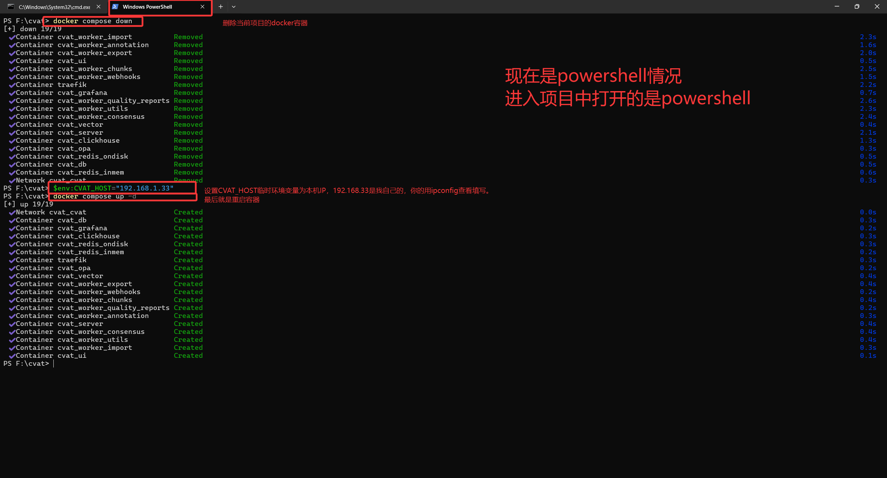
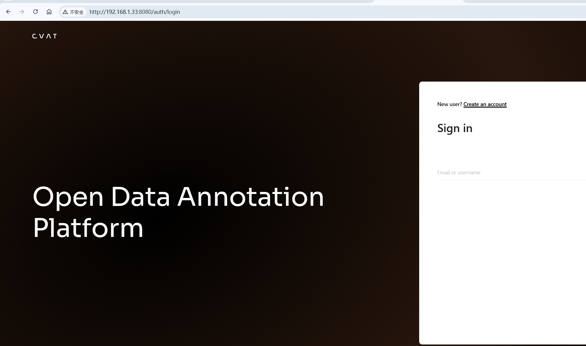

<h1>🚀 CVAT部署一篇文章全部搞定</h1>

😎 包括CVAT(计算机视觉标注工具)部署及其遇到的相关问题

笔记时间：2026.2.28 📅，如果笔记过时就让AI联网以下链接难道最新的数据进行指导 🤖

这个标注工具可以线上https://app.cvat.ai/auth/login 注册账号云端标注也可以 🌥️，但是国内访问速度很慢(我这边觉得卡) 🐢，所以部署到本地使用 💻，如果不想折腾下面的东西直接访问网址注册就可以用了

国内用户和小白直接看全文 👀，有vpn环境git、docker的直接看`访问并使用`的内容

官方文档参考：
https://github.com/cvat-ai/cvat
https://docs.cvat.ai/docs/administration/community/basics/installation/

https://www.docker.com/
https://docs.docker.com/desktop/setup/install/linux/

# 📖 CVAT简介
CVAT的全称是**Computer Vision Annotation Tool**（计算机视觉标注工具）。它最初由Intel开发并于2018年开源，现已成为OpenCV社区的核心项目之一 🔓。

简单来说，CVAT是一个**基于网页的、功能强大的专用标注平台** 🎯。它的核心价值在于为图像和视频数据提供了一套高效、精准的标注解决方案，将原始数据转化为AI模型可以理解的标准化数据集 🗂️。你可以把它想象成一个为企业级数据标注而生的“专业画图工具”，其“画布”是海量的图像与视频 🖼️，“画笔”是边界框、多边形、关键点等专业工具 🖌️，“作品”则是用于训练AI的黄金标准数据 💎。

### 🚀 CVAT优势

CVAT的流行绝非偶然，它精准地击中了企业在数据准备阶段的核心痛点 🎯。其成功可以归纳为以下三大关键因素：

**1. 效率与质量的极致平衡**  
在效率与质量的极致平衡方面，CVAT通过 **AI辅助标注** 🤖，可无缝集成YOLO、Segment Anything等模型，实现自动预标注，人工仅需检查修正，标注速度提升可达10倍；它支持**全类型数据** 📁，完美支持图像与**视频标注** 🎥，并提供关键帧插值功能，极大提升视频数据处理效率；同时拥有**丰富的工具链** 🛠️，从矩形、多边形到**3D立方体** 🧊、**语义分割画笔** 🖍️，覆盖绝大多数计算机视觉任务。这精准解决了**标注成本高、周期长的问题** 💰，在保证数据质量的同时，大幅缩短数据准备时间，加速AI模型迭代。

**2. 数据安全与部署灵活性**  
在数据安全与部署灵活性方面，CVAT提供**开源社区版 (Self-Hosted)** 🏠，企业可完全在自己的服务器上部署，数据不出本地，满足严格的合规性与安全要求 🔒；同时支持**多云/本地部署** ☁️，企业版提供更高级的私有化部署、单点登录和权限管控；此外还有**云端托管版 (CVAT.ai)** 🌐，为中小团队或项目初期提供即开即用的便捷选项。这完美**解决了核心数据资产的安全顾虑** 🛡️，让金融、医疗、安防等敏感行业也能放心使用，同时灵活的部署选项适应企业不同发展阶段的需求。

**3. 专业的团队协作与管理**  
在专业的团队协作与管理方面，CVAT内置**多角色管理系统** 👥，包含管理员、项目经理、标注员、审核员等清晰的角色分工，任务流转高效；通过**质量控制机制** ✅，支持设置“黄金数据集”进行质量考核，或进行交叉验证，确保最终交付数据的可靠性；并形成**完整的项目流程** 🔄，从项目创建、任务分配、标注执行到审核导出的流程闭环，便于规模化管理和追溯。这有效**解决了团队协作混乱、质量管理难的问题** 🤝，使数据标注从“手工作坊”升级为可管控、可复制的标准化流程，支持大规模、分布式团队的协同工作。

总而言之，CVAT之所以在企业中出名，是因为它不仅仅是一个标注工具，更是一个集**高效生产力、数据安全性和团队协作力**于一体的企业级数据解决方案 🏆。它成功地将开源社区的创新活力与企业对稳定、安全、可扩展的需求结合起来，因此成为了众多企业构建高质量AI数据集的**事实标准** 🌟。

### 💡 总结

总而言之，CVAT之所以在企业中出名，是因为它不仅仅是一个标注工具，更是一个集**高效生产力、数据安全性和团队协作力**于一体的企业级数据解决方案 🏆。它成功地将开源社区的创新活力与企业对稳定、安全、可扩展的需求结合起来，因此成为了众多企业构建高质量AI数据集的**事实标准** 🌟。

# ⚙️ 部署过程
## 🛠️ 准备好环境：
- Windows或Linux系统(发行榜随意) 💻
- 准备好docker 🐳
  - linux(需要自己部署):https://docs.docker.com/desktop/setup/install/linux/
  - windows(直接访问就能下载)：https://desktop.docker.com/win/main/arm64/Docker%20Desktop%20Installer.exe?utm_source=docker&utm_medium=webreferral&utm_campaign=dd-smartbutton&utm_location=module&_gl=1*78raxm*_gcl_au*MTE3Njc4Mjk5Ny4xNzcyMjU0Mjcx*_ga*MTQ4NjUwMTY3NC4xNzY0ODExNjU0*_ga_XJWPQMJYHQ*czE3NzIyNTQyNzEkbzIkZzEkdDE3NzIyNTQzMzMkajYwJGwwJG0

## 📥 克隆或下载项目
有git就直接找个文件夹`git clone https://github.com/cvat-ai/cvat` 🐙
没有就直接去`https://github.com/cvat-ai/cvat`下载，访问不了就下载一个[steam++(现在叫Watt Toolkit)](https://steampp.net/)然后开启去访问GitHub 🛜，下载项目(实在下载不了就访问`https://github.akams.cn/`使用代理输入`https://github.com/cvat-ai/cvat/archive/refs/heads/develop.zip`链接)。

以上目的都是下载项目，即使没有steam++或git只要最后把`https://github.com/cvat-ai/cvat`的项目弄到手就行 📦，如果被墙（访问超时或404）就把`克隆或下载项目`内容扔给AI(deepseek或豆包)让他教你操作 🤓

## 🐳 CVAT部署
部署最好的方式就是查看官方的部署文档（最正规步骤最全面）：
https://docs.cvat.ai/docs/administration/community/basics/installation/

我是windows系统且直接部署要了docker,这边我就直接用docker部署了 🐋，linux系统的话直接看官方文档就行。
我这边有vpn环境，没有稳定环境的就根据文档来操作[(docker容器需要换源，之前搞过就不用搞了)](https://docs.cvat.ai/docs/administration/community/basics/installation/#sources-for-users-from-china) 🔌

接下来的都是关于wiondows系统的部署，linux系统的话直接看官方文档就行。后面内容是windows的不是在Linux实践的未必通用。以后再写Linux的 📝

### 🪟 Windows部署
下载或克隆项目后(如果有解压就把他解压了，解压完成后放到合适的地方，比如D盘根目录)，进入项目中

入文件夹中看到这些文件就ok了 ✅

点击键盘F4输入`cmd`回车 ⌨️


以上步骤就是进入项目中并开启cmd（终端），win+R输入cmd然后cd到项目路径中都行

#### 🐳 docker部署指令
下载(或更新)容器：`docker compose up -d` ⬇️
如果下载卡顿或失败请回退到`CVAT部署`进行换源 🔄（有vpn环境就直接重试`docker compose up -d`指令就行了）

#### 👤 创建超级用户
默认情况下，用户没有查看任务列表的权限，所以下一步是创建一个超级用户（创不创无所谓，不是团队仅仅是个人使用的话没必要折腾，超级用户可以使用管理面板为其他用户分配正确的组，人话就是给成员分配职责和任务）👑:
docker exec -it cvat_server bash -ic 'python3 ~/manage.py createsuperuser'
如果您没有安装 winpty 或上述命令不起作用，您还可以尝试以下方法：
```bash
# enter docker image first
docker exec -it cvat_server /bin/bash
# then run
python3 ~/manage.py createsuperuser
```

#### 🌐 访问并使用
此时你已经部署好了项目了（是的，docker部署就是如此简单）🎉
实际上对于有环境的真正干活的就只是1条指令`docker compose up -d`完成这一切而已 ✨
最后浏览器输入`http://localhost:8080/`就可以了 🖥️，请记住：如果你关闭了docker容器，那么你将无法访问CVAT，所以请确保docker容器始终在运行

`以上方法创建完成后其实仅仅是个人使用，无法进行团队合作，接下来折腾团队合作的，如果你要要团队合作的话就继续往下看` 👥

***

# 🎯 CVAT使用
由于CVAT的使用是基于界面的，本作为md文档无法更好的演示和撰写，为什么大家更好的学习推荐直接看视频(B站搜：CVAT使用) 🎬 或直接去官网https://docs.cvat.ai/docs/workspace/ 学习（官网写的详略得当，这里没有必要再做无意义的帮运和概括）📚。

***

# ❓ 问题
一切以官方文档为准:https://docs.cvat.ai/docs/administration/community/basics/installation/
不会的名词直接找或者问AI解决 💬

## 👥 团队协作问题
项目docker部署后别人无法访问（404 page not found）：

原因：部署文件默认是仅仅允许本地(localhost)访问，所以别人无法访问 🚫。如果需要挂载到网址请直接在你的linux主机bash上(必须自己先进入项目文件夹中)
文档参考：https://docs.cvat.ai/docs/administration/community/basics/installation/#use-your-own-domain
```bash
# 以下命令停止并删除由yml文件创建的容器和网络up
docker compose down
export CVAT_HOST=你的域名
```

解决方案：
1. 方案一（官方，但是仅仅是Linux不适用，我这里进行迁移到window）：如果部署了容器且运行的话先在项目目录下F1输入cmd回车打开cmd终端（这里的终端必须是cmd，如果你是powershell的话接下来使用的指令你要做好区分）`docker compose down`后在在cmd窗口中输入`set CVAT_HOST=你电脑IP`(powershell输入`$env:CVAT_HOST=你电脑IP`)后再输入`docker compose up -d`就可以了 ⚙️

powershell方案：

2. 方案二：修改配置文件`docker-compose.yml`，把`localhost全都改成电脑当前IP`，然后在项目目录下F1输入cmd回车打开cmd终端输入指令`docker compose down`和`docker compose up -d` 🔧
3. 方案三：使用docker配置覆盖文件，在项目目录中创建`docker-compose.override.yml`文件，win+R输入cmd使用`ipconfig`指令查看当前电脑IP（出来一坨内容自己看不懂直接扔AI）🤔，然后在`docker-compose.override.yml`中输入以下内容：
    ```yaml
    services:
    cvat_server:
        environment:
        CVAT_HOST: 需要替换你电脑的IP
        labels:
        - "traefik.http.routers.cvat.rule=Host(`替换你电脑的IP`) && (PathPrefix(`/api/`) || PathPrefix(`/static/`) || PathPrefix(`/admin`) || PathPrefix(`/django-rq`))"

    cvat_ui:
        environment:
        CVAT_HOST: 需要替换你电脑的IP
        labels:
        - "traefik.http.routers.cvat-ui.rule=Host(`替换你电脑的IP`)"

    traefik:
        environment:
        CVAT_HOST: 需要替换你电脑的IP
    ```
    完成后输入并执行`docker compose down`和`docker compose up -d`指令就行了。 📝

**最后浏览器访问`本机IP:8080`即可** ✅


如果做完这些别人依据无法访问那就是你的网络配置有问题了，请根据以下步骤排查 🔍：
1. 不在同一个广播域(局域网)下访问`主机IP:8080` 🌐
2. 防火墙阻止了访问`主机IP:8080` 🔥
3. 路由器阻止了访问`主机IP:8080` 📡
4. 火绒或者360等杀毒软件阻止了8080端口 🛡️
5. 防火墙阻止了docker的内网暴露 ⚠️

正常情况到这一步不会到这一步，如果你认真根据上面步骤做了没有出错那么就不这个文档扔给AI进行网络配置文件的排查 📨。

**注意：如果你的IP位置变换了你得重新来一遍，只要设置好IP后（环境变量或文件）`docker compose up -d`就可以了，一劳永逸就是直接把IP换成你的主机名(ipconfig拿到)** 🔄

## 💾 数据集存储问题
针对 CVAT 部署中由于 F 盘空间不足（96GB）无法支撑 300GB 数据集的问题，官方和技术实践中主要有以下几种成熟的解决方案 🧠。

由于 CVAT 的数据（包括上传的任务、提取的帧、生成的缓存）默认存储在 Docker 的 **Volume（卷）** 中，最直接的方法就是**修改存储路径** 📂。

### 方案一：迁移 Docker 根目录（推荐，最彻底） ✅

默认数据存到你项目部署的盘中，如果你当前盘已满，可以将 Docker 的所有数据（包括镜像和卷）整体迁移到空间更大的磁盘（比如合并后的其他分区，或者挂载的大容量云硬盘） 💽。

1. **停止 CVAT：** 在 CVAT 目录下运行 `docker compose down` ⏹️。
2. **修改 Docker 配置：**
* 在 Windows Docker Desktop 中：点击 **Settings -> Resources -> Advanced**，修改 `Disk image location` 到空间更大的盘符 ⚙️。
* 在 Linux 下：修改 `/etc/docker/daemon.json` 中的 `"data-root"` 🐧。

3. **重启 Docker**，它会自动搬迁现有数据 🔄。

### 方案二：利用“云存储”或“外部文件系统” (Cloud Storage) ☁️

CVAT 官方支持 **Cloud Storage** 功能，这是解决本地硬盘不足的最佳方案 🌟。你可以将 300GB 的数据集存放在 AWS S3、Azure Blob、Google Cloud Storage 或通过 **MinIO** 自建的私有对象存储中。

### 方案三：使用本地“共享目录”挂载 (Connected File Share) 🔗

如果你想直接读取其他盘（如 D 盘、E 盘）上的原始数据，而不希望将它们拷贝到 Docker 的卷里：

1. **准备数据：** 将 300GB 数据放在比如 `E:\cvat_data_raw` 📁。
2. **修改 `docker-compose.override.yml`：**
创建一个名为 `docker-compose.override.yml` 的文件（或修改现有的），将外部路径映射进 `cvat_server`：
```yaml
services:
  cvat_server:
    volumes:
      - /E/cvat_data_raw:/home/django/share:ro
```

3. **在界面创建任务：** 在创建 Task 的数据来源中选择 **Connected File Share**，你就能直接看到并选择 E 盘里的文件 🖱️。

### 方案四：软链接迁移（Windows 适用） 🔗

如果你不想动 Docker 配置，只想把特定的 CVAT 卷挪走：

1. 停止 CVAT 和 Docker ⏸️。
2. 找到 F 盘中 Docker 存储 `cvat_data` 卷的物理文件夹 🔍。
3. 将该文件夹**剪切**到空间足够大的盘（如 `G:\cvat_data_large`） ✂️。
4. 使用 Windows 的 `mklink /j` 命令创建一个目录联接：
`mklink /j "F:\原本的Docker路径\cvat_data" "G:\cvat_data_large"` 🔗
5. 这样 Docker 读写 F 盘路径时，实际是在读写 G 盘 💡。

### 总结建议 💭

* **如果追求极致性能且有大硬盘：** 用 **方案一** 整体迁移 Docker 🏆。
* **如果不希望本地存数据：** 用 **方案二** 挂载云存储 ☁️。
* **如果数据已经在其他盘了：** 用 **方案三** 的 `Connected File Share` ✅。