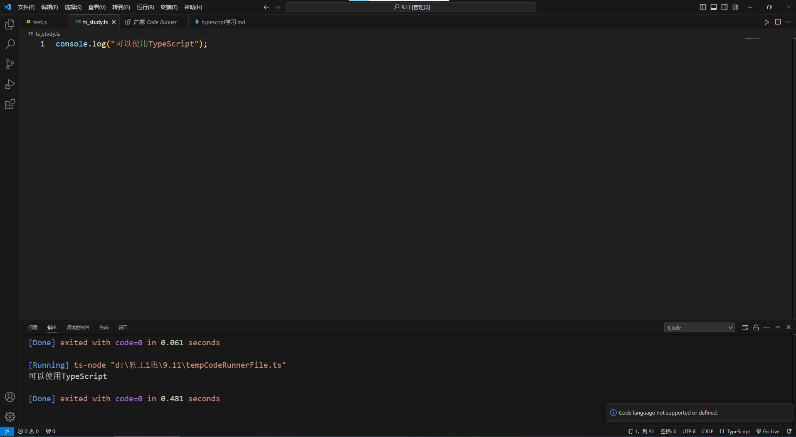

全局安装 ts-node
通过 npm 全局安装 ts-node：
cmd执行下面这个指令
```
npm install -g ts-node
```

# 细节
ts可以使用tsc转为js
然后使用node去执行js代码

# tsc
可以仅仅安装tsc然后去跑js代码

# ts-node
这里面有tsc也有node

# 机房的shell被限制了
```
PS D:\软工1班\9.11> ts-node ts_study.ts
ts-node : 无法加载文件 C:\Users\Administrator\AppData\Roaming\npm\ts-node.ps1，因为在此系统上禁止运行脚本。有关详细信息，请参阅 https:/go.microsoft.com/fwlink/?LinkID=135170 中的 about_Execution_Policies。
所在位置 行:1 字符: 1
+ ts-node ts_study.ts
+ ~~~~~~~
    + CategoryInfo          : SecurityError: (:) []，PSSecurityException
    + FullyQualifiedErrorId : UnauthorizedAccess
```

使用这个指令去掉限制执行你的ts代码
```
Set-ExecutionPolicy -ExecutionPolicy RemoteSigned -Scope Process
```

# 在vscode里面跑typescript
```
console.log("可以使用TypeScript");
```
这个语句运行成功了，但是终端没有任何输出。
运行ts-node通常需要tsconfig.json这个配置文件，但ts-node有时能免配置运行。
我估计新的typescript为了规范搞成了必须要这个配置文件，便于项目管理和检查
解决方案：
1. 直接在这个目录下创建tsconfig.json文件就行了。
2. 使用`tsc --init`指引，但是机房的电脑没有配置tsc的环境变量。

# vscode插件运行ts
每次都有在终端敲执行代码太累了
我这里直接用`Code Runner`这个插件
这个插件能直接跑js和ts
但是ts还是需要以上的环境配置，`tsconfig.json`和`tsc`这个编译器。
