<h1>
树和二叉树、图
</h1>

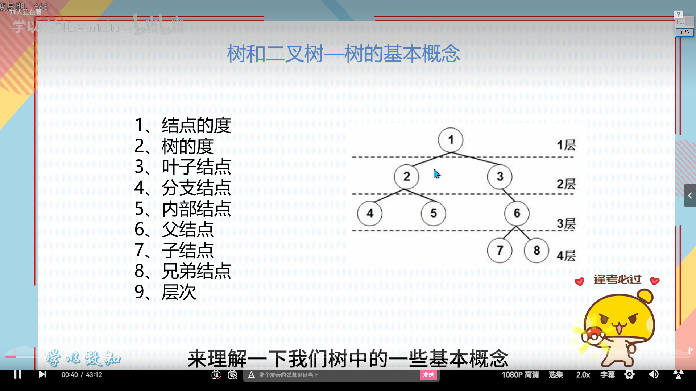

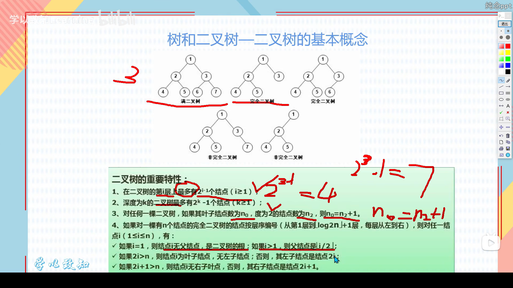

这里真的讲得一坨呀，要不是我学过我还真是听不懂呀
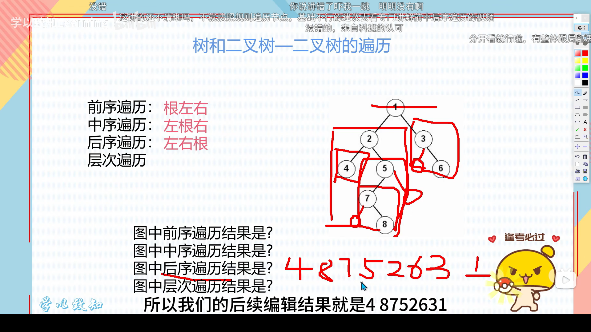

反向构造二叉树
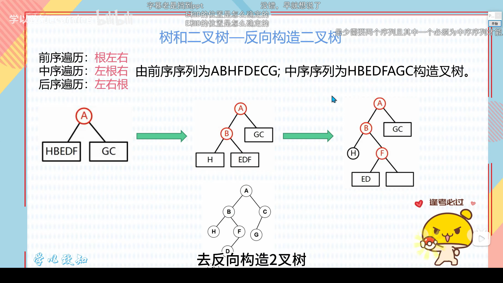

明白，咱们把所有花里胡哨的排版都去掉，用最直白的大白话给别人总结一套转换秘籍。你可以直接把这段话转给看不懂的人：

树转二叉树的本质，就是把原本乱糟糟的“多胞胎关系”转换成一种“排队关系”。你只需要记住两个动作：

第一步：找兄弟。
在原图里，只要是同一个亲爹生的孩子，让他们手拉手横向连起来。比如老大拉着老二，老二拉着老三，老三拉着老四。

第二步：断亲缘。
亲爹狠心一点，只保留和老大的血缘关系，把和老二、老三、老四的连线全部掐断。从此以后，亲爹只认老大。

第三步：换位置。
现在你会发现，每个爹都只连着一个大儿子。那么剩下的二弟、三弟怎么办呢？二弟就挂在老大的右手边，三弟挂在二弟的右手边，以此类推。

最后总结出来的规律就是：
在二叉树里，一个节点的左手边连的一定是它的亲生大儿子；而它的右手边连的一定是它的亲亲兄弟。

你顺着左边往下走，是在查人家的家谱（下一辈）；你顺着右边往横里走，是在查人家的兄弟（同辈分）。

这个转换方法的专业叫法叫“左孩子右兄弟法”。不管原先一个爹有多少个娃，转换后每个节点都只有两个方向，电脑处理起来就快得多了。
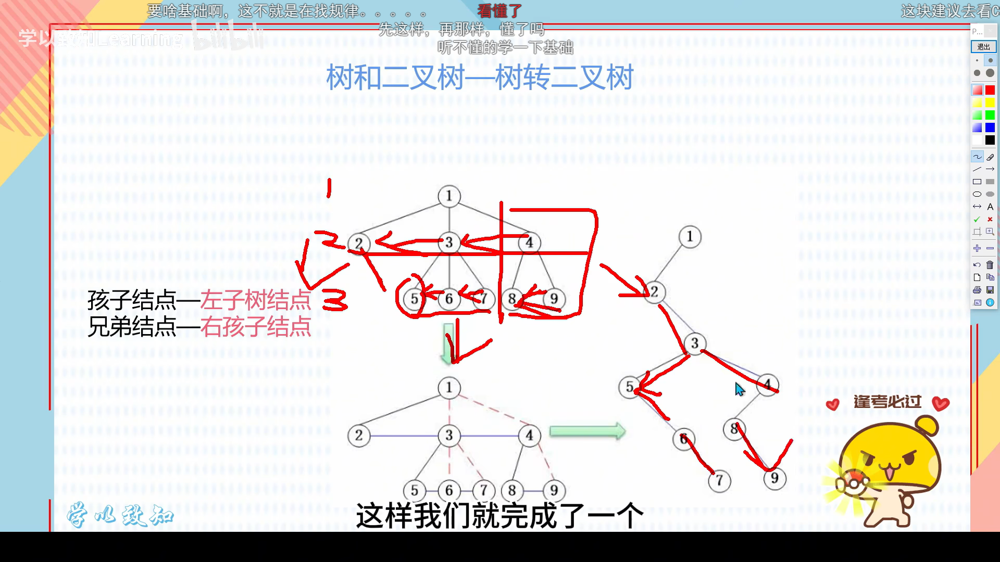

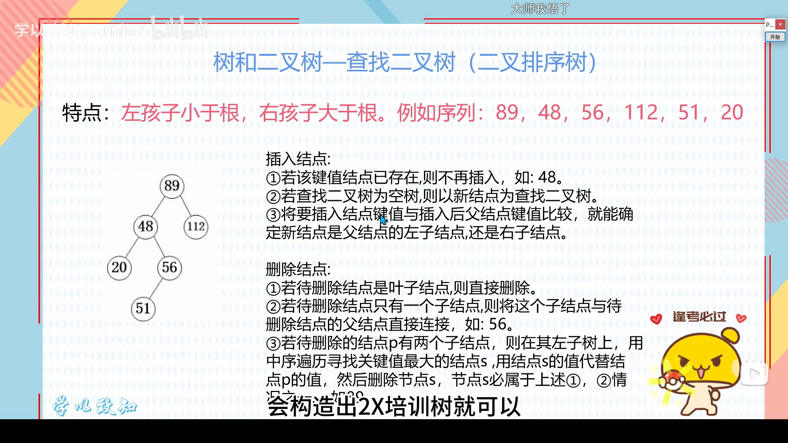

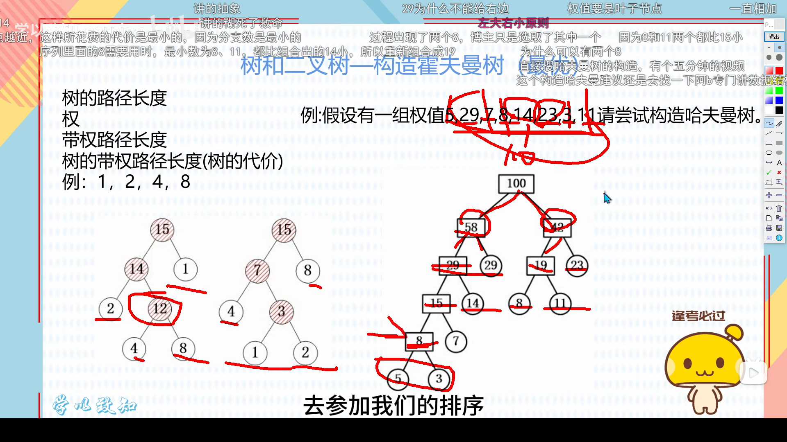

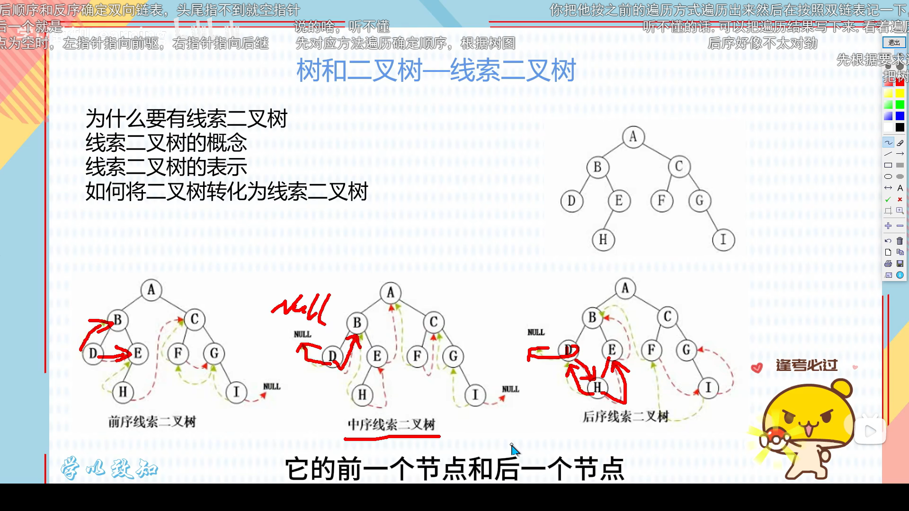

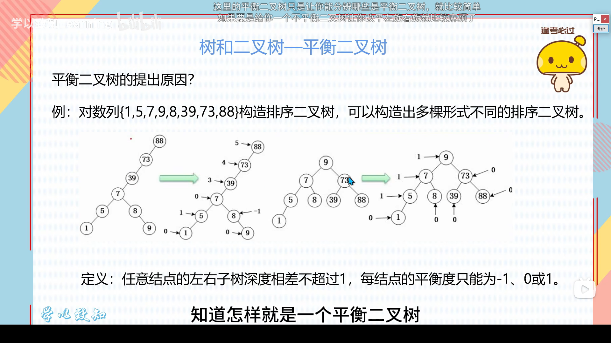

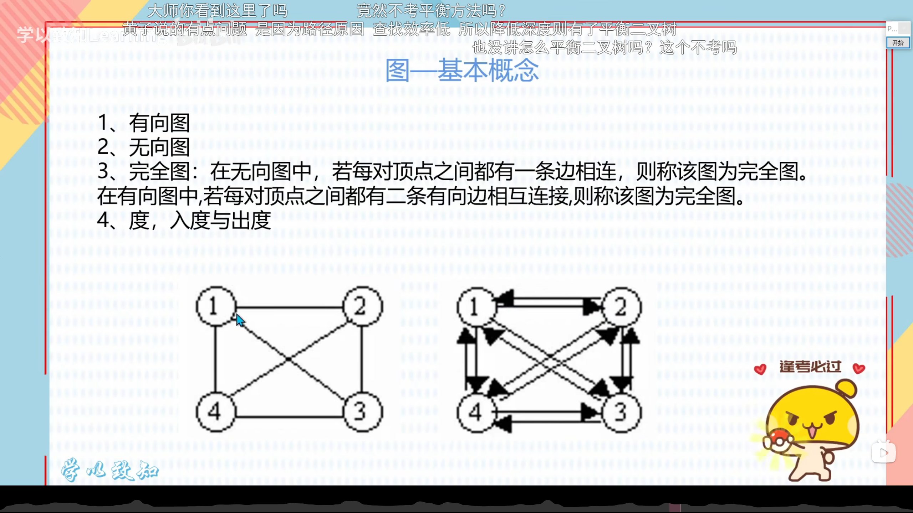

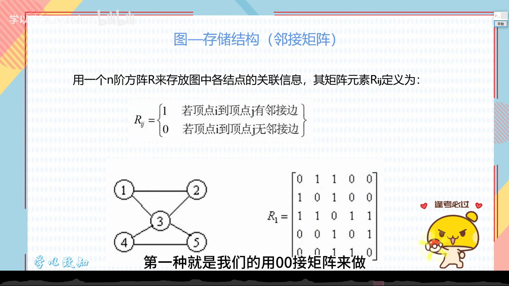

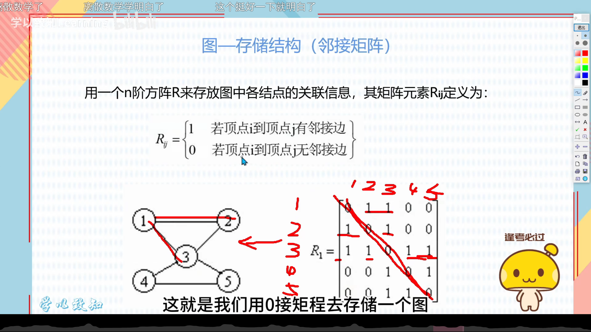

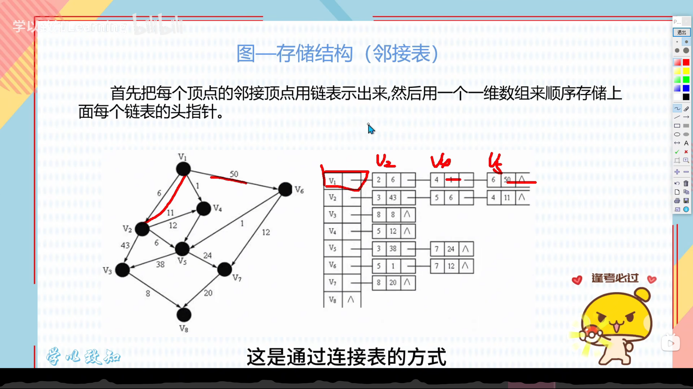

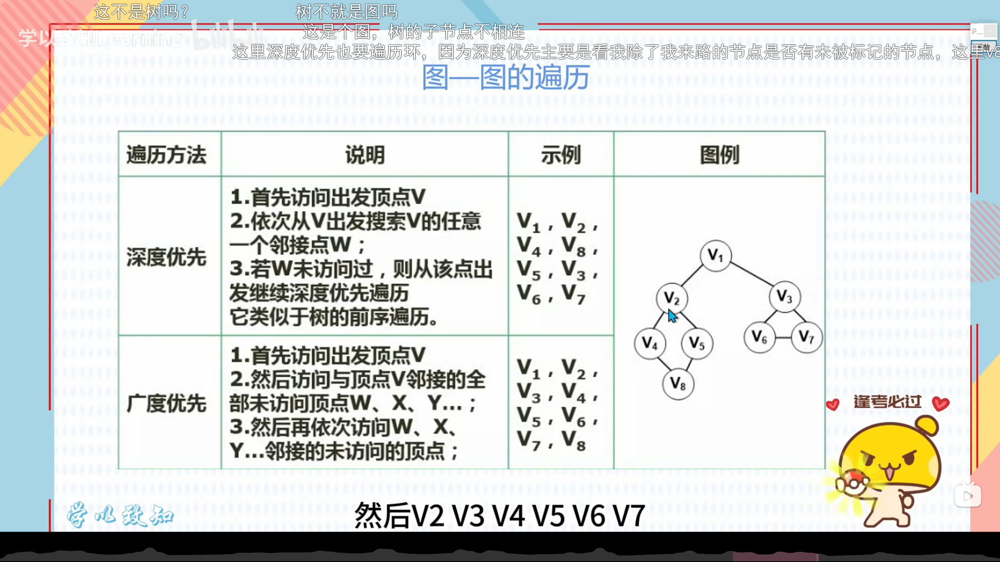

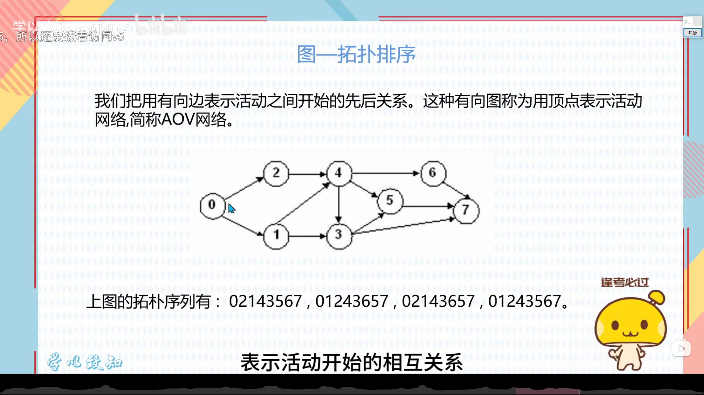

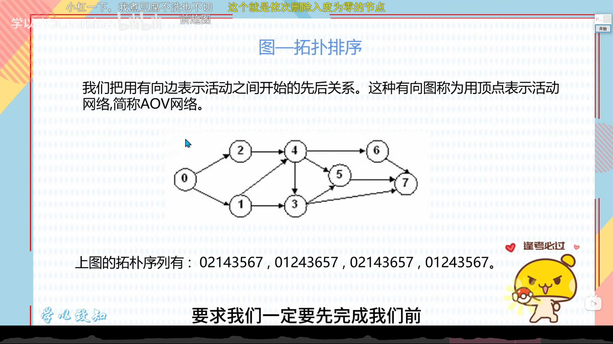

**图的2个算法过程中绝对不能形成闭环**

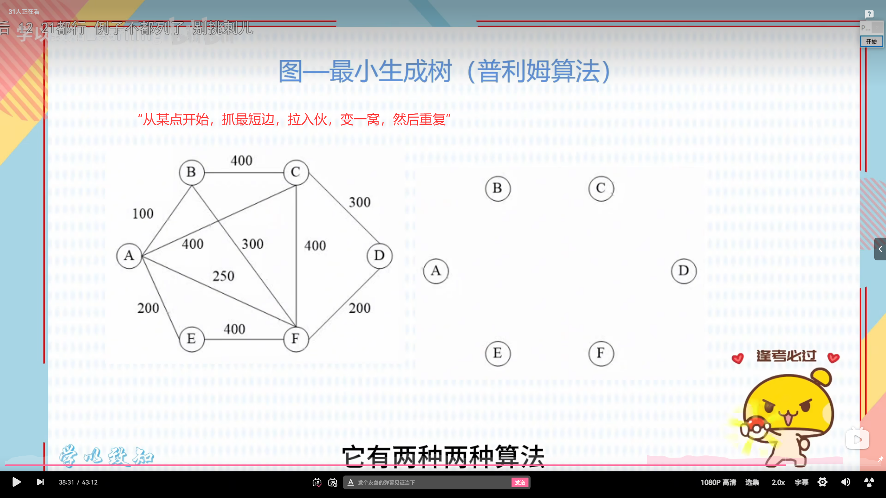

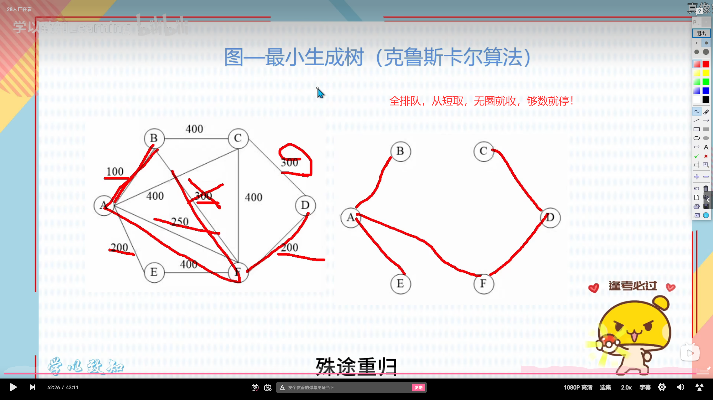