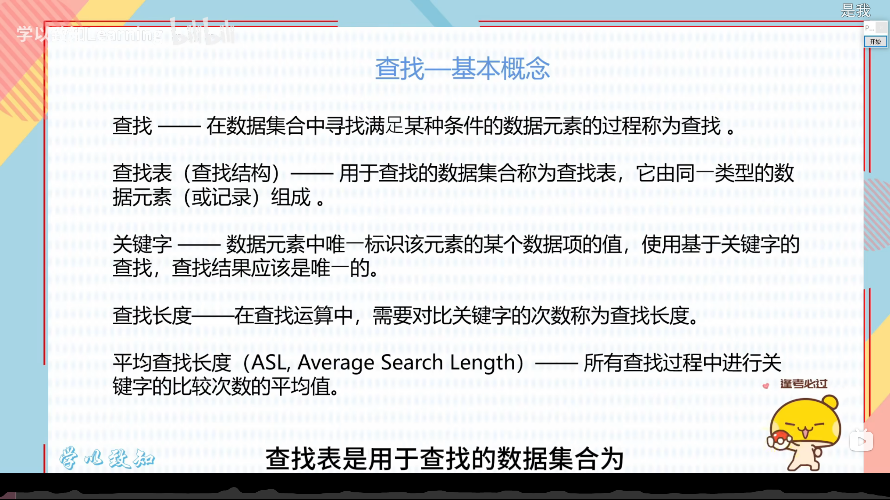

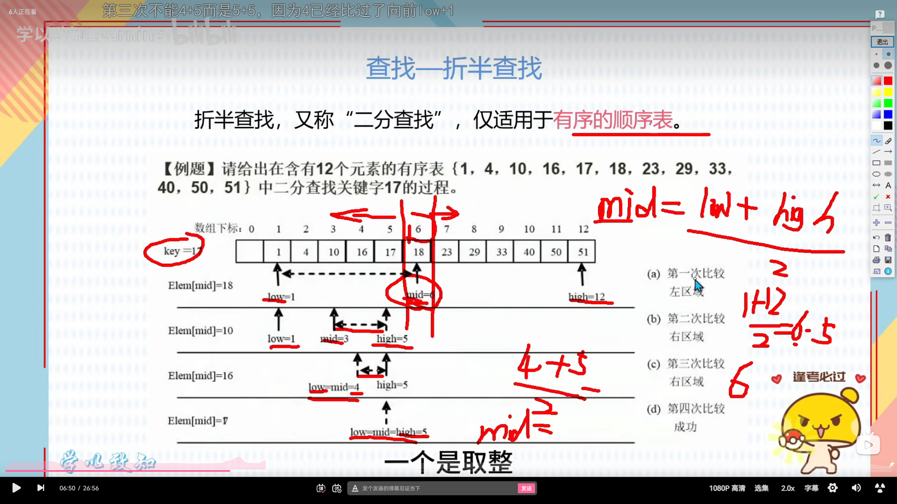

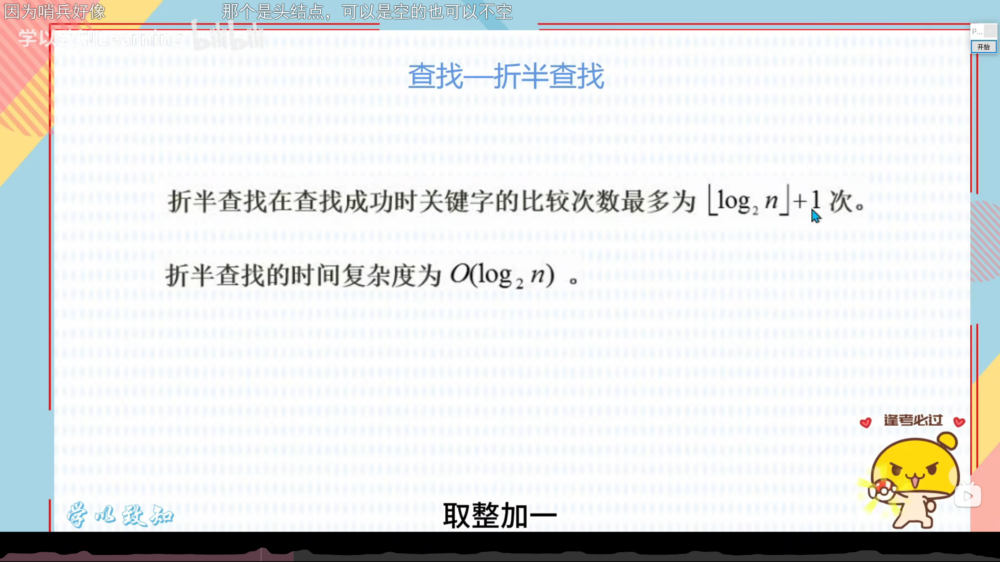

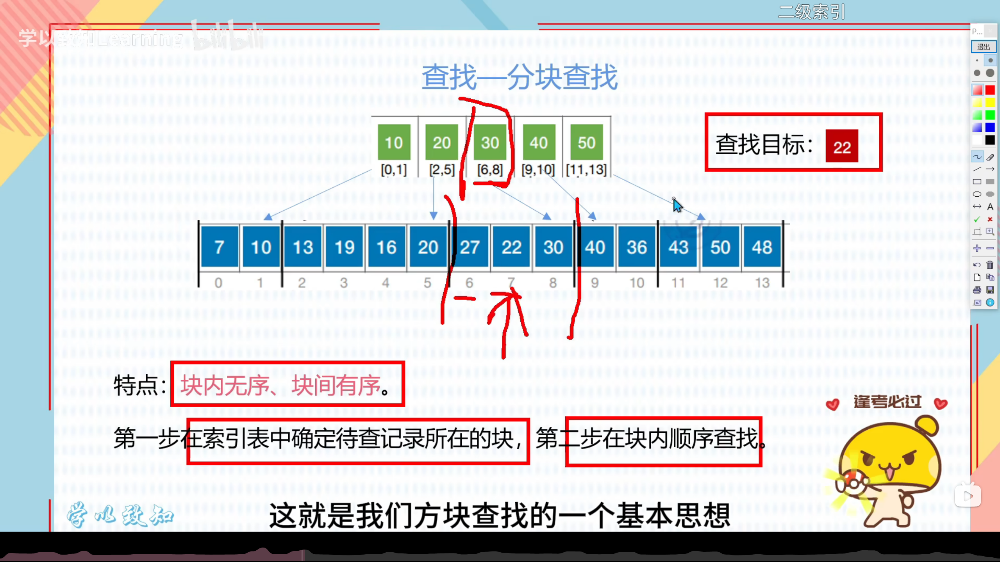

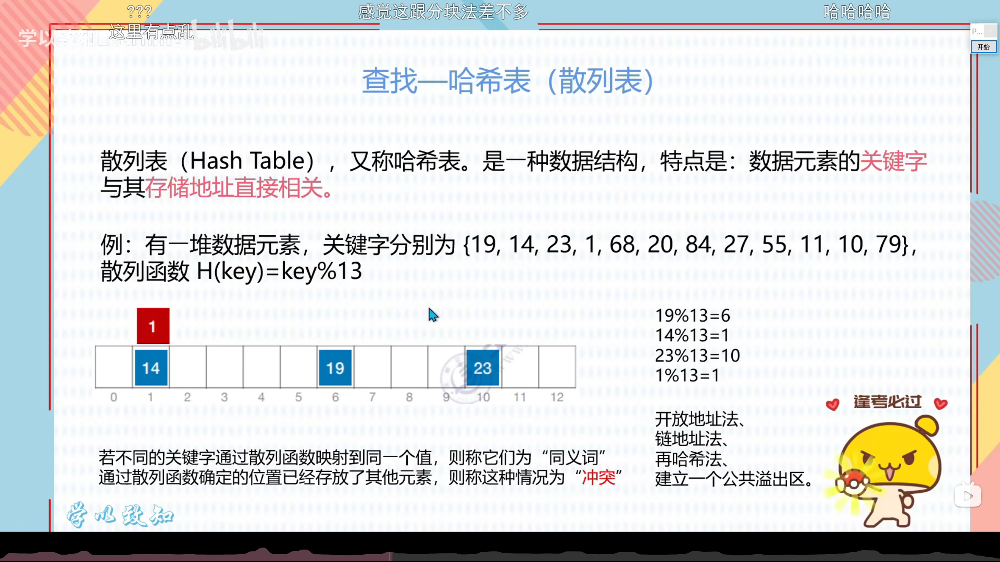

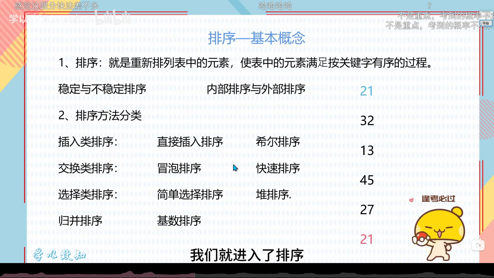

---

图片中提到的“稳定与不稳定排序”，指的是**在排序过程中，如何处理关键字相等的元素。**

用最通俗的话解释：

### 1. 核心定义
假设待排序的列表里有两个**完全相同**的关键字元素，比如元素A和元素B，**A原本排在B的前面**。

*   **稳定排序**：排序后，A**依然**排在B的前面。这种排序算法被称为“稳定”的。
*   **不稳定排序**：排序后，A和B的相对顺序可能会**颠倒**（B跑到了A的前面）。这种排序算法被称为“不稳定”的。

### 2. 举个简单的例子
假设有一组考试数据，按照“分数”排序。原来有两个学生：
*   **学生1（小明）：** 分数=90，名字首字母X
*   **学生2（小红）：** 分数=90，名字首字母H
**原始顺序**是：小明（X）在前，小红（H）在后。

*   **如果是稳定排序（如冒泡排序、归并排序）**：排序后，还是 **小明（X）**排在 **小红（H）**前面。这就保留了原有的先后顺序。
*   **如果是不稳定排序（如快速排序、选择排序）**：排序后，可能会变成 **小红（H）**排在 **小明（X）**前面。

### 3. 图片中涉及的常见排序算法分类
结合你提供的PPT图片，这些算法属于哪一类：

**稳定排序（能保持相等元素原顺序）：**
*   **插入类：** 直接插入排序
*   **交换类：** 冒泡排序
*   **归并排序**
*   **基数排序**

**不稳定排序（不能保证相等元素原顺序）：**
*   **插入类：** 希尔排序（因为它跨步长交换，破坏了稳定性）
*   **交换类：** 快速排序
*   **选择类：** 简单选择排序、堆排序

### 4. 为什么要把排序分为“稳定”和“不稳定”？
在单纯对数字进行排序时，稳定性显得不那么重要。但**在现实业务场景中，稳定性非常关键**。比如：
*   你需要先按“年龄”排序，再按“工资”排序。如果使用**稳定排序**，第二次排序后，年龄相同的人，其工资的顺序依然保留（即第二次排序不会打乱第一次排序已经排好的相对顺序）。如果使用**不稳定排序**，第二次排序会把第一次排序的结果彻底搅乱。
*   
---

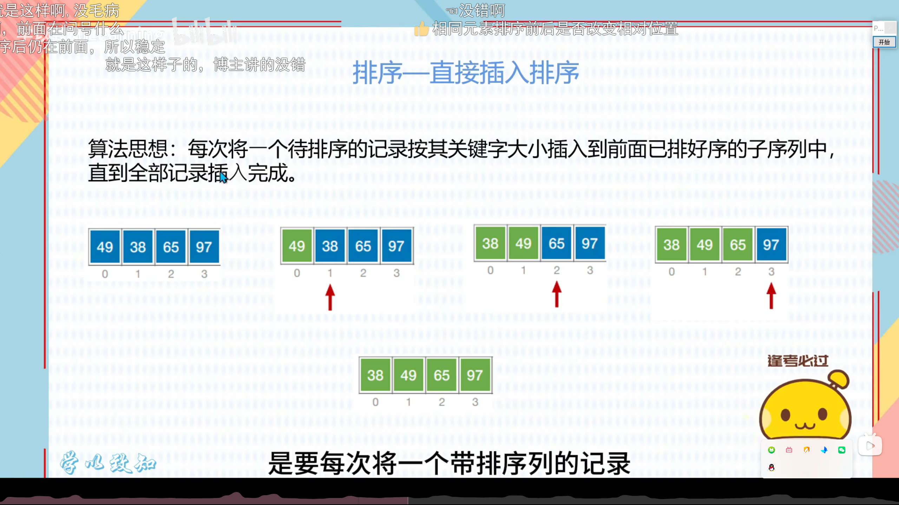

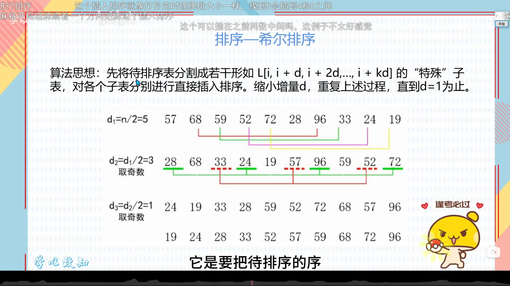

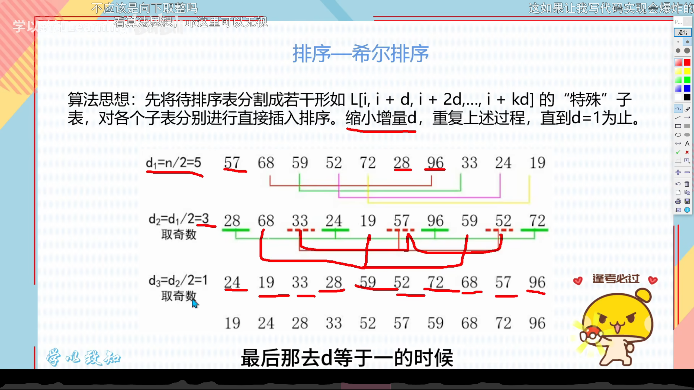

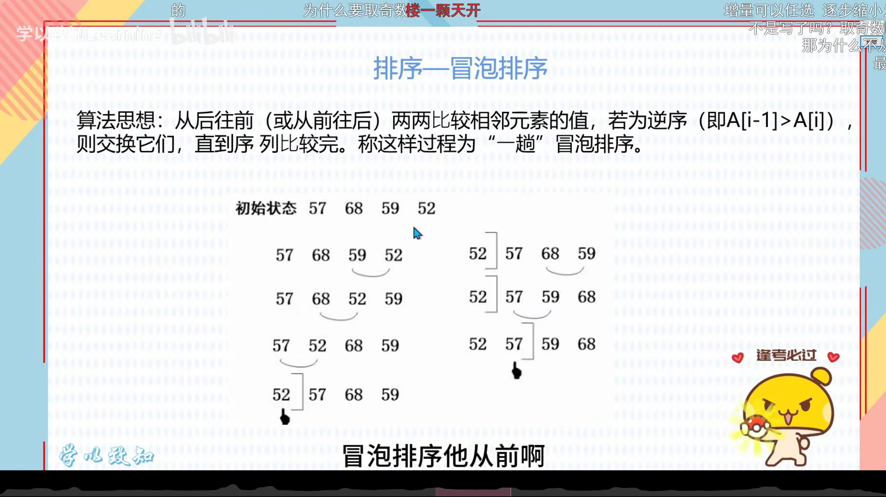

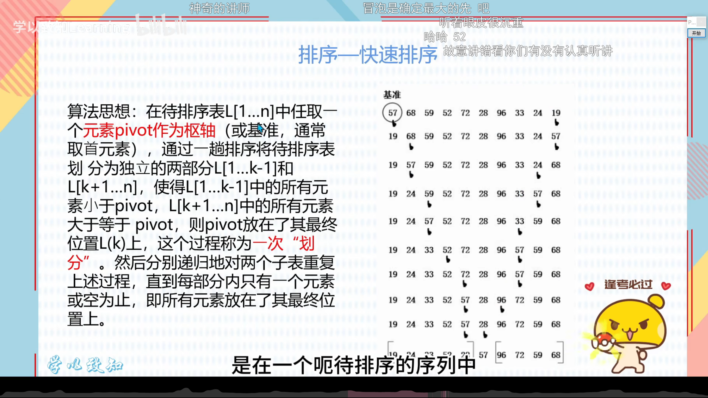

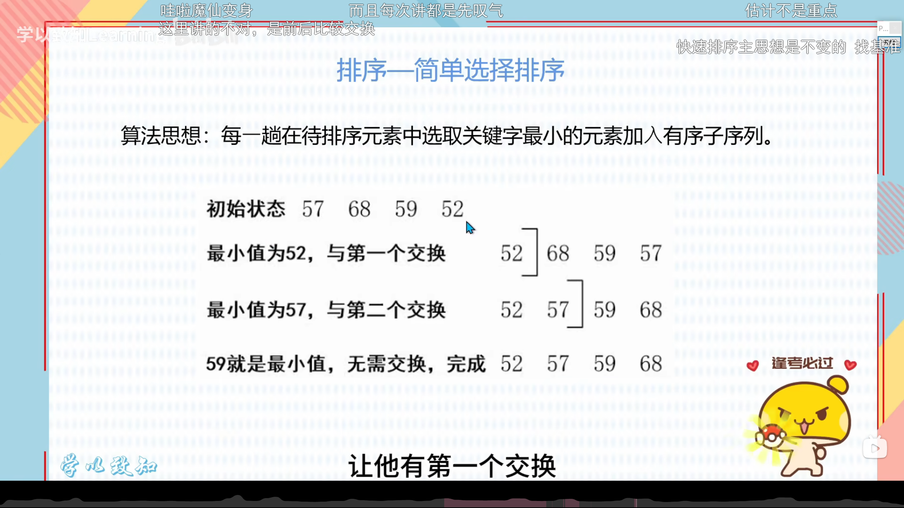

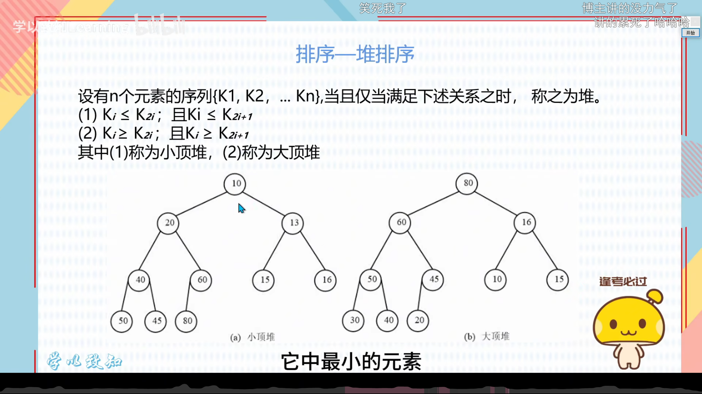

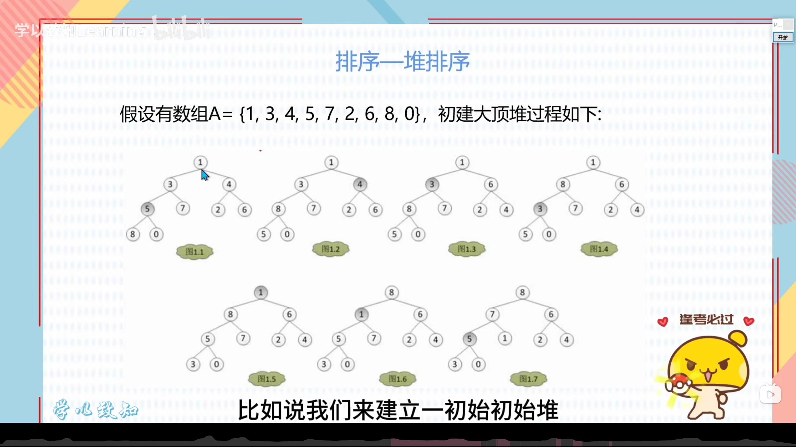

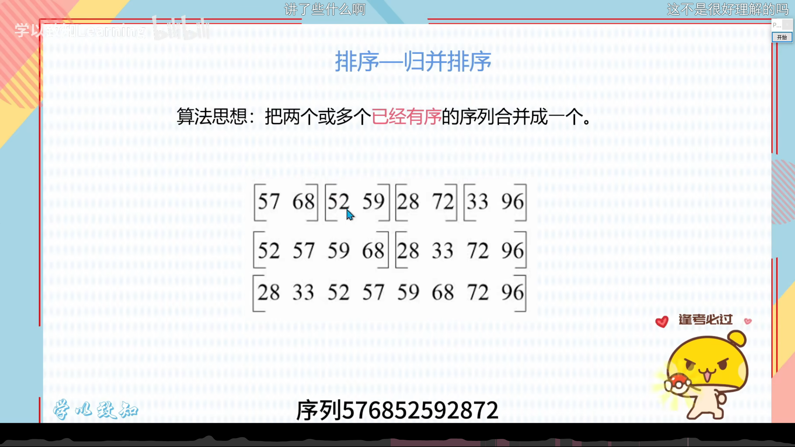

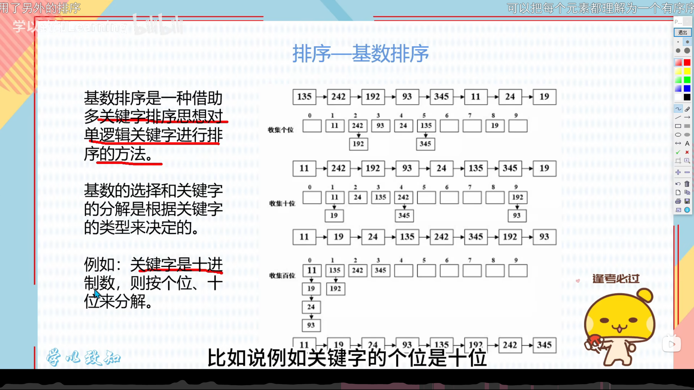

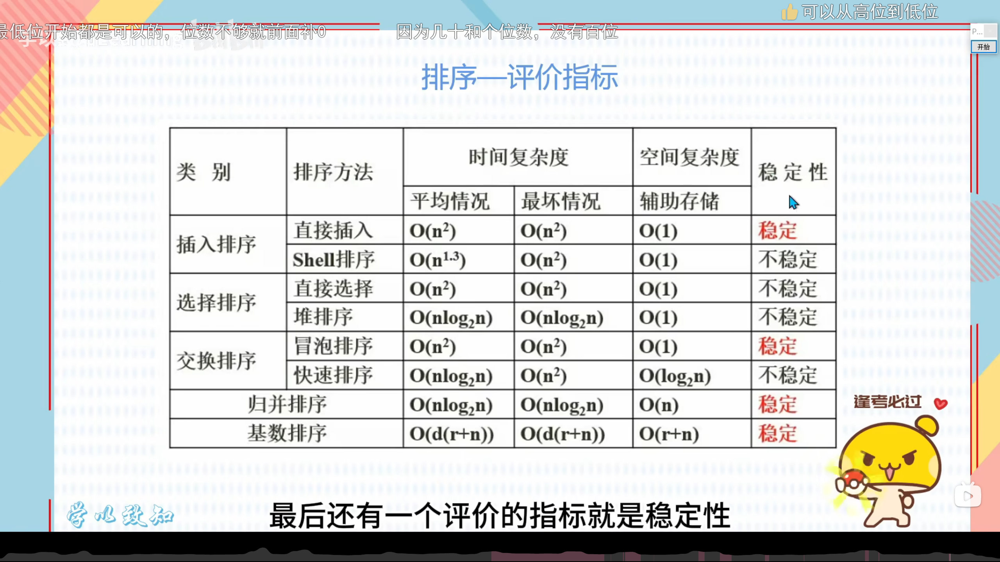

根据你提供的幻灯片图片，这些内容涵盖了数据结构中**“查找”**（图2-6）和**“排序”**（图1、7-17）两大核心模块。虽然你提到了整理“排序内容”，但为了方便你全局掌握，我会以**排序**为核心为你整理，附上具体事例和计算过程，并给你一套**超级好用的记忆大法**。

---

### 第一部分：排序的“成绩单”（评价指标）
**记忆重点：看对应图片1的表格**
排序好不好，主要看三点：**时间复杂度（快慢）、空间复杂度（费不费内存）、稳定性（稳不稳）**。

| 排序方法     | 平均时间  | 最坏时间  | 辅助空间 | 稳定性   |
| :----------- | :-------- | :-------- | :------- | :------- |
| **直接插入** | O(n²)     | O(n²)     | O(1)     | **稳定** |
| **希尔排序** | O(n¹·³)   | O(n²)     | O(1)     | 不稳定   |
| **简单选择** | O(n²)     | O(n²)     | O(1)     | 不稳定   |
| **堆排序**   | O(nlog₂n) | O(nlog₂n) | O(1)     | 不稳定   |
| **冒泡排序** | O(n²)     | O(n²)     | O(1)     | **稳定** |
| **快速排序** | O(nlog₂n) | O(n²)     | O(log₂n) | 不稳定   |
| **归并排序** | O(nlog₂n) | O(nlog₂n) | O(n)     | **稳定** |
| **基数排序** | O(d(r+n)) | O(d(r+n)) | O(r+n)   | **稳定** |

---

### 第二部分：核心排序算法解析（结合幻灯片具体例子）
**（请结合你的图片 8~17 来看这里的计算过程）**

#### 1. 直接插入排序（图8）
*   **思想**：像打扑克牌整理手牌。每轮从“未排序区”拿一张牌，插入到“已排序区”的正确位置。
*   **实例**：`49, 38, 65, 97`
*   **过程**：
    1.  `49`算已排好。
    2.  拿`38`，比`49`小，插到前面 → `38, 49, 65, 97`。
    3.  拿`65`，比`49`大，保持不动。

#### 2. 希尔排序（图9、10）
*   **思想**：插入排序的升级版。先分大组（d较大）粗排，再分小组（d变小）精排，最后d=1变成直接插入排序。
*   **实例**：`57, 68, 59, 52, 72, 28, 96, 33, 24, 19` (n=10)
*   **计算过程**：
    *   **Step 1**: d1 = n/2 = 5。比较隔5个位置的数（如57和28，68和96...）进行插入排序，得到：`28, 68, 33, 24, 19, 57, 96, 59, 52, 72`。
    *   **Step 2**: d2 = d1/2 = 3。比较隔3个位置的数...
    *   **Step 3**: d3 = 1。做最后的直接插入排序。

#### 3. 冒泡排序（图12）
*   **思想**：相邻PK，谁大谁往后走（像汽水冒泡）。每轮确定最大/最小值放最后。
*   **实例**：`57, 68, 59, 52`
*   **过程**：
    1.  57 vs 68 (不动)， 68 vs 59 (交换: 57, 59, 68, 52)， 68 vs 52 (交换: 57, 59, 52, 68)。
    2.  **第一轮结束，68归位**。

#### 4. 快速排序（图11）
*   **思想**：选一个“轴”（pivot），比它小的放左边，比它大的放右边。递归解决两边。
*   **实例**：`57, 68, 59, 52, 72, 28, 96, 33, 24, 19`
*   **计算过程**：
    *   选第一个数`57`为轴。
    *   右边找比57小的，左边找比57大的，交换。
    *   最终把轴`57`放在它应该在的位置（假设最终在这个位置k），形成 `[小于57的部分] 57 [大于57的部分]`。
    *   递归排序左右两部分。

#### 5. 简单选择排序（图13）
*   **思想**：每一轮在剩下的数里，找到**最小**的数，放到最前面。
*   **实例**：`57, 68, 59, 52`
*   **过程**：
    1.  找全数组最小的是`52`，和`57`交换 → `52, 68, 59, 57`。
    2.  在`68, 59, 57`中找最小`57`，和`68`交换 → `52, 57, 59, 68`。

#### 6. 堆排序（图14、15）
*   **思想**：利用完全二叉树。**大顶堆**是根节点最大。
*   **实例**：`1, 3, 4, 5, 7, 2, 6, 8, 0`
*   **过程**（建堆）：
    1.  画成二叉树，从最后一个非叶子节点开始做“向下调整”。
    2.  不断交换父节点和孩子节点，确保父>子。
    3.  建好大顶堆后，堆顶（最大值）和堆底交换，输出最大值。然后对剩下的 n-1 个元素重复此过程。

#### 7. 归并排序（图16）
*   **思想**：将两个或多个**已有顺序**的序列合并成一个。
*   **实例**：`[57, 68]` 和 `[52, 59]` 合并。
*   **过程**：两个指针。比较`57`和`52`，`52`小放前面；再比较`57`和`59`，`57`放前面... 最终得到`[52, 57, 59, 68]`。

#### 8. 基数排序（图17）
*   **思想**：按**位**（个位、十位、百位）来排序。
*   **实例**：`135, 242, 192, 93, 345, 11...`
*   **过程**：
    *   第一趟（按个位）：放进桶0-9。收集后变成：`[11, 242, 192, 93, 24, 135, 345...]`
    *   第二趟（按十位）：放进桶0-9。收集...
    *   第三趟（按百位）：放进桶0-9。最终全部有序。

---

### 第三部分：【考试必过】如何高效记忆（含口诀）

#### 🎯 一、记住“稳定性” (选择题/判断题最爱考)
*   **稳定四君子**：**插（插入）、冒（冒泡）、归（归并）、基（基数）**
    *   *记忆口诀*：“**插冒归基**，稳如老狗！” (剩下的只要不是这4个，全部不稳定)
*   **为什么它们稳定？**（防止你死记硬背）：
    *   **插 & 冒**：因为只和相邻的元素交换，不会打乱顺序。
    *   **归**：当两个相等的数相遇时，总把“左边序列的数”先拿出来。
    *   **基**：是按位分桶，桶和桶之间顺序是不会乱跳的。

#### 🎯 二、记住“时间复杂度” (核心公式)
*   **O(n²) 三剑客**：**直接插入**、**冒泡**、**简单选择**。这些都是傻白甜的暴力法。
*   **O(n log₂n) 三巨头**：**快（快速）、归（归并）、堆（堆排序）**。为什么？因为它们都用到了“分治”/“树”的思想。
    *   *特别提醒*：**快排**最坏情况是O(n²)！（当数组已经是有序的时候）。
*   **O(n¹·³)**：**希尔**（仅此一家，记住这个特殊数字）。
*   **O(d*n)**：**基数**（d是位数，如3位数的d=3）。

#### 🎯 三、空间复杂度谁最“吃内存”？
*   **归并排序**：最占空间！它需要额外一个和原数组一样长的数组，即 **O(n)**。
*   **快速排序**：空间是 **O(log₂n)**，那是因为递归需要栈空间。
*   **基数排序**：需要 **r+n**的空间，即10个桶加上辅助数组。
*   其他统统是 **O(1)**，原地排序搞定。

#### 🎯 四、刷题/考试时的“唯一救命稻草”
如果在考场上忘了具体步骤，只要记住**“打扑克（插入）、排队选班长（选择、快排）、比身高交换（冒泡）、按位数（基数）”**这四幅画面，就能推导出它们的基本动作了！

**建议：** 准备好纸笔，拿着数据列（比如 `1,3,4,5,7...`）自己手动画一遍**快速排序**和**堆排序**的图，这一步做完，你的排序就算完全掌握了！加油，逢考必过！

