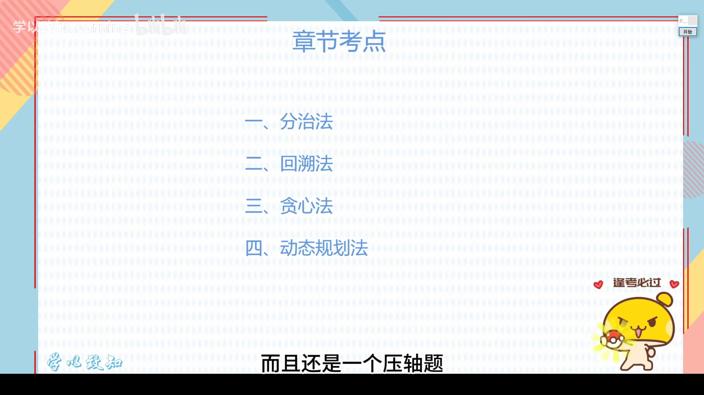
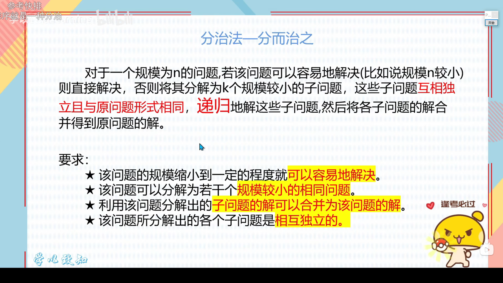
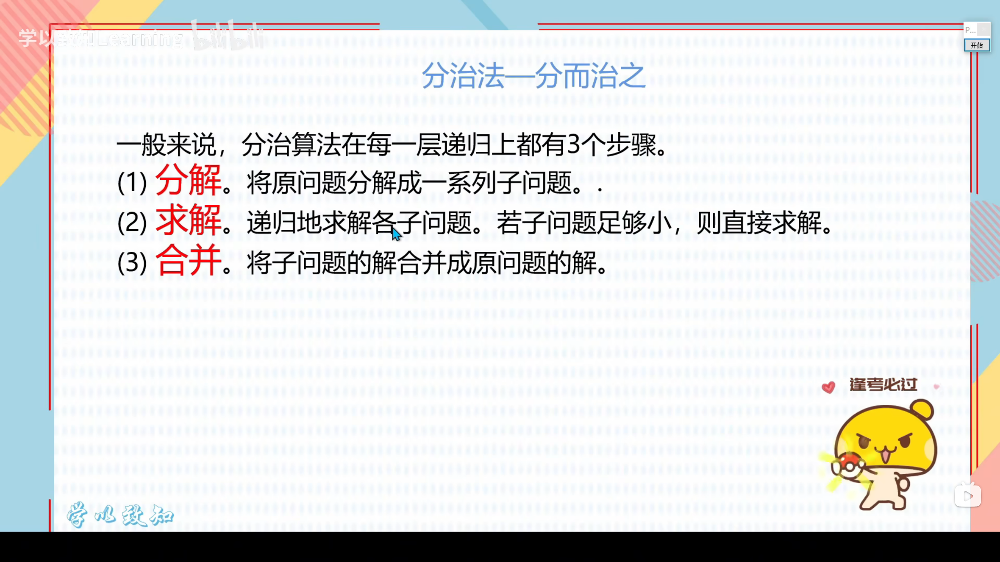
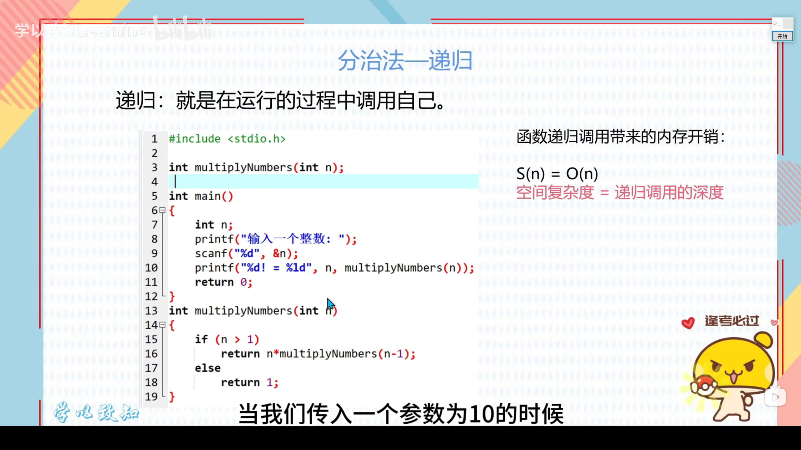
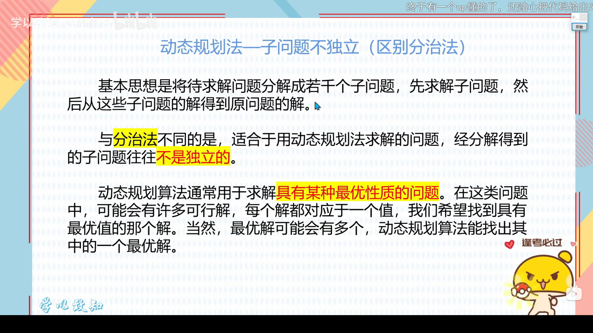
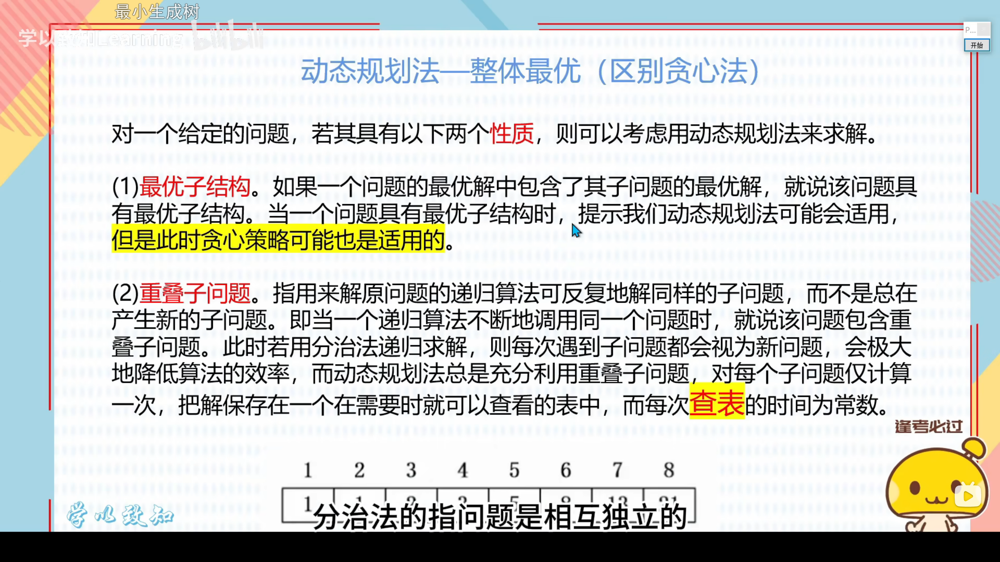
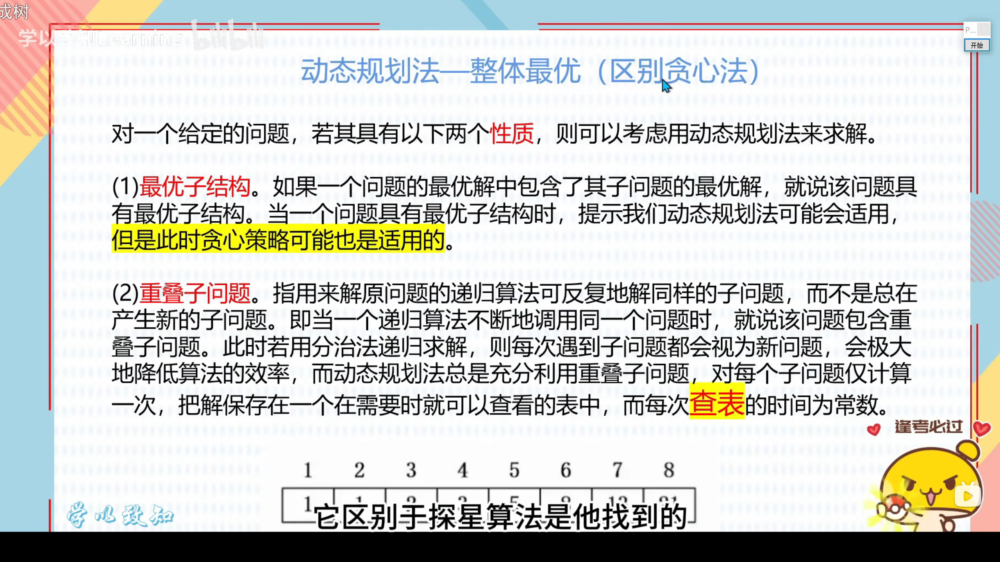
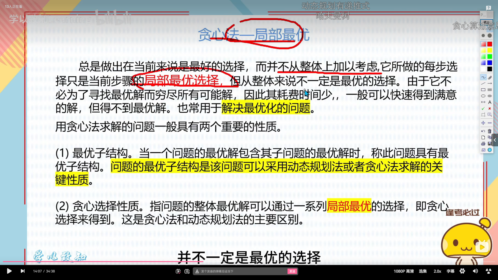
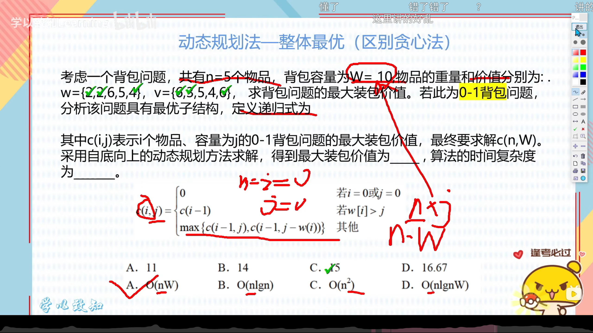
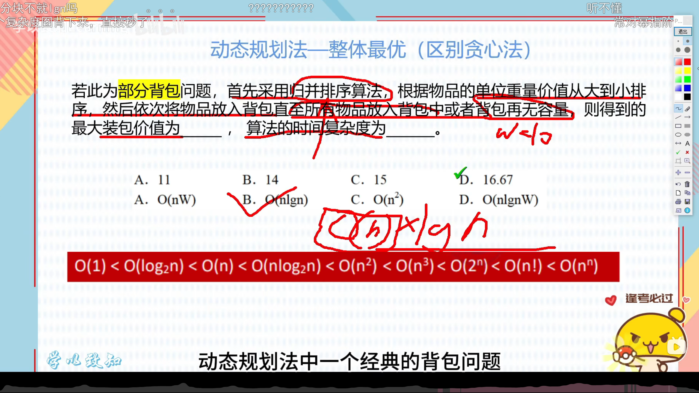

0-1背包问题，这个表达式错的，所以这里解析其实是无效的。

首先计算出单个重量的价值，根据这个计算结果排序，取最高价值。然后一起装入背包容量W=10，因为上部分背包问题一个价值可以只装部分，所以这个容量一定能装满。
第一个2对应的价值是6，求出它的单个价值6/2=3；第二个2对应的价值是3，求出它的单个价值3/2=1.5；其余3个同理，他们的单位价值分别是0.83(3的循环)，0.8和1.5。

