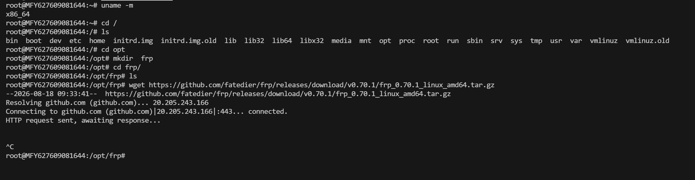
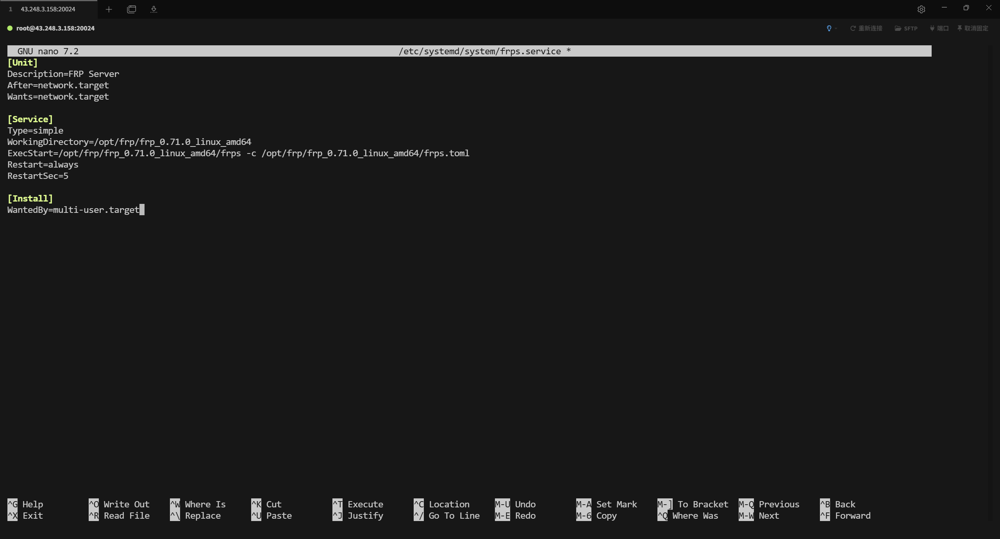

首先要准备一台有公网IP地址的服务器，这里我就用买了2元的赔钱云服务器做一个实验。
首先就是使用tabby连接到服务器，然后使用命令 `cd /opt` 去到这个opt文件夹(软件安装我都是放到这个文件夹里面的，不一定要放到这个文件夹里面去),使用 `mkdir frp` 给frp这个软件创建文件夹，`cd frp` 进去这个文件里面，接下来就是真正工作了，上面都是为了连上服务器给frp软件找个位置存放
实验采用的服务器配置，非常低配置
价格：2.00元/月
CPU：1核 8272CL 睿频3.7GHz
内存：2G
硬盘：8GB系统盘(企业级固态U.2) / 0GB数据盘
带宽：上行2Mbps / 下行100Mbps
虚拟化：KVM
系统：Linux


我的下载过程中发现它不能下载因为这个下载是要github那边的，所以我这边是先下到我的本地电脑然后再通过tabby的SFTP协议从我本地电脑传过去（下载下来的是软件压缩包）
[frp实现内网穿透.md](frp实现内网穿透.md)

然后解压这个frp工具
```bash
tar -xzf frp_0.71.0_linux_amd64.tar.gz
```



```bash
systemctl daemon-reload
systemctl enable --now frps
```


# 内网win电脑的配置
2026-8-18这个时间点0.71.0 版本确实没有提供 Windows 的预编译包，我只能下载`frp_0.70.1_windows_amd64.zip`这个版本的了


