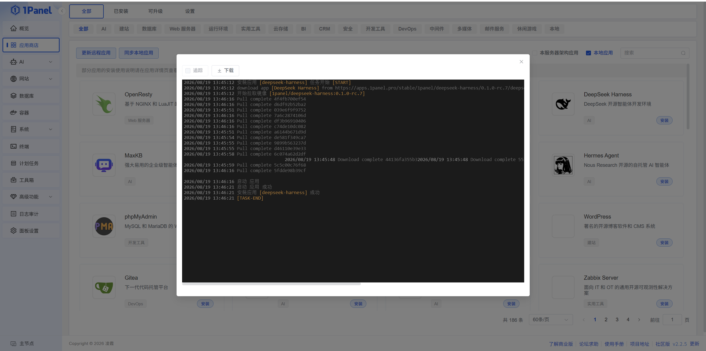
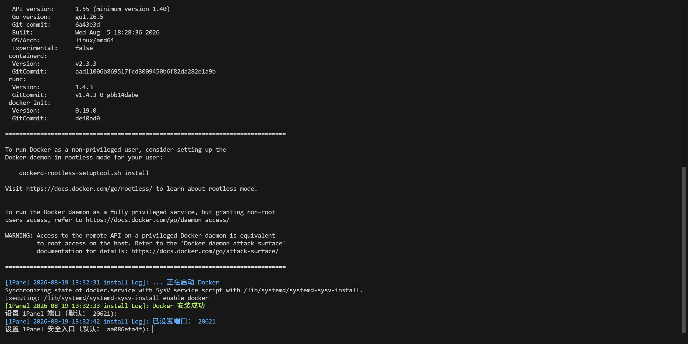
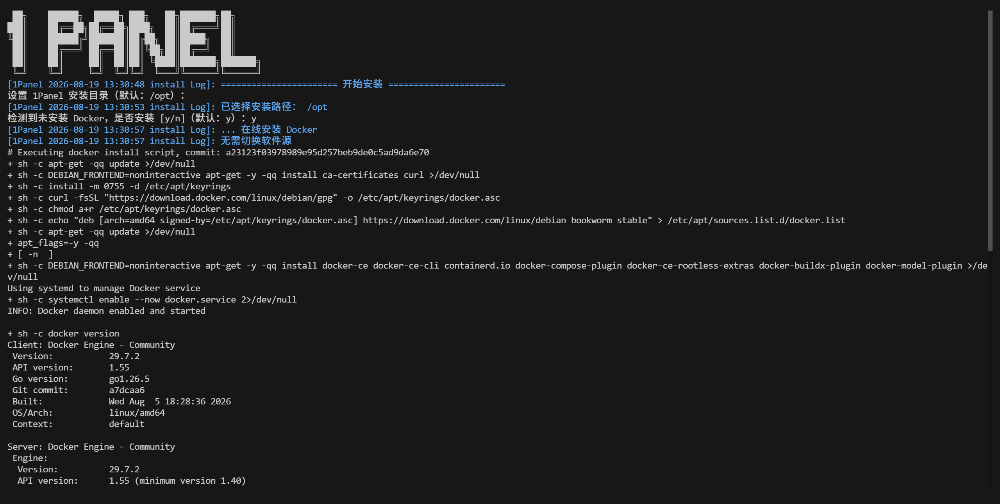

# 1Panel 服务器运维工具

> 项目地址：https://github.com/1Panel-dev/1Panel ｜ 官方文档：https://1panel.cn/docs/
>
> 本文是一份**部署实践流程**：把 1Panel 装到公司 Ubuntu/Debian 服务器上，完成加固，并跑通第一个网站。全文按真实操作顺序编排，每一步都写明"输入什么、期望看到什么、不对怎么办"，照着从头走到尾即可。

## 部署流程总览

| 阶段              | 做什么                        | 完成标志                 |
| ----------------- | ----------------------------- | ------------------------ |
| 阶段 0 体检       | SSH 登录，检查系统/内存/磁盘  | 四项检查全部达标         |
| 阶段 1 安装       | 执行安装脚本                  | 控制台打印出登录信息     |
| 阶段 2 取登录信息 | 拿到面板地址、账号、密码      | `1pctl user-info` 能查到 |
| 阶段 3 开门放行   | 放行面板端口（ufw + 安全组）  | `curl` 返回 200/302      |
| 阶段 4 登录加固   | 改密码、开两步验证、限来源 IP | 四项加固全部完成         |
| 阶段 5 实战验证   | 部署网站 + SSL + 验证备份     | 浏览器能打开 https 网站  |
| 阶段 6 收尾       | 明确日常维护和升级方式        | 备份任务跑通             |

## 前提与约定（读一遍即可）

- **服务器**：公司 Ubuntu/Debian 系服务器，x86_64，内存 ≥2GB，可访问互联网。
- **端口规划**：面板用随机高位端口（本次实际 20621），80/443 留给网站，22 是 SSH。面板端口**不要**用 22/80/443——它是全服务器最高权限的入口，要用高位不常见端口。
- **占位符**：本文档在公开仓库，真实值一律用占位符：`<公网IP>`、`<面板端口>`、`<安全入口>`、`<面板账号>`、`<面板密码>`、`<公司域名>`。真实密码只进密码管理器，不进文档。
- **底线**：面板是 root 权限服务。装完必须完成阶段 4 的加固，否则等于把服务器钥匙挂在大街上。

---

## 阶段 0：连接服务器做体检

```bash
ssh root@<公网IP>          # 普通账号登录则随后 sudo -i
```

依次执行四条命令，对照期望值判断能否开装：

| 命令                  | 期望看到                                                     | 不达标怎么办                           |
| --------------------- | ------------------------------------------------------------ | -------------------------------------- |
| `cat /etc/os-release` | Ubuntu 22.04 及以上 / Debian 12 及以上                       | Windows 系统见附录 B；旧版本先升级系统 |
| `uname -m`            | `x86_64` 或 `aarch64`                                        | 其他架构查官方支持列表                 |
| `free -h`             | 可用 ≥2GB（官方要求 1GB，但装完 Docker + 网站后 1GB 很紧张） | 升级配置或加 swap                      |
| `df -h /opt`          | 可用 ≥10GB                                                   | 清理磁盘                               |

四条全过，进入阶段 1。

---

## 阶段 1：安装（约 10~30 分钟，看网速）

```bash
bash -c "$(curl -sSL https://resource.fit2cloud.com/1panel/package/v2/quick_start.sh)"
```

> GitHub README 里的地址 `https://resource.1panel.pro/v2/quick_start.sh` 是国际版引导脚本，二选一即可（区别见附录 B）。

脚本会逐项提问，按下面填：

1. **安装目录** → 直接回车，用默认 `/opt`。面板本体装在 `/opt/1panel`，命令工具装到 `/usr/local/bin/1pctl`。
2. **面板端口** → 默认值同样是脚本随机生成的（本次是 20621），回车即用；也可自填规划的端口。
3. **安全入口** → 提示里括号中的默认值（本次是 `aa08fefa4f`）是脚本**随机生成**的，直接回车即用；也可自填 3~30 位字母数字下划线。记住它，访问地址必须带这段路径，不带会 404。
4. **面板账号、密码** → 密码 8~30 位，支持字母数字和 `_!@#$%*,.?`。用密码管理器生成。
5. **是否安装 Docker** → 选是。

**成功标志**：控制台最后打印出面板地址、账号、密码（见阶段 2）。

> 安装脚本是个引导脚本，会把安装包临时解压在**你执行命令时所在的目录**，与面板运行位置无关，装完可删。

### 公司环境进阶：非交互安装

需要可复现、可审计时，把参数写进环境变量一次装完：

```bash
PANEL_NON_INTERACTIVE=true \
PANEL_LANG=zh \
PANEL_INSTALL_DIR=/opt \
PANEL_PORT=<面板端口> \
PANEL_ENTRANCE=<安全入口> \
PANEL_USERNAME=<面板账号> \
PANEL_PASSWORD='<面板密码>' \
PANEL_INSTALL_DOCKER=y \
PANEL_DOCKER_MODE=auto \
PANEL_CONFIGURE_ACCELERATOR=n \
PANEL_REPLACE_DAEMON_JSON=n \
bash -c "$(curl -sSL https://resource.fit2cloud.com/1panel/package/v2/quick_start.sh)"
```

两个坑：密码用 `PANEL_PASSWORD` 环境变量传，**别写进命令行参数**（会留在 `history` 里）；非交互模式下漏写的参数用默认值（比如漏了 `PANEL_INSTALL_DOCKER=y` 就不会装 Docker），装完用 `1pctl user-info` 核对。

| 变量                                | 含义                                           |
| ----------------------------------- | ---------------------------------------------- |
| `PANEL_NON_INTERACTIVE`             | 非交互开关，`true` 时不提问直接装              |
| `PANEL_LANG`                        | 语言：`zh` / `en` / `fa` / `pt-BR` / `ru`      |
| `PANEL_INSTALL_DIR`                 | 安装目录，绝对路径，默认 `/opt`                |
| `PANEL_PORT`                        | 面板端口，未设置时随机生成                     |
| `PANEL_ENTRANCE`                    | 安全入口，3~30 位字母、数字、下划线            |
| `PANEL_USERNAME` / `PANEL_PASSWORD` | 面板账号 / 密码                                |
| `PANEL_INSTALL_DOCKER`              | 是否安装 Docker，默认 `n`，要装必须显式 `y`    |
| `PANEL_DOCKER_MODE`                 | Docker 安装模式：`auto` / `builtin` / `online` |
| `PANEL_CONFIGURE_ACCELERATOR`       | 已装 Docker 时是否配置镜像加速，默认 `n`       |
| `PANEL_REPLACE_DAEMON_JSON`         | 是否替换 Docker 的 daemon.json，默认 `n`       |

### 如果卡在 Docker 安装

公司网络最常死在这一步。官方兜底方案：

```bash
bash <(curl -sSL https://linuxmirrors.cn/docker.sh)
```

装好 Docker 后重新执行安装脚本，脚本会复用已有 Docker。

---

## 阶段 2：取回登录信息

安装成功后，控制台输出大致是这样（示例）：

```
================= 感谢您的耐心等待，安装已经完成 =================
面板地址: http://<公网IP>:20621/aa08fefa4f
用户名称: <面板账号>
用户密码: <面板密码>
```

访问格式永远是：`http://<公网IP>:<面板端口>/<安全入口>`。

任何时候忘了，SSH 登录执行：

```bash
1pctl user-info    # 面板地址、账号、密码一次全拿到
```

**注意**：直接访问 `http://<公网IP>:20621` 不带安全入口会得到 **404，这是正常现象**，不是装坏了——安全入口就是第一道防线，让扫描器连登录页都找不到。

---

## 阶段 3：开门放行

面板在服务器上跑起来了，但公网还进不来。按**这个顺序**执行，顺序本身就是防坑：

```bash
sudo ufw status                    # 先看防火墙状态（inactive = 没开）
sudo ufw allow 22/tcp              # ① 先保住 SSH，防止把自己锁在外面
sudo ufw allow 20621/tcp           # ② 放行面板端口
sudo ufw allow 80/tcp              # ③ 给网站预留
sudo ufw allow 443/tcp
sudo ufw enable                    # ④ 最后才开启防火墙
```

`ufw enable` 必须在 22 放行之后——顺序反了 SSH 会断，只能去云控制台的救援模式救。

云服务器再补一层：云控制台 → 安全组 → 入方向放行 20621、80、443。

**验证**：在办公电脑执行 `curl -I http://<公网IP>:20621/aa08fefa4f`，返回 200/302 即通；超时说明 ufw 或安全组有一层没放行。

---

## 阶段 4：登录面板，一口气加固

浏览器打开 `http://<公网IP>:20621/aa08fefa4f`，登录后**按顺序做完下面四步**，全部完成才算"装完了"：

1. **改密码**（面板设置 → 修改密码，或命令行 `1pctl update password`）。安装时那套密码如果经手过聊天记录或文档，必须换掉。
2. **开启两步验证**（面板设置 → 安全 → 两部校验）：手机装 Authenticator 类 App（Aegis / 2FAS / Google Authenticator）扫码或输入密钥绑定。注意手机**时间要自动校准**——验证码依赖时间，手机时间不准验证码永远失效。换手机导致进不去时，SSH 执行 `1pctl reset mfa` 关闭后重绑。
3. **授权 IP 白名单（可选）**：公司有固定出口 IP 时，在 面板设置 → 安全 → 授权 IP 只放行办公网。出差/在家需要 VPN 回公司才能进面板。
4. **面板绑域名 + SSL（可选）**：有域名时绑定 `panel.<公司域名>` 并申请证书，之后全程 https。

至此，面板对公网的暴露面压到最小，可以放心进入实战。

---

## 阶段 5：实战验证：部署第一个网站

主线走**静态网站**——最省资源，先把"域名 → 服务器 → HTTPS"整条链路跑通：

1. 面板 → 网站 → 创建网站 → 静态网站，端口 80。
2. 文件管理里找到站点目录，编辑 `index.html` 写个测试页（一行 hello 也行）。
3. 域名控制台把 `<公司域名>` 的 A 记录解析到 `<公网IP>`（生效一般几分钟，可用 `nslookup` 确认）。
4. 网站 → SSL → 一键申请证书（Let's Encrypt / ZeroSSL，自动续期）→ 开启强制 HTTPS。
5. 浏览器打开 `https://<公司域名>`，看到测试页即全链路打通。

想一步到位跑动态站：应用商店搜 Halo 或 WordPress 一键安装，同时验证容器、数据库、反向代理、SSL 整条链。数据库同理，应用商店一键装 MySQL / PostgreSQL / Redis。

**最后一件事：验证备份。** 面板 → 计划任务 → 新建备份任务（面板 + 网站 + 数据库，本地或云存储）→ **手动执行一次**，确认备份产物正常生成。备份没验证过就等于没有备份。

---

## 阶段 6：收尾与日常

- **日常三件事**：看主机监控（内存/磁盘告警早处理）、看审计日志（有无异常登录）、抽查备份产物能否恢复。
- **升级**：面板右下角【检查更新】一键升级，升级前先做一次备份。
- **卸载**：`1pctl uninstall`，卸载前务必先备份。

---

## 附录 A：1pctl 命令速查

| 命令                                                    | 作用                                                                 |
| ------------------------------------------------------- | -------------------------------------------------------------------- |
| `1pctl status [core\|agent]`                            | 查看 1Panel 服务状态                                                 |
| `1pctl start / stop / restart [core\|agent\|all]`       | 启动 / 停止 / 重启服务                                               |
| `1pctl user-info`                                       | 查看面板地址、账号、密码                                             |
| `1pctl version`                                         | 查看版本                                                             |
| `1pctl update username \| password \| port`             | 修改面板账号 / 密码 / 端口                                           |
| `1pctl reset entrance \| https \| ips \| mfa \| domain` | 分别取消：安全入口 / HTTPS 登录 / 授权 IP 限制 / 两步验证 / 域名绑定 |
| `1pctl listen-ip ipv4 \| ipv6`                          | 切换监听 IPv4 / IPv6                                                 |
| `1pctl restore`                                         | 恢复 1Panel 服务及数据                                               |
| `1pctl uninstall`                                       | 卸载 1Panel                                                          |

## 附录 B：常见疑问

- **Windows 能装吗？** 没有原生版本，只能走 WSL2（需开启 systemd，且存在 Docker 状态检测等兼容问题），只适合本地体验，公司生产服务器请用 Linux。
- **两个安装地址什么区别？** `resource.1panel.pro` 和 `resource.fit2cloud.com` 都是官方地址，前者是国际版引导脚本，后者是国内版，装出来的功能一致，选一个即可。

## 参考链接

- 项目仓库：https://github.com/1Panel-dev/1Panel
- 官方文档：https://1panel.cn/docs/
- 在线安装（含非交互安装参数）：https://1panel.cn/docs/installation/online_installation/
- 命令行工具 1pctl：https://1panel.cn/docs/v2/installation/cli/
- 应用商店：https://1panel.pro/apps


---

# 实战记录：公司服务器真实部署（2026-08-19）

> 本节是本次部署的真实日志回放：Debian 12 服务器，13:30 开始。对照上面的流程，本次走完了阶段 0（体检）、阶段 1（安装），并通过应用商店部署了第一个应用。

## 实际部署环境

| 项目 | 实际值 |
|---|---|
| 操作系统 | Debian GNU/Linux 12 (Bookworm) |
| 面板安装目录 | /opt |
| 面板端口 | 20621（脚本随机生成的默认值，回车确认） |
| 安全入口 | aa08fefa4f（脚本随机生成的默认值，回车确认） |
| Docker 版本 | 29.7.2（由面板自动安装） |
| 开始时间 | 2026-08-19 13:30 |

> 本节记录的是真实值。若不想在公开仓库暴露，可在面板设置里随时改端口，安全入口用 `1pctl reset entrance` 重置后再重新设置。

## 第 1 段：环境检查与 Docker 自动安装（约 3 分钟）



| 日志内容 | 背后发生了什么 |
|---|---|
| `设置 1panel 安装目录（默认：/opt）` | 询问面板核心程序装哪，回车用默认 /opt |
| `已选择安装路径：/opt` | 确认安装目录 |
| `检测到未安装 Docker，是否安装 [y/n] (默认：y)：y` | 脚本自动探测到系统没有 Docker，确认安装 |
| `在线安装 Docker`、`apt-get -qq update`、`install ca-certificates curl` | 更新软件源索引，装证书与网络工具，为添加 Docker 官方源做准备 |
| `install -m 0755 -d /etc/apt/keyrings`、`curl ... docker.asc`、`chmod a+r` | 下载 Docker 官方 GPG 密钥并放入密钥目录 |
| `echo "deb ... bookworm stable" > docker.list` | 把 Docker 官方 apt 源写入系统源列表（bookworm 即 Debian 12 的代号） |
| `apt-get install docker-ce ...` | 安装 Docker 引擎、CLI、containerd 运行时、Compose 插件等组件 |
| `systemctl enable --now docker.service` | 启动 Docker 并设为开机自启 |
| `docker version` | 验证安装成功，Client/Server 版本 29.7.2 |

## 第 2 段：面板初始化（端口与安全入口）



| 日志内容 | 背后发生了什么 |
|---|---|
| `To run Docker as a non-privileged user...` | Docker 官方提醒：普通用户免 sudo 使用 Docker 需要无根模式 |
| `Warning: Access to the remote API...` | Docker 警告：暴露远程 API 端口等于交出主机 root 权限（默认不开启，无需处理） |
| `[Panel ... install Log]: 正在启动 Docker` → `Docker 安装成功` | 面板确认 Docker 依赖就位 |
| `设置 1Panel 端口 (默认: 20621)` → `已设置端口: 20621` | 询问面板 Web 端口，默认值 20621 是脚本随机生成的，回车确认 |
| `设置 1Panel 安全入口 (默认: aa08fefa4f): []` | 询问安全入口，回车使用随机默认值 aa08fefa4f |

## 第 3 段：应用商店部署 DeepSeek-Harness（约 2 分钟）



| 日志内容 | 背后发生了什么 |
|---|---|
| `安装应用 [deepseek-harness] 完成任务 [START]` | 在应用商店点击安装，面板开始执行部署任务 |
| `开始拉取镜像 [1panel/deepseek-harness:0.1.0-rc.7]` | 从镜像仓库拉取 AI 开发环境镜像 |
| `Pull complete`（多行） | 镜像按层（Layer）下载完成 |
| `Downloaded newer image` | 镜像已存入本地 |
| `容器启动成功 [deepseek-harness]` | 容器创建并运行 |
| `安装应用 [deepseek-harness] 成功` | 应用商店中标记为"已安装" |

## 归纳与下一步

**本次做了什么**：在 Debian 12 上完成 1Panel 安装（自动装 Docker 29.7.2、端口 20621、安全入口 aa08fefa4f），并通过应用商店部署了第一个应用 DeepSeek-Harness。

**接下来按流程补**：

1. 访问面板：浏览器打开 `http://<公网IP>:20621/aa08fefa4f` 登录（忘了入口就 `1pctl user-info`）
2. 查看 DeepSeek 访问地址：应用商店 → 已安装 → DeepSeek-Harness 详情页，看端口映射和访问地址
3. **补做阶段 4 加固**（改密码、开两步验证）——本次还没做，这是最关键的一步
4. 若云服务器安全组还没放行 20621，按阶段 3 补放行