# Porkbun 平台购买域名、实名认证失败、Cloudflare 兜底购买与后续部署的完整记录

> **记录目的**
>
> 这份文档不是“快速教程”，而是把这次从“准备购买域名”到“Porkbun 实名认证反复失败”、再到“转去 Cloudflare Registrar 购买成功”、最后“Porkbun 人工审核通过”的全过程完整记录下来。  
> 重点是保留当时页面、错误信息、客服原意、我做过的操作、误判原因，以及以后再次购买域名时应该避免的坑。
>
> **隐私提醒**
>
> 本文配图来自真实操作过程，部分原图可能包含邮箱、用户名、手机号、Account ID、账单金额或证件局部信息。本文适合作为个人归档；如果以后公开发布，必须先做二次脱敏，尤其不要公开身份证号码、完整住址、手机号、银行卡信息和验证链接。

---

## 目录

1. [最初的目标：为什么要买域名](#1-最初的目标为什么要买域名)
2. [Porkbun 购物车里到底卖了什么](#2-porkbun-购物车里到底卖了什么)
3. [域名、DNS、子域名、Nginx、Cloudflare Tunnel 的关系](#3-域名dns子域名nginxcloudflare-tunnel-的关系)
4. [Porkbun 实名认证踩坑全过程](#4-porkbun-实名认证踩坑全过程)
5. [第一次真正定位失败原因：不是“平台不认我”，而是提交方式和账户姓名有问题](#5-第一次真正定位失败原因不是平台不认我而是提交方式和账户姓名有问题)
6. [删号、重建、再次失败：Veriff 对中文身份证的自动识别问题](#6-删号重建再次失败veriff-对中文身份证的自动识别问题)
7. [客服给出的关键结论：可以人工审核，中文或拼音都可以](#7-客服给出的关键结论可以人工审核中文或拼音都可以)
8. [Porkbun 最终人工审核通过](#8-porkbun-最终人工审核通过)
9. [中途转向 Cloudflare Registrar：支付失败、重复账单与欠款提示](#9-中途转向-cloudflare-registrar支付失败重复账单与欠款提示)
10. [Cloudflare 最终购买成功以及银行卡“冻结”资金](#10-cloudflare-最终购买成功以及银行卡冻结资金)
11. [这次经历里最容易混淆的几个概念](#11-这次经历里最容易混淆的几个概念)
12. [我现在最适合的域名与服务器架构](#12-我现在最适合的域名与服务器架构)
13. [以后再买域名时的完整检查流程](#13-以后再买域名时的完整检查流程)
14. [本次踩坑时间线](#14-本次踩坑时间线)
15. [最终结论](#15-最终结论)

---

# 1. 最初的目标：为什么要买域名

我本来已经有自己的后端服务器和本地/内网服务，能够把网页跑起来。我的核心需求不是购买网站托管，而是：

- 给自己的服务绑定一个长期可用的正式域名；
- 用主域名承载比较稳定的服务；
- 用子域名快速发布开发中的 Demo；
- 我的服务器不一定拥有独立公网 IP，因此需要考虑内网穿透；
- 最核心的安全要求是：**尽量不要让普通访问者直接知道我的真实服务器 IP**；
- 希望后续能把多个服务、不同端口、甚至不同电脑统一挂在一个域名体系下面。

因此我一开始研究 Porkbun，并不是想买它的 Web Hosting，而主要是想买域名本身，然后把 DNS、Cloudflare、Tunnel、Nginx 等组件组合起来。

---

# 2. Porkbun 购物车里到底卖了什么

我最初在 Porkbun 购物车里准备购买 `yandifei.com`，一度选择了 **10 年注册期**。截图当时显示：

- 10 年总价约 **110.80 美元**；
- 页面显示 `.com` 预计续费价约 **11.08 美元/年**；
- 页面同时强调域名注册和续费 **NO REFUNDS / NO EXCEPTIONS**；
- 页面右侧列出了一批“FREE WITH EVERY DOMAIN”的附带服务。

> 注意：这里的价格和免费服务是**当时页面状态**，不是对未来永久有效的保证。域名注册商以后可能调整续费价格、附带服务、试用期限和条款，所以这份记录的意义就是以后可以对比政策是否变化。

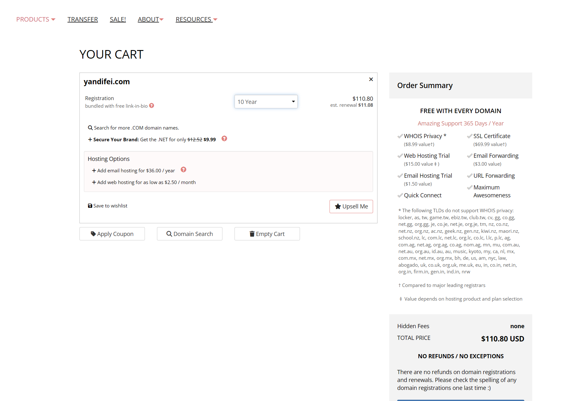

## 2.1 购物车里这些免费/附带项目到底是什么

| 项目 | 实际作用 | 对我是否重要 | 需要注意 |
|---|---|---|---|
| WHOIS Privacy | 隐藏公开 WHOIS / RDAP 中的注册人联系信息 | 很重要 | 它保护“注册人信息”，**不等于隐藏服务器 IP** |
| SSL Certificate | 给网站提供 HTTPS 证书 | 有用，但不是必须用 Porkbun 的 | 如果使用 Cloudflare，也可以由 Cloudflare 处理前端 TLS |
| Web Hosting Trial | Porkbun 提供的网站托管试用 | 对我基本没必要 | 我已经有自己的服务器 |
| Email Hosting Trial | 真正的域名邮箱托管试用 | 以后可能有用 | 试用结束通常需要付费；它和“邮件转发”不是一回事 |
| Email Forwarding | 把 `name@我的域名` 收到的邮件转发到现有邮箱 | 有用 | 主要解决“收信”；要稳定“以域名邮箱发信”通常还需要完整邮件服务 |
| URL Forwarding | 把域名/子域名跳转到另一个 URL | 有时有用 | 本质是 HTTP 跳转，不是反向代理 |
| Quick Connect | 快速把域名连接到部分受支持的平台/服务 | 可选 | 主要是方便配置，不是必须组件 |
| Maximum Awesomeness | 营销文案 | 无技术意义 | 不应把它理解成额外的安全服务 |
| Amazing Support | 客服支持 | 这次实际非常重要 | 后面 ID 验证最终就是靠人工支持解决 |

此外购物车还有一些**付费加购**：

- Email Hosting：当时显示约 `36 美元/年`；
- Web Hosting：当时显示最低约 `2.50 美元/月`；
- `.NET` 之类“Secure Your Brand”属于品牌保护式加购，不是购买 `.com` 必须的内容。

## 2.2 “保护”到底保护什么，持续多久

我最开始最担心的是：买了十年是不是就有“十年保护”，别人是不是查不到我、也不能把我的服务“开掉”。

这里必须拆开理解：

1. **域名所有权期限**：我买几年，就代表域名注册权有效几年；到期仍需要续费。
2. **WHOIS Privacy**：主要隐藏域名注册人的公开联系信息，只要该顶级域支持并且注册商继续提供这项服务，一般会随域名保持，但政策以后可能变化。
3. **SSL**：解决 HTTPS，不隐藏源站。
4. **Cloudflare Proxy / Tunnel**：这是隐藏源站网络位置更关键的部分，不是 WHOIS Privacy。
5. **账户安全**：2FA、强密码、恢复邮箱、真实联系信息，决定了别人是否容易盗走我的注册商账户。

所以“买十年域名”主要是锁定域名使用权期限，不等于自动获得十年的全部网络安全防护。

---

# 3. 域名、DNS、子域名、Nginx、Cloudflare Tunnel 的关系

这次在真正付款之前，我先把几个基础概念搞清楚了。这个部分以后部署服务器时非常重要。

## 3.1 买一个域名，不代表只能有一个网址

例如我拥有：

```text
yandifei.com
```

那么我可以创建很多子域名，例如：

```text
dev.yandifei.com
api.yandifei.com
demo.yandifei.com
blog.yandifei.com
ai.yandifei.com
```

这些子域名不需要一个个重新购买。它们本质上都是我在 `yandifei.com` 这个 DNS Zone 下面创建的记录。

所以更准确地说：

> 我购买的是一个**根域名（registrable domain）**，然后我可以在这个根域名下自由组织很多子域名。

## 3.2 根域名和子域名可以走完全不同的服务器

例如完全可以这样设计：

```text
yandifei.com
    ↓
正式服务器

dev.yandifei.com
    ↓
Cloudflare Tunnel
    ↓
我的笔记本 / 内网电脑

api.yandifei.com
    ↓
另一台服务器

demo.yandifei.com
    ↓
临时测试服务
```

所以我之前想的方案：

> `dev` 用 Cloudflare 做内网穿透，主域名扔给正式服务器

是完全合理的。

## 3.3 DNS 管理和域名注册不是一回事

域名可以在 Porkbun 买，但 DNS 不一定必须由 Porkbun 管。

可以有两种常见组合：

```text
Porkbun Registrar
+ Porkbun DNS
```

或者：

```text
Porkbun Registrar
+ Cloudflare DNS
```

如果域名最终直接在 Cloudflare Registrar 买，那么通常 DNS 也直接在 Cloudflare 管最自然。

**注意：同一个域名的权威 DNS 最终只能按一套 Nameserver 体系工作。**  
不是 Porkbun DNS 和 Cloudflare DNS 同时各写一半，而是把 Nameserver 指向谁，就主要由谁做权威解析。

## 3.4 Nginx 是“服务器内部/入口处的分流器”

假设我的一台服务器里同时跑：

```text
3000 端口：前端 Demo
8000 端口：API
9000 端口：后台管理
```

Nginx 可以把不同域名或路径转发到不同端口，例如：

```text
demo.yandifei.com  -> 127.0.0.1:3000
api.yandifei.com   -> 127.0.0.1:8000
admin.yandifei.com -> 127.0.0.1:9000
```

也可以按路径：

```text
yandifei.com/api/   -> 8000
yandifei.com/admin/ -> 9000
```

因此：

- **DNS** 解决“这个名字先去哪里”；
- **Cloudflare/Tunnel** 解决“外网怎么安全到达我”；
- **Nginx** 解决“到了入口以后应该分到哪个程序/端口”。

## 3.5 没有独立公网 IP 时，Cloudflare Tunnel 特别适合

如果服务器/笔记本没有独立公网 IP，Cloudflare Tunnel 的思路不是让外部主动打进来，而是：

```text
内网设备主动连接 Cloudflare
        ↓
形成出站隧道
        ↓
外部访问 dev.yandifei.com
        ↓
Cloudflare 把流量送进这个隧道
```

这样通常不需要：

- 路由器端口转发；
- 公网 IPv4；
- 把源站端口直接暴露在互联网上。

对我“随时把笔记本上的 Demo 映射出去”的需求非常合适。

---

# 4. Porkbun 实名认证踩坑全过程

这次最大的坑不是域名价格，而是 **Porkbun 新账号触发 Veriff 身份验证**。

## 4.1 一开始 Porkbun 就强调联系信息必须真实

创建账号和继续操作时，Porkbun 明确提示：

> 电话、邮箱、邮寄/实际地址必须真实正确；这些资料可能用于账号恢复。  
> 如果资料无效或无法验证，可能导致账号锁定、域名暂停或删除。

当时我看到的提醒如下：

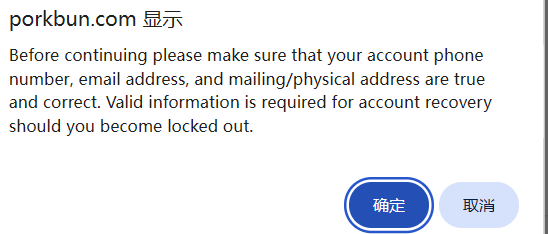

这一步最容易产生一个误区：

> 我以为注册域名只要“能付款”就行。

实际上注册商要承担反欺诈、滥用、账号恢复、注册人联系信息等责任，因此某些账号会被要求进一步验证。

## 4.2 进入 ID Verification Gate

账号被要求验证后，Porkbun 页面会进入专门的 `ID VERIFICATION` 页面：

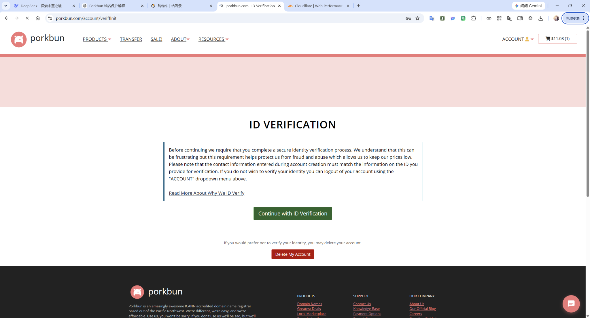

页面核心意思是：

- 必须完成安全身份验证；
- 账号创建时填写的联系信息，应与用于验证的身份证件相匹配；
- 如果不想验证，可以选择删除账户。

这时我开始觉得“为什么买个域名还要身份证”，并尝试寻找是否可以绕过，但后来事实证明：**对这个账号来说，这个验证流程就是必须完成的。**

---

# 5. 第一次真正定位失败原因：不是“平台不认我”，而是提交方式和账户姓名有问题

## 5.1 Veriff 验证界面

Porkbun 使用 Veriff 作为身份验证合作方。进入验证后，会要求：

- 准备有效身份证件；
- 使用智能手机；
- 可以扫描二维码，在手机上继续；
- 也可以通过短信发送安全链接。

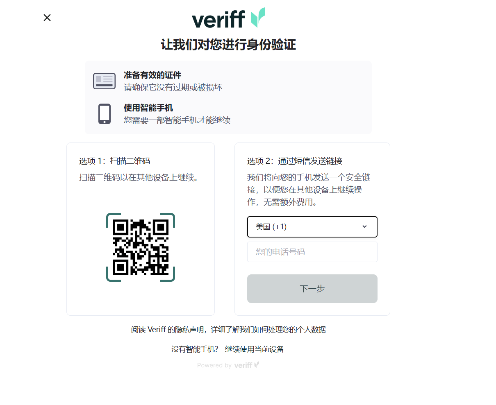

## 5.2 第一次失败：我提交的不是“现场拍摄实体证件”

第一次验证失败后，Porkbun 页面直接显示：

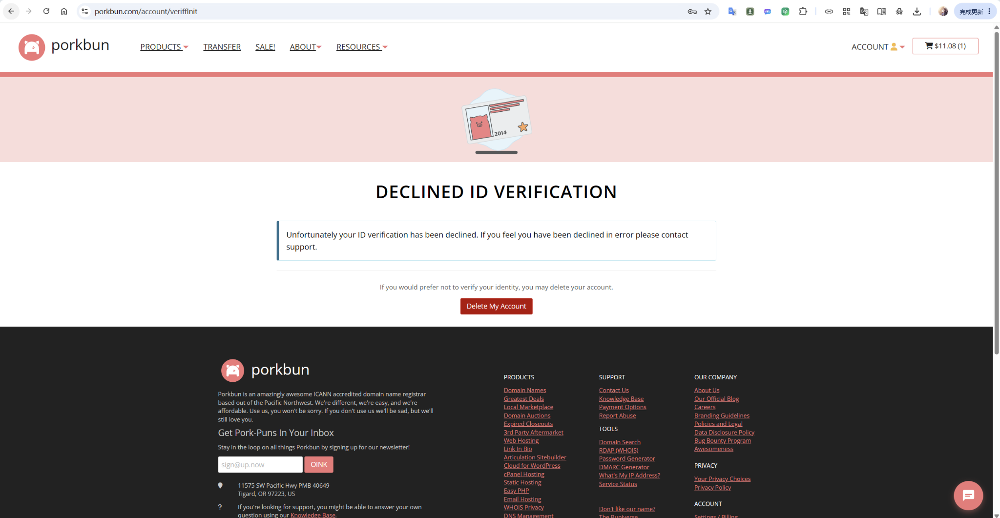

最开始我甚至怀疑：

> 会不会是 IP、地区、网络环境问题？  
> 群里也有人说他们不需要验证。

但从后续客服回复看，这个猜测并没有得到证据支持。

客服第一次真正指出的技术原因是：

> 我提交的是**电脑屏幕上的证件照片**，而不是对实体身份证本身进行拍摄。

相关邮件过程截图：

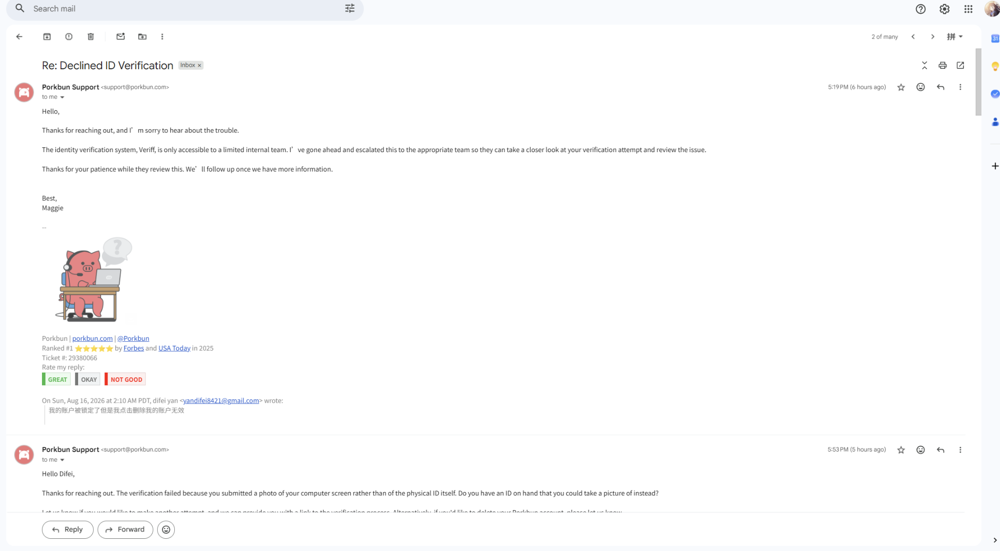

这一点非常关键：

### 错误做法

```text
身份证照片
→ 放在电脑/手机相册里
→ 再拍屏幕
→ 提交
```

### 正确做法

```text
实体身份证
→ Veriff 打开摄像头
→ 现场直接拍摄证件
→ 再完成人脸 / 自拍步骤
```

身份验证系统会检查证件真实性、拍摄环境、版式、防伪特征、图像来源等。  
“拍屏幕”很容易被判断为不是原始证件采集。

## 5.3 银行卡不能拿来代替身份证

当时实体身份证不在手边，我还问客服：

> 能不能用我的实体银行卡做验证？

客服明确告诉我：

- 银行卡通常不是 Veriff 支持的身份证明文件；
- 应使用政府签发的带照片证件、护照等；
- 客服重新创建了一个验证链接；
- 新链接当时有效期是 **72 小时**；
- 点验证链接前，客服还要求先从 Porkbun 退出登录；
- 在人工审核完成以前，页面可能继续显示 `declined` / `expired`，甚至可能出现空白页。

邮件记录：

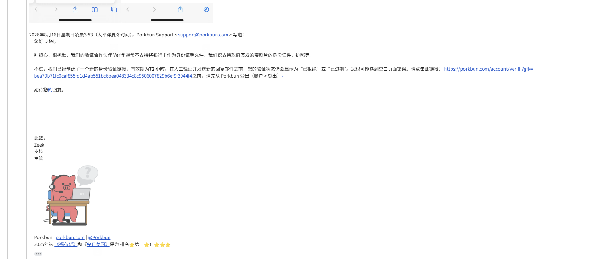

这个细节以后非常重要：  
**前端显示 Declined 不一定代表人工审核已经最终失败。**

---

# 6. 删号、重建、再次失败：Veriff 对中文身份证的自动识别问题

## 6.1 用实体中国居民身份证再次验证，仍然失败

拿到实体身份证后，我按要求重新尝试，但 Veriff 仍然报：

```text
Unsupported document
请使用其他身份证件
无法验证您使用的身份证件
```

这时问题从“我提交方式错误”变成了另一个问题：

> **Veriff 自动识别流程对中国居民身份证/中文证件的处理不稳定。**

原始文档里已经记录过这一步：重新创建账号后，仍然会进入验证流程，验证依旧失败。fileciteturn6file0L1-L7

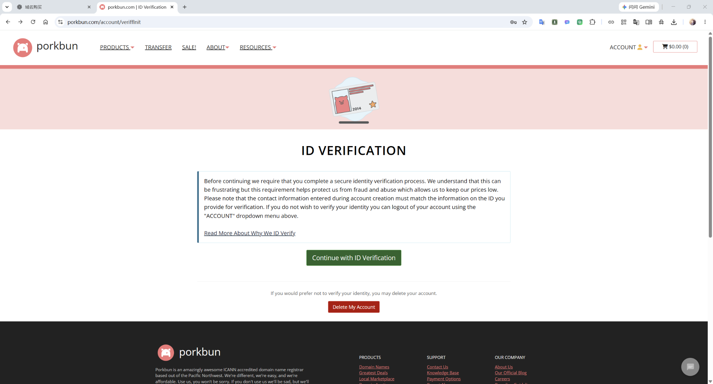

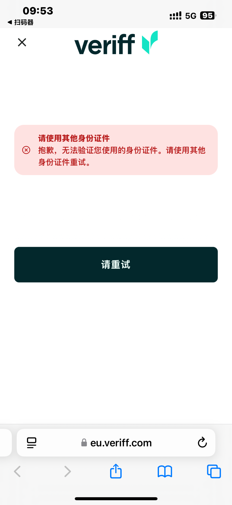

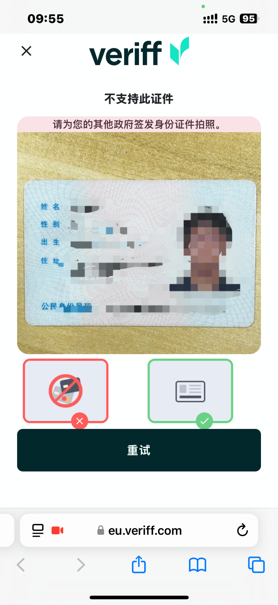

## 6.2 客服人工检查后发现：账号姓名和证件姓名不一致

这次客服没有只看 Veriff 的自动结果，而是进行了人工检查。

客服给出的关键结论是：

> **the name on your Porkbun account does not match the name on the submitted document**

也就是说，除了 Veriff 自动识别中文证件的问题之外，我当时的 Porkbun 账户姓名填写也存在不匹配。

这是一个非常重要的坑。

### 中国姓名在英文表单里的字段含义

如果一个人的法定姓名是：

```text
姓：潘
名：炜德
```

那么英文表单概念上应该是：

```text
FIRST OR GIVEN NAME = 名
LAST NAME / FAMILY NAME = 姓
```

也就是不能把“姓”填到 First Name、把“名”填到 Last Name。

但后来客服进一步明确：  
因为最终是人工审核，所以**中文原字符或拼音都可以**，真正关键的是：

- 姓与名字段含义正确；
- 账户姓名和身份证对应得上；
- 不要写英文昵称代替法定姓名；
- 不要把姓名顺序填反。

## 6.3 第一次删号 / 重建

客服建议：

> 删除当前账户，重新创建一个姓名信息与证件匹配的新账户。

我接受了这个方案。

Porkbun 的删除账户是一个真正的删除流程，不只是退出登录。页面会强调：

- 删除不可逆；
- 账户、域名、产品可能永久删除；
- 提交后账户会进入删除队列；
- 一旦 queued for deletion，将失去访问权限；
- 后台通常会在一段时间内完成处理。

原始文档也记录了“第二次删号”的节点。fileciteturn6file0L8-L9

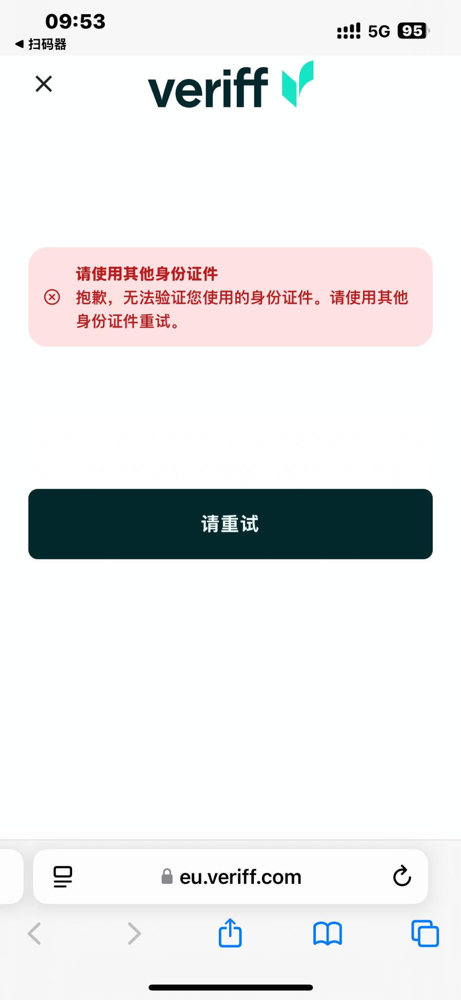

这里的教训是：

> **不要因为 Veriff 前端报红就立刻删号。**  
> 如果已经有客服/ID Team 在人工审核，删号会把事情重新打回起点。

---

# 7. 客服给出的关键结论：可以人工审核，中文或拼音都可以

在我反复遇到“中国身份证不支持”的提示后，Porkbun Support 最终把规则解释清楚了。

客服 Maggie 的核心意思是：

1. Veriff 对其他语言的身份证件识别确实可能比较困难；
2. 前端可能继续显示 `declined` 或 `not accepted`；
3. **只要身份证和 selfie 已经成功上传，他们可以在 Veriff 后台人工审核**；
4. 姓名可以使用 **Pinyin（拼音）**；
5. 也可以使用 **standard characters（原始字符/中文字符）**；
6. 因为是人工审核，两种形式他们都可以判断；
7. 账号删除完成后可以重新建立。

原邮件截图：

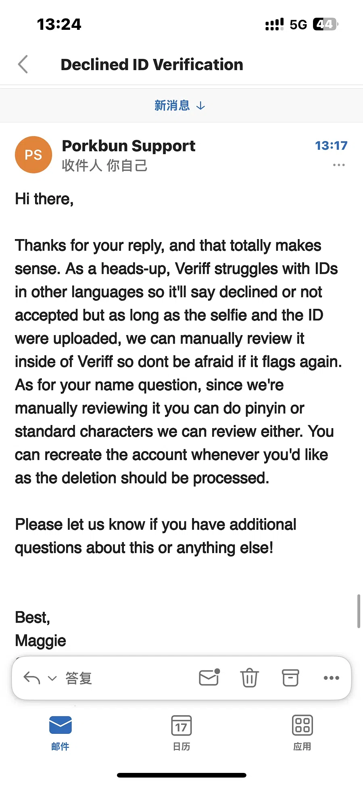

这封邮件实际上把前面所有疑问都解释通了：

### 不是必须“填英文名”

客服并没有要求我写一个英文昵称。

正确理解是：

```text
法定姓名
↓
中文原字符可以
或者
拼音可以
↓
字段必须对应
↓
人工审核能识别
```

### Veriff 自动失败不等于 Porkbun 最终失败

这次最重要的流程认知是：

```text
Veriff 自动识别
        ↓
可能失败 / Unsupported
        ↓
身份证 + 自拍实际上已经上传
        ↓
Porkbun ID Team 后台人工检查
        ↓
可以人工批准
```

这也是后面最终成功的原因。

---

# 8. Porkbun 最终人工审核通过

在最后一次账号重建后，我重新：

- 填写正确联系信息；
- 使用实体中国居民身份证；
- 按手机流程拍摄；
- 即使 Veriff 仍然显示“不支持/无法验证”，也**不再删号**；
- 给 Porkbun Support 发邮件，明确请求对“最新的 Veriff submission”进行 manual review；
- 保留当前账号等待 ID Team。

客服后来回复的最终结论非常明确：

> **“We have manually reviewed and approved your ID verification — welcome to Porkbun!”**

也就是说：

```text
Veriff 自动审核：失败
Porkbun 人工审核：通过
最终账号状态：可正常使用
```

人工审核通过后，Porkbun 页面已经可以正常进入域名搜索/购买页面：

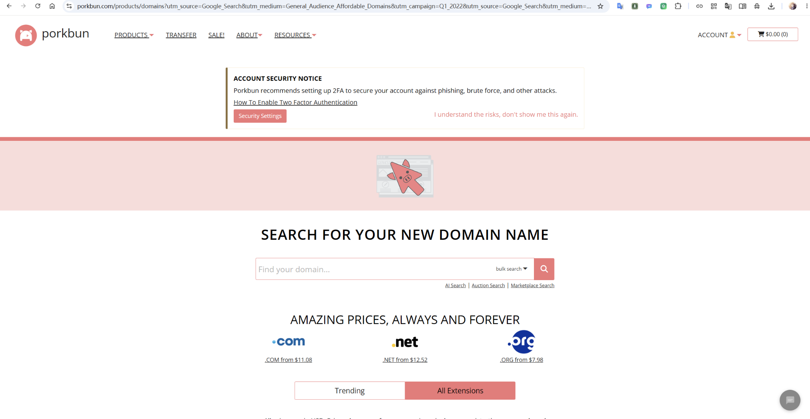

## 8.1 这次 Porkbun 验证的完整结论

真正出现过的问题至少有三层：

### 第一层：提交方式错误

最早提交了“屏幕上的证件照片”，不是直接拍实体身份证。

### 第二层：账户姓名与证件不一致

客服人工核对后发现 Porkbun account name 与身份证姓名不匹配。

### 第三层：Veriff 对中文身份证自动识别不稳定

即使实体身份证和账户信息已经处理正确，自动系统仍可能提示不支持。

最终解决方法不是无限重试，而是：

```text
确保资料正确
+ 确保证件和 selfie 都上传
+ 保留账号
+ 找 Porkbun ID Team 人工审核
```

---

# 9. 中途转向 Cloudflare Registrar：支付失败、重复账单与欠款提示

因为 Porkbun 实名认证折腾太久，我中途决定：

> 干脆去 Cloudflare Registrar 买域名。

结果又遇到了第二组坑：**支付失败后生成重复未付款发票**。

## 9.1 Cloudflare 第一次支付报错

支付页面出现：

```text
An unexpected error occurred while processing your payment.
```

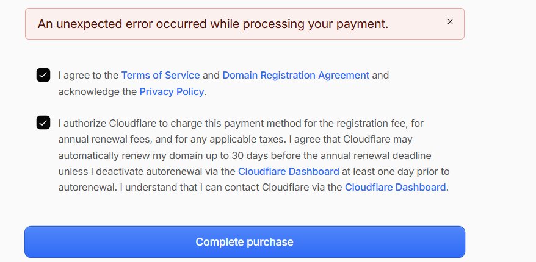

当时我使用 Visa / 银行卡尝试，支付没有真正完成。

## 9.2 连续重试导致生成 3 张未付款发票

因为我以为“没付成功就再点一次”，结果连续失败以后，Cloudflare Billing 里出现了三张未付款 invoice。

每张大约：

```text
$20.92
```

三张合计：

```text
$62.76
```

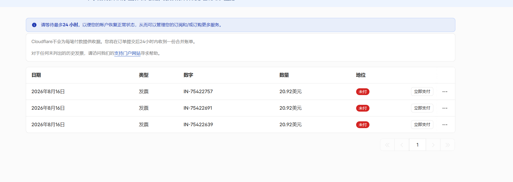

随后账户直接提示：

```text
Your account has an overdue balance.
Outstanding balance: $62.76
```

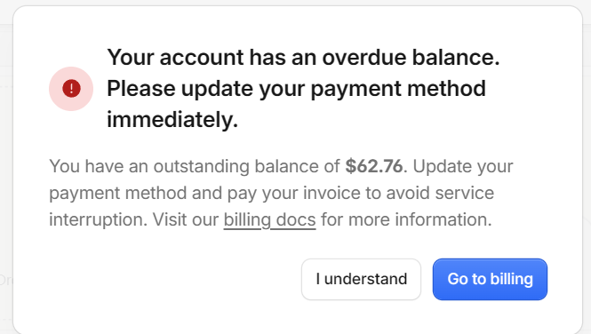

这里最危险的地方是：

> 邮件还写着系统可能会在接下来几天**自动重试付款**。

所以如果这时直接添加一张可以成功扣款的新卡，就会担心旧失败订单被系统重新尝试扣款。

## 9.3 正确处理方法：找 Billing Support，不要继续重复下单

我进入 Cloudflare Support Portal：

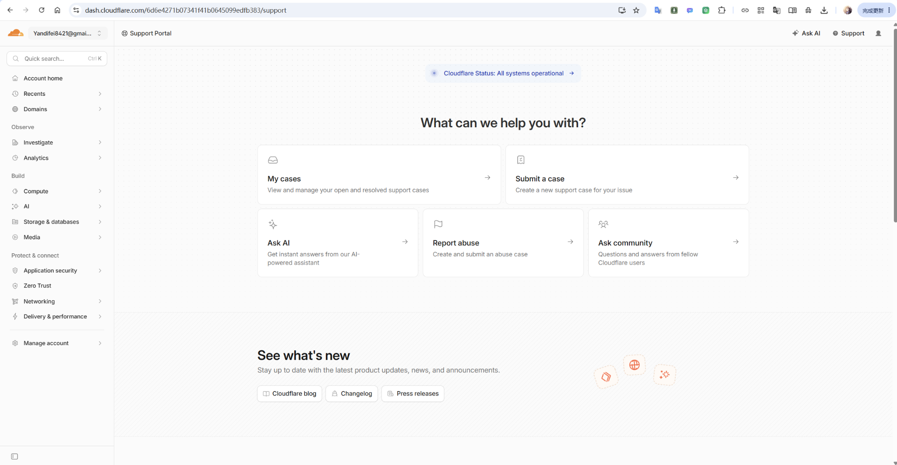

在 Billing 分类里找 invoice / overdue / payment issue：

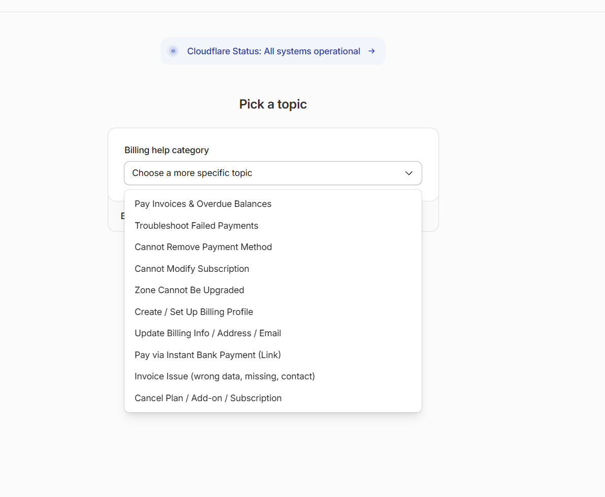

我当时要求处理的核心是：

```text
3 次域名注册付款均失败
没有获得对应 3 个域名服务
却生成 3 张未付款发票

要求：
- void / cancel 重复失败发票
- stop automatic payment retries
- clear outstanding balance
- 确认没有重复注册
```

这次教训很明确：

> **域名支付失败后，不要连续盲点三四次。**  
> 先查 Billing、订单、Registrar 状态，再决定是否重新提交。

---

# 10. Cloudflare 最终购买成功以及银行卡“冻结”资金

后来我办理/使用 Mastercard，最终在 Cloudflare Registrar 成功买下了：

```text
yandifei.com
```

Cloudflare Registrar 后台显示：

- Domain：`yandifei.com`
- Status：`Active`
- Auto-renew：已开启
- Expires：`Aug 17, 2028`

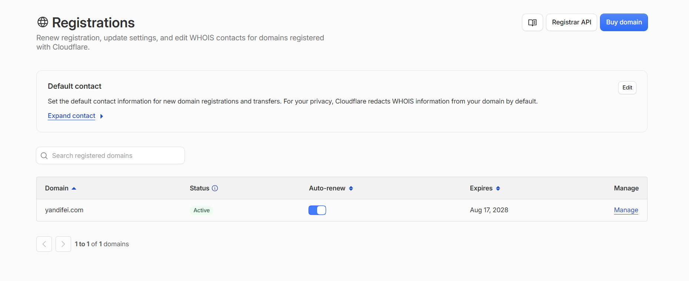

这才是判断“域名到底有没有买成功”的核心证据之一：

> **Registrar 页面里域名已经 Active，说明注册本身成功。**

## 10.1 卡里没有立即显示正式扣款，反而出现资金冻结

域名注册成功以后，我发现银行卡并没有马上以“已正式扣款”的形式显示，而是有约 `141 元`变成不可用资金。

招商银行页面提示：

- 部分资金暂不可用；
- 可能是理财在途、存款证明冻结、挂失冻结、贷款质押冻结等；
- 实际只有剩余未冻结余额可以直接使用。

相关画面：

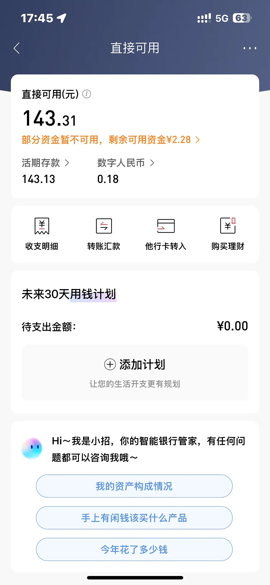

我随后直接打电话问银行客服。

银行给出的解释是：

- 这是正常现象；
- 约 141 元被这笔境外 Mastercard 交易暂时占用/冻结；
- 其他余额仍然可以正常使用；
- 卡也可以正常充值、继续使用；
- 商户/卡组织/银行还需要时间完成后续清算流程；
- 等商户真正完成请款/清算后，这部分会转成正式扣账，而不是“永久冻结”。

所以这不是“域名买成功但钱没扣”的矛盾，而是银行卡支付的两个阶段：

```text
第一阶段：授权
→ 银行先把对应资金占住

第二阶段：清算 / 入账
→ 商户正式取得款项
→ 账单变成正式消费记录
```

这次实际已经电话向发卡行确认，不需要因为短时间的授权冻结重复付款。

---

# 11. 这次经历里最容易混淆的几个概念

## 11.1 WHOIS Privacy ≠ 隐藏服务器真实 IP

WHOIS Privacy 保护的是：

```text
域名注册人姓名
邮箱
电话
地址
```

它不负责隐藏：

```text
服务器公网 IP
源站端口
源站真实网络位置
```

如果我的核心目标是：

> “不想让别人知道服务器真实地址”

更关键的是：

- Cloudflare Proxy；
- Cloudflare Tunnel；
- 源站防火墙；
- 不在 DNS 历史、邮件、其他子域、响应头等地方泄露源站。

## 11.2 Cloudflare Proxy 和 Cloudflare Tunnel 也不是完全一样

### Proxy（橙云）

典型情况：

```text
域名
→ Cloudflare 边缘
→ Cloudflare 再访问我的公网源站
```

源站通常仍需要能被 Cloudflare 访问。

### Tunnel

典型情况：

```text
我的内网机器主动向 Cloudflare 建立连接
→ 不需要公网入口
→ Cloudflare 通过隧道把请求送进来
```

如果我没有独立公网 IP，Tunnel 更适合。

## 11.3 Email Forwarding ≠ Email Hosting

### Email Forwarding

例如：

```text
hello@yandifei.com
→ 转发到我的 Gmail / QQ 邮箱
```

它主要解决“别人发给我，我能收到”。

### Email Hosting

是真正提供：

- 邮箱空间；
- IMAP/POP；
- SMTP；
- Webmail；
- 以 `@我的域名` 直接收发邮件。

所以看到 Porkbun 的“Email Hosting Trial”和“Email Forwarding”时不能把它们当成同一个服务。

## 11.4 域名注册商 ≠ DNS 服务商 ≠ Web Hosting

三个角色可以完全拆开：

```text
Registrar：谁帮我注册和续费域名
DNS：谁负责把域名解析到目标
Hosting：真正运行网站/程序的服务器在哪里
```

例如完全可以：

```text
Porkbun 注册
Cloudflare DNS
自己的服务器 Hosting
```

也可以：

```text
Cloudflare Registrar
Cloudflare DNS
自己的服务器 / Tunnel
```

---

# 12. 我现在最适合的域名与服务器架构

结合我最初的需求，后续比较合适的结构是：

```text
                    yandifei.com
                         │
                  Cloudflare DNS
                         │
        ┌────────────────┼────────────────┐
        │                │                │
        ▼                ▼                ▼
 yandifei.com      dev.yandifei.com   api.yandifei.com
 正式服务             Demo/笔记本         API
        │                │                │
        │         Cloudflare Tunnel        │
        │                │                │
        ▼                ▼                ▼
 正式服务器          内网电脑/笔记本      后端服务
        │
      Nginx
        │
  ┌─────┼──────────┐
  ▼     ▼          ▼
前端   API       管理后台
```

如果不想暴露源站 IP，优先考虑：

```text
Cloudflare Tunnel
```

或者：

```text
Cloudflare Proxy
+ 源站防火墙只允许必要来源
```

## 12.1 一个很实用的开发工作流

我写完前端 Demo 后，可以快速：

```text
本地启动：
localhost:3000

Cloudflare Tunnel：
dev.yandifei.com -> localhost:3000
```

这样不需要每次都把程序正式部署到公网服务器，就能让别人访问 Demo。

正式版本再通过：

```text
yandifei.com
```

指向正式服务器。

---

# 13. 以后再买域名时的完整检查流程

## 13.1 下单前

确认：

- 域名拼写绝对正确；
- 注册几年；
- 首年价格和续费价格分开看；
- 是否支持 WHOIS Privacy；
- 哪些是永久免费，哪些只是 Trial；
- 是否默认自动续费；
- 是否 No Refund；
- 有没有被自动加购 Hosting / Email 等服务；
- 付款卡是否支持境外在线交易、3DS、对应币种。

## 13.2 注册商要求身份验证时

不要慌，也不要马上删号。

先检查：

```text
账户姓名 == 法定证件姓名
First/Given Name == 名
Last/Family Name == 姓
电话、邮箱、地址真实
```

Veriff 操作时：

```text
实体证件
现场拍摄
证件完整
不拍电脑屏幕
不使用截图
不打码
完成 selfie
```

如果自动系统报：

```text
Unsupported
Declined
Not accepted
```

先确认：

> 身份证和 selfie 是否实际上已经成功上传。

如果上传完成，就找注册商支持团队人工复核，而不是无限重试。

## 13.3 付款失败时

不要连续点击三次、四次。

先检查：

```text
Registrar：域名是否 Active
Billing：是否生成 invoice
Card：授权有没有成功
Email：有没有 payment failed / retry 通知
```

如果出现重复 invoice，先联系 Billing Support。

## 13.4 域名购买成功后

马上做：

```text
开启 2FA
保存恢复码
开启 Registrar Lock / Transfer Lock
检查 Auto-renew
确认恢复邮箱和手机号
检查 WHOIS Privacy
规划 DNS
```

Porkbun 页面也明确建议配置 2FA 来降低 phishing、brute force 等账户攻击风险。

---

# 14. 本次踩坑时间线

| 阶段 | 我做了什么 | 发生了什么 | 最终理解 |
|---|---|---|---|
| 准备阶段 | 研究 Porkbun 10 年 `.com` | 看到 WHOIS、SSL、Hosting Trial、Email 等一堆服务 | 域名本体和附带服务要分开理解 |
| 架构阶段 | 研究 DNS、子域名、Nginx、Cloudflare | 确认可以一个域名挂多个服务 | 子域名不需要重复购买 |
| Porkbun 初次注册 | 创建账号并准备购买 | 触发 ID Verification | 某些账户会触发风控验证 |
| 第一次 Veriff | 提交验证 | 被 Declined | 最初提交方式有问题 |
| 客服第一次检查 | 联系 Porkbun | 客服指出我拍了电脑屏幕，不是实体证件 | 必须现场拍实体证件 |
| 再次验证 | 使用实体中国身份证 | 仍提示 Unsupported | 自动系统对中文身份证不稳定 |
| 人工检查 | Support 查看 Veriff submission | 发现 Porkbun 账户姓名与证件姓名不匹配 | 账户姓名也必须正确 |
| 删号重建 | 删除旧账号后重建 | 又进入验证 | 删除账户并不能解决 Veriff 语言问题 |
| 再次失败 | 中国身份证仍被自动拒绝 | 前端继续红色提示 | 自动结果不是最终结果 |
| 客服明确规则 | Maggie 回复 | 中文或拼音都可以；ID + selfie 上传后可人工审核 | 关键是保留账号并让 ID Team 接管 |
| 最终提交 | 保留新账号，请求 manual review | ID Team 人工复核 | **人工审核通过** |
| Cloudflare 兜底 | 中途去 Cloudflare 买域名 | 多次支付失败生成 3 张 invoice | 支付失败不能盲目重试 |
| Cloudflare 最终付款 | Mastercard 成功授权 | `yandifei.com` Registrar 状态 Active | 域名最终购买成功 |
| 银行侧 | 约 141 元暂时不可用 | 电话确认属于正常授权/清算过程 | 冻结不等于永久扣住 |
| 最终状态 | Porkbun 账号也已人工通过 | 两个平台都能正常使用 | Porkbun 可保留备用，域名当前在 Cloudflare |

---

# 15. 最终结论

这次经历最值得保留的不是“哪个按钮点哪里”，而是下面这一整套判断逻辑。

## 15.1 Porkbun 方面

最终事实是：

```text
Porkbun 要求 ID Verification
→ Veriff 对中文身份证自动识别失败
→ 早期还有提交屏幕照片、姓名不匹配的问题
→ 反复删号不是正确解法
→ 正确做法是把真实资料填对
→ 确保证件 + selfie 上传
→ 找 Porkbun ID Team 人工审核
→ 最终人工审核通过
```

客服最终已经明确批准身份验证，Porkbun 账号现在可以正常使用。

## 15.2 Cloudflare 方面

最终事实是：

```text
前期支付失败
→ 产生多张未付款 invoice
→ 出现 overdue balance
→ 需要 Billing Support 处理重复失败订单

后来 Mastercard 支付成功
→ yandifei.com 在 Registrar 中显示 Active
→ 银行资金先授权冻结
→ 后续等待正常清算
```

## 15.3 域名实际部署方面

我真正需要的技术架构并不依赖注册商提供 Web Hosting。

最适合我的路线是：

```text
域名
+ Cloudflare DNS
+ Cloudflare Tunnel / Proxy
+ Nginx
+ 自己的服务器/笔记本
```

这样：

- 正式服务可以放主域名；
- Demo 可以放 `dev` 子域名；
- API 可以独立子域名；
- 不需要每个服务重新买一个域名；
- 没有公网 IP 的设备也能通过 Tunnel 暴露服务；
- 可以尽量减少真实源站 IP 暴露。

---

# 附：本次最重要的“不要再踩”事项

1. **不要把 WHOIS Privacy 当成隐藏服务器 IP 的工具。**
2. **不要把 Email Forwarding 和 Email Hosting 当成同一件事。**
3. **身份证验证必须拍实体证件，不要拍屏幕。**
4. **First/Given Name 是“名”，Last/Family Name 是“姓”。**
5. **客服已明确：人工审核时可以用拼音或中文字符。**
6. **Veriff 自动显示 Declined 不代表 Porkbun 人工审核一定失败。**
7. **只要 ID + selfie 上传成功，优先让 ID Team 人工 review。**
8. **有人工工单时不要反复删账号。**
9. **付款失败不要连续重复下单，否则可能生成多张 invoice。**
10. **判断域名是否购买成功，要看 Registrar 状态是否 Active，而不是只看银行卡有没有马上正式扣账。**
11. **银行卡先冻结/授权、后清算，是境外卡支付中可能出现的正常流程。**
12. **最终要隐藏源站，重点是 Cloudflare Tunnel / Proxy 和源站网络策略，而不是注册商的 WHOIS Privacy。**

---

## 配图索引

为了方便以后查阅，本记录把关键截图统一整理在 `images/` 目录：

```text
images/01-Porkbun十年域名购物车.png             Porkbun 10 年购物车
images/02-Porkbun联系信息真实提醒.png           联系信息必须真实的提醒
images/03-Porkbun身份验证页面.png               Porkbun ID Verification Gate
images/04-Veriff身份验证起始页.png              Veriff 起始页面
images/05-Porkbun身份验证被拒绝.png             Declined ID Verification
images/06-客服指出屏幕照片问题.png              客服指出屏幕照片问题
images/07-客服提供72小时验证链接.png            客服给 72 小时验证链接
images/08-重建账号后仍需验证.png               重建账号后再次验证
images/09-第二次验证失败.png                   第二次验证失败
images/10-Veriff不支持证件提示.png              Veriff 不支持证件提示
images/11-账号再次删除.png                     再次删号
images/12-客服确认人工审核拼音中文均可.png      客服确认人工审核 + 拼音/中文均可
images/13-人工审核通过后账号恢复正常.png        Porkbun 人工通过后恢复正常
images/14-Cloudflare域名支付错误.png            Cloudflare 支付错误
images/15-Cloudflare三张未付款发票.png          Cloudflare 三张重复未付款发票
images/16-Cloudflare逾期欠款提示.png            Cloudflare $62.76 overdue balance
images/17-Cloudflare支持门户.png                Cloudflare Support Portal
images/18-Cloudflare账单问题分类.png            Cloudflare Billing 分类
images/19-Cloudflare域名已激活.png              yandifei.com 在 Cloudflare Registrar Active
images/20-银行卡资金冻结提示.png                银行卡授权冻结/暂不可用资金
```

---

**文档状态：** 已根据 2026 年 8 月这次真实操作过程整理。  
**建议：** 以后如果 Porkbun、Cloudflare 的价格、验证规则、免费服务或续费政策发生变化，直接在本文件对应章节追加“新政策记录”，不要覆盖旧记录，这样可以保留政策变化历史。
