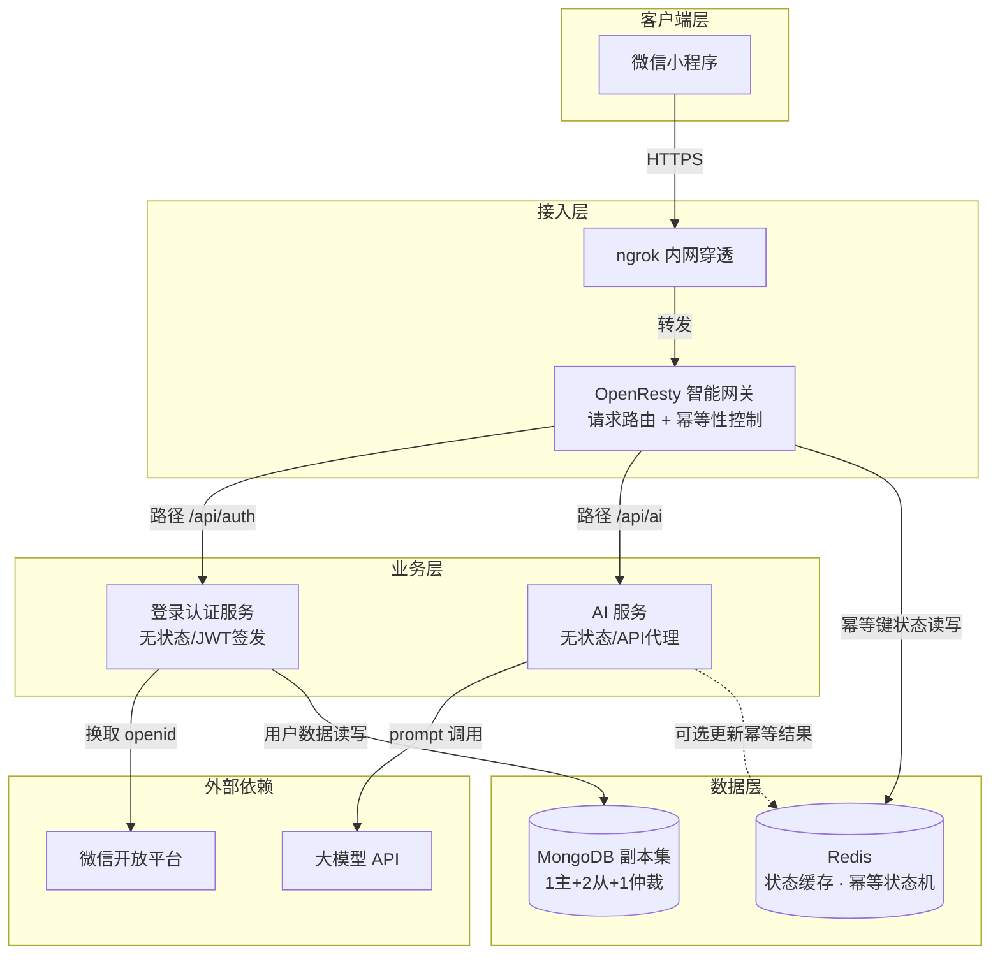
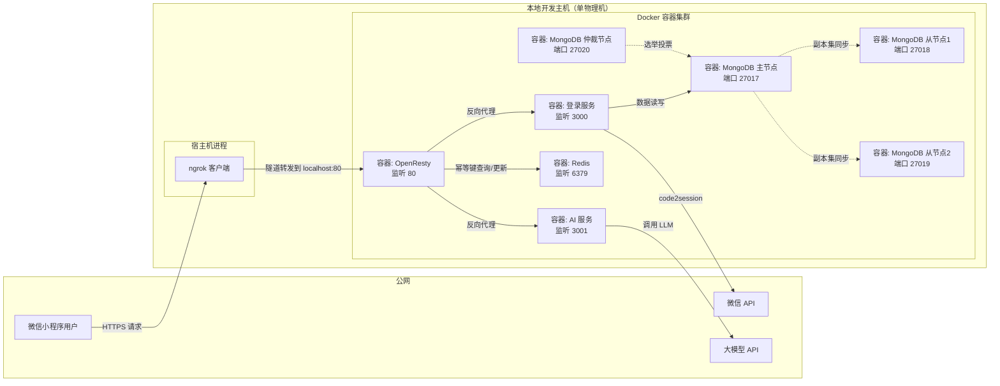

# 微信小程序后端系统架构设计文档
版本 1.0 | 2026年5月30日

## 1. 文档概述 (Introduction)

### 1.1 范围与目标 (Scope and Goals)

本架构设计文档旨在定义一个稳定、可扩展的**微信小程序后端系统**。该系统采用**单机微服务模式**，以满足**快速原型验证与产品演示**为核心目标。文档覆盖了从用户接入、业务处理到数据持久化的全链路架构设计，并遵循IEEE 1471-2000标准，使用多个“视图”来组织架构描述。

### 1.2 利益相关者 (Stakeholders)

*   **开发者 (Developer):** 您是本文档的核心读者，负责架构的落地实现与运维。
*   **产品经理 (Product Manager):** 关注功能实现度与上线效率。
*   **运维工程师 (Operations Engineer):** 在后续演进阶段，将参考本文档进行系统监控与扩容。

### 1.3 架构约束 (Architectural Constraints)

*   **部署环境约束:** 开发与演示阶段，所有组件必须能运行在**单台物理机或虚拟机**上。
*   **网络环境约束:** 需使用**ngrok**等内网穿透工具，为本地服务提供公网可访问的HTTPS终点，以适配微信小程序的合法域名要求。
*   **性能基准约束 (Performance Baseline):** 系统并非为超高并发设计，但在单实例下，需满足API响应时间低于200ms（不含外部AI服务调用时间）。

## 2. 架构设计 (Architectural Design)

### 2.1 架构描述与视图 (Architecture Description & Views)

本系统采用**逻辑视图 (Logical View)** 与**部署视图 (Deployment View)** 来描述其软件架构。

#### 2.1.1 逻辑视图

逻辑视图将系统划分为接入层、业务层、数据层及辅助层四个层次，体现了“高内聚、低耦合”的设计原则。

*   **接入层 (Access Layer):** 作为系统的统一入口，负责请求路由、协议转换及路径分发。同时，该层是首个“幂等性控制点”，在请求进入业务逻辑前进行拦截判断。
*   **业务层 (Business Layer):** 包含两个核心无状态服务。
    *   **登录认证服务 (Auth Service):** 负责用户身份认证和JWT（JSON Web Token）的签发。
    *   **AI服务 (AI Service):** 负责接收用户请求，调用外部大模型API，并返回生成结果。
*   **数据层 (Data Layer):**
    *   **数据持久化服务 (MongoDB Cluster):** 以副本集的形式提供高可用的数据存储。
    *   **状态与缓存服务 (Redis):** 用于实现业务层的幂等性控制、分布式锁及临时数据缓存。
*   **辅助层 (Auxiliary Layer):**
    *   **反向代理服务 (Nginx):** 在此方案中，OpenResty替代标准Nginx，负责具体的反向代理和流量分发工作。
    *   **内网穿透服务 (ngrok Client):** 作为网络辅助工具，建立本地服务与公网的隧道。

#### 2.1.2 部署视图

部署视图描述了软件组件如何在硬件节点上分布和交互。当前设计采用 **“All-in-One”物理部署，逻辑分布**的模式。

*   **物理节点 (Physical Node):** 单台本地开发主机。
*   **容器化部署 (Containerized Deployment):** 所有核心服务组件，包括 OpenResty、登录认证服务、AI服务、MongoDB 副本集（4个实例）、Redis，均通过Docker Compose进行编排，运行在独立的Docker容器中。
*   **内网穿透隧道 (Tunnel):** ngrok客户端运行在宿主机，将本地OpenResty监听的端口暴露至公网。
*   **外部依赖 (External Dependency):** 业务层依赖的外部AI模型API和微信登录API。

## 3. 组件设计 (Component Design)

### 3.1 接入层与API网关 (Access Layer & API Gateway)

本系统选择 **OpenResty** 作为核心接入组件，其设计要点在于：

*   **选型依据 (Rationale):** 相较于标准的Nginx，OpenResty 通过在 Nginx 核心中深度集成 LuaJIT，使得在请求处理的生命周期内，能直接与 Redis 等后端服务进行非阻塞交互，这对于在网关层实现自定义的、高性能的幂等性逻辑至关重要。它在此架构中扮演 **“智能网关”** 的角色，而非简单的反向代理。
*   **核心职责:**
    *   **请求路由 (Routing):** 根据请求的 URL 路径 (`/api/auth/`， `/api/ai/`)，将流量精准地分发给后端的登录认证服务或 AI 服务。
    *   **幂等性网关 (Idempotency Gateway):** 作为API网关的“横切关注点 (Cross-Cutting Concern)”，OpenResty 将内建幂等性处理机制。在将请求转发至后端业务服务**之前**，它会主动查询Redis，以执行幂等性判断。所有非首次或处理中的请求在此层被拦截，确保后端服务接收到的都是“干净”的请求。

### 3.2 业务层 (Business Layer)

#### 3.2.1 登录认证服务 (Auth Service)

*   **核心职责:**
    *   **凭证交换:** 接收小程序端传来的 `code`，并与微信官方服务器交互，换取用户的唯一标识 `openid`。
    *   **身份凭证签发:** 生成并签署标准的 **JWT（JSON Web Token）** 作为用户后续请求的认证凭证。
*   **设计决策 (Design Decisions):**
    *   **无状态设计 (Stateless):** 服务本身不存储任何用户会话状态。用户的认证信息完全包含在自包含的JWT中。此设计使得该服务能够轻松地进行水平扩展。
    *   **密钥管理:** JWT的签名密钥通过环境变量注入，避免硬编码。

#### 3.2.2 AI服务 (AI Service)

*   **核心职责:**
    *   **请求代理:** 接收来自API网关的请求，将其封装后，安全地调用第三方大模型提供商的API。
    *   **结果处理与回落 (Fallback):** 对AI模型返回的结果进行解析和格式化。同时需设计超时和重试机制，以处理外部服务不稳定的情况。
*   **设计决策 (Design Decisions):**
    *   **无状态设计 (Stateless):** 服务实例不保存任何对话状态或用户数据，所有必要的上下文信息均由请求附带。
    *   **资源保护:** 该服务应被视为“昂贵”资源，因此所有对其的访问都必须经过上游网关的幂等性检查，以防止因重复请求造成的资源浪费和额外计费。

### 3.3 数据层 (Data Layer)

#### 3.3.1 状态与缓存服务 (Redis)

*   **核心职责:**
    *   **网关层幂等控制枢纽:** 作为OpenResty实现幂等性的核心依赖。Redis 存储和管理每个“幂等键”的状态机（如 `PROCESSING`， `DONE`），其原子操作能力是确保并发安全的关键。
    *   **业务层辅助:** 可作为登录服务JWT黑名单或AI服务限流计数器的临时存储。
*   **选型依据 (Rationale):** Redis的内存存储与高性能特性，完全符合幂等性机制对极低延迟和高吞吐的原子操作要求。

#### 3.3.2 数据持久化服务 (MongoDB Cluster)

*   **核心职责:**
    *   **数据持久存储:** 作为系统的主数据库，负责持久化存储用户信息、对话历史记录等所有业务数据。
*   **设计决策 - 副本集架构 (Design Decision - Replica Set Architecture):**
    *   **单机多实例模拟:** 在本部署环境中，通过Docker Compose在一台物理机上运行 **1主(Primary) + 2从(Secondary) + 1仲裁(Arbiter)** 共4个MongoDB实例，组成一个完整的副本集。
    *   **高可用架构模拟:** 此设计旨在模拟生产环境的标准副本集部署模式。虽然物理上仍存在单点故障风险，但其逻辑结构确保了**读写分离**、**数据冗余**和**自动故障转移**的机制能够得到充分验证。`Arbiter`节点的加入，使得在只有两个数据节点时也能满足选举所需的“奇数个投票成员”要求，避免了“脑裂”风险。
*   **数据模型设计原则:**
    *   **以访问模式为导向 (Access Pattern-Oriented):** 遵循MongoDB的设计哲学，数据模型将围绕应用程序的查询模式进行设计，通过数据嵌套或引用来减少Join操作，以优化读写性能。

## 4. 关键技术决策 (Key Technical Decisions)

### 4.1 API网关幂等性策略 (Idempotency Strategy at Gateway)

*   **问题背景:** 在网络不稳定的环境中，客户端（小程序）的重试机制可能导致同一个请求（如“生成报告”）被多次发送，造成资源浪费或结果不一致。
*   **决策:** **在API网关层（OpenResty）强制实施幂等性控制。**
*   **设计原理:** 采用“一锁、二判、三更新”的设计模式。
    1.  **客户端负责:** 为每个可能产生副作用的请求（如调用AI服务）生成一个全局唯一的 `Idempotency-Key` 并在请求头中传递。
    2.  **网关负责 (OpenResty + Redis):**
        *   **一锁 (Lock):** 网关接受到请求后，提取 `Idempotency-Key`，并尝试在Redis中以原子性操作（`SET NX`）创建一个key，若成功则代表这是首次请求。
        *   **二判 (Check & Decide):** 若创建key失败（表明key已存在），网关立即查询Redis中该key对应的状态。
        *   **三更新 (Update & Forward):** 若判定为首次请求，将此key的状态更新为 `PROCESSING`，并将请求转发给后端服务。后端服务处理完毕后，需回调网关或直接操作Redis，将状态更新为 `DONE` 并缓存响应结果。对于后续相同key的请求，网关直接返回缓存的结果。

## 5. 安全性设计 (Security Design)

### 5.1 认证与授权 (Authentication & Authorization)

*   **认证机制:** 采用基于JWT的无状态认证模式。用户登录成功后，服务端签发一个包含用户身份信息且经过签名的JWT。
*   **授权:** 后续请求在到达业务层前，由**登录认证服务**的中间件（或引入一个独立的认证过滤器）拦截并验证JWT的签名和有效期。

### 5.2 访问控制 (Access Control)

*   **网络隔离:** 所有内部服务（登录服务、AI服务、MongoDB、Redis）均不应直接暴露在公网。唯一公网入口是**OpenResty网关**。
*   **安全传输:** 所有外部通信，尤其是小程序客户端与服务器之间的通信，必须通过 **HTTPS** 协议进行。在开发环境中，`ngrok` 自动提供TLS加密的公网HTTPS地址，用于满足此要求。

### 5.3 凭证管理 (Credential Management)

*   **敏感信息:** 微信小程序的 `AppSecret`、AI模型的`API Key`、JWT签名密钥等所有敏感凭证，均禁止硬编码。
*   **管理方式:** 通过 **Docker Compose 的环境变量**或**独立的 `.env` 文件**进行注入，并由版本控制系统忽略。

## 6. 部署与演进 (Deployment & Evolution)

### 6.1 当前部署方案 (Current Deployment)

此架构专为当前环境设计，提供了一条从本地开发到功能演示的完整路径。
1.  **环境准备:** 在本地开发主机上安装 Docker 和 Docker Compose。
2.  **服务编排:** 编写 `docker-compose.yml` 文件，定义并编排 **OpenResty**、**Auth Service**、**AI Service**、**MongoDB (4实例)** 和 **Redis** 这五个核心服务。
3.  **配置启动:** 通过配置文件配置OpenResty的路由和幂等逻辑，配置MongoDB副本集，然后执行 `docker-compose up` 启动所有容器。
4.  **公网暴露:** 在宿主机上运行 `ngrok` 客户端，并将流量指向 OpenResty 容器的宿主端口。
5.  **小程序配置:** 将 `ngrok` 提供的公网 HTTPS 地址配置为微信小程序后台的合法服务器域名，完成联调。

### 6.2 未来演进规划 (Future Evolution)

*   **阶段一：高可用演进 (High Availability Evolution):** 当项目需要升级为正式生产环境时，首要任务是将所有组件从“单机部署”演进为“多机部署”。
    *   **动作:**
        *   将 **OpenResty** 替换或前置为云服务商的**负载均衡器 (SLB/ALB)**。
        *   使用 **容器编排平台 (如 Kubernetes)**，将 **Auth Service** 和 **AI Service** 部署为多副本，并分布到**至少2台**云主机上，以消除单点故障。
        *   将 **MongoDB 副本集**的4个实例迁移到**多台独立的云主机**上，以发挥其真正的容灾与自动故障转移能力。
*   **阶段二：服务治理演进 (Governance Evolution):**
    *   **动作:** 引入更强大的API网关，如基于OpenResty构建的企业级产品 OpenResty Edge，以获得更完善的流量管理、安全防护和可观测性功能。

---

## 图1：逻辑架构视图（Logical View）

展示系统的分层结构、组件划分以及它们之间的依赖关系。

**说明**：
- **接入层**：OpenResty 作为唯一公网入口，既做路由也做幂等性网关（直接与 Redis 交互）。
- **业务层**：两个无状态服务，登录服务连接微信和 MongoDB，AI 服务连接大模型 API。
- **数据层**：Redis 为网关提供实时状态查询；MongoDB 为登录服务提供持久化。

## 图2：部署与交互视图（Deployment View）

展示物理节点、容器分布、网络隧道以及外部访问路径。此图对应“单机 Docker 部署 + ngrok 内网穿透”的实际环境。

**说明**：
- 所有服务运行在**同一台物理机**的 Docker 容器中，通过 Docker Compose 编排。
- **ngrok** 运行在宿主机，将 OpenResty 的 80 端口暴露到公网 HTTPS 地址。
- MongoDB 的 4 个容器组成副本集（1 主、2 从、1 仲裁），模拟生产环境架构。
- 登录服务和 AI 服务分别访问外部微信 API 和大模型 API。