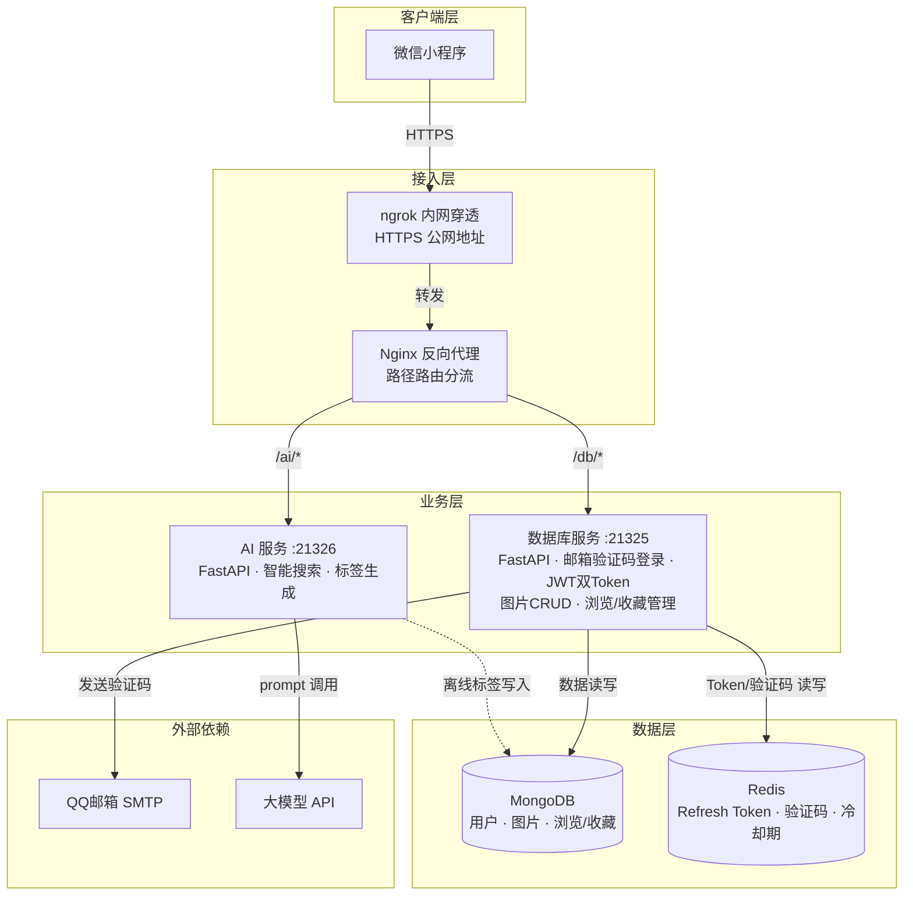
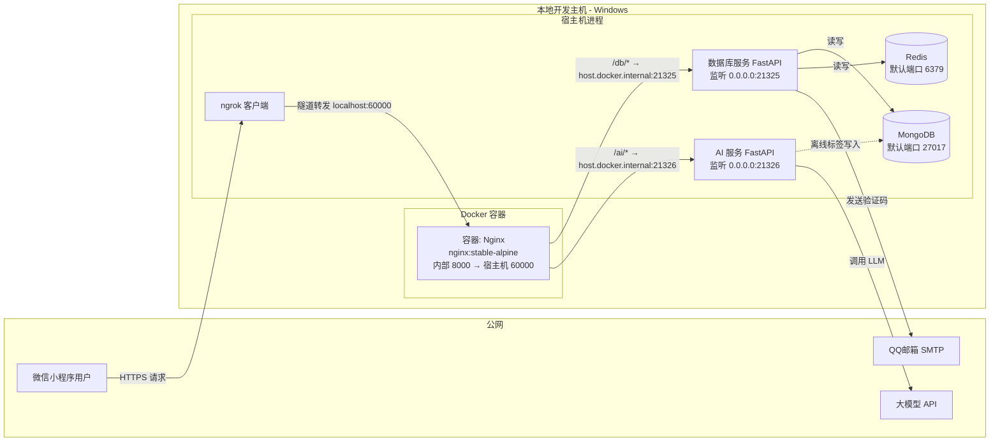

# 微信小程序后端系统架构设计文档
版本 2.0 | 2026年6月11日

## 1. 文档概述 (Introduction)

### 1.1 范围与目标 (Scope and Goals)

本架构设计文档旨在定义一个稳定、可扩展的**微信小程序后端系统**。该系统采用**单机微服务模式**，通过 **Nginx 路由分发**将请求按路径分流至不同后端服务，以满足**快速原型验证与产品演示**为核心目标。文档覆盖了从用户接入、业务处理到数据持久化的全链路架构设计，并遵循IEEE 1471-2000标准，使用多个"视图"来组织架构描述。

### 1.2 利益相关者 (Stakeholders)

*   **开发者 (Developer):** 您是本文档的核心读者，负责架构的落地实现与运维。
*   **产品经理 (Product Manager):** 关注功能实现度与上线效率。
*   **运维工程师 (Operations Engineer):** 在后续演进阶段，将参考本文档进行系统监控与扩容。
*   **实际目前开发者都是我一个人**

### 1.3 架构约束 (Architectural Constraints)

*   **部署环境约束:** 开发与演示阶段，所有组件必须能运行在**单台物理机或虚拟机**上。
*   **网络环境约束:** 需使用**ngrok**等内网穿透工具，为本地服务提供公网可访问的HTTPS终点，以适配微信小程序的合法域名要求。
*   **性能基准约束 (Performance Baseline):** 系统并非为超高并发设计，但在单实例下，需满足API响应时间低于200ms（不含外部AI服务调用时间）。

## 2. 架构设计 (Architectural Design)

### 2.1 架构描述与视图 (Architecture Description & Views)

本系统采用**逻辑视图 (Logical View)** 与**部署视图 (Deployment View)** 来描述其软件架构。

#### 2.1.1 逻辑视图

逻辑视图将系统划分为接入层、业务层、数据层及辅助层四个层次，体现了"高内聚、低耦合"的设计原则。

*   **接入层 (Access Layer):** 作为系统的统一入口，负责请求路由与路径分发。使用 **Nginx** 作为反向代理，根据 URL 前缀将请求分发给对应的后端服务。
*   **业务层 (Business Layer):** 包含两个核心无状态服务。
    *   **数据库服务 (DB Service - mongodb_service):** 端口 21325。负责邮箱验证码登录、JWT 双 Token 认证、图片数据 CRUD、浏览记录管理、收藏管理等业务逻辑。依赖 MongoDB 做数据持久化，依赖 Redis 做 Refresh Token 存储和验证码管理。
    *   **AI服务 (AI Service):** 端口 21326。负责接收搜索请求，调用大模型 API 进行自然语言处理、图片标签生成等智能功能。
*   **数据层 (Data Layer):**
    *   **MongoDB:** 单实例，负责用户信息、图片元数据、浏览记录（嵌入式）、收藏记录（嵌入式）等业务数据的持久化存储。
    *   **Redis:** 单实例，负责 Refresh Token 会话存储（`refresh:{user_id}:{jti}`）、邮箱验证码存储（`email_code:{email}`，5min TTL）、发送冷却期标记（`email_cooldown:{email}`，60s TTL）。
*   **辅助层 (Auxiliary Layer):**
    *   **反向代理服务 (Nginx):** 标准 Nginx，通过 Docker Compose 部署，负责 URL 路径路由分流（`/db/*` → 数据库服务 21325，`/ai/*` → AI 服务 21326）。
    *   **内网穿透服务 (ngrok Client):** 作为网络辅助工具，建立本地服务与公网的隧道，为微信小程序提供 HTTPS 接入。

#### 2.1.2 部署视图

部署视图描述了软件组件如何在硬件节点上分布和交互。当前设计采用 **"All-in-One"物理部署，逻辑分布**的模式。

*   **物理节点 (Physical Node):** 单台本地开发主机（Windows 11）。
*   **容器化部署 (Containerized Deployment):** Nginx 通过 Docker Compose 进行容器化部署；数据库服务与 AI 服务以 Python FastAPI（Uvicorn）进程直接运行在宿主机上，端口分别为 21325 和 21326。
*   **数据库部署:** MongoDB 和 Redis 均为单实例部署在宿主机（或 Docker 容器），默认端口 27017 和 6379。
*   **内网穿透隧道 (Tunnel):** ngrok 客户端运行在宿主机，将本地 Nginx 暴露的 60000 端口映射至公网 HTTPS 地址。
*   **外部依赖 (External Dependency):** 业务层依赖的外部 AI 模型 API 和 QQ 邮箱 SMTP 服务。

## 3. 组件设计 (Component Design)

### 3.1 接入层与路由分发 (Access Layer & Routing)

本系统选择 **Nginx** 作为核心接入组件，其设计要点在于：

*   **选型依据 (Rationale):** Nginx 是业界最成熟的高性能反向代理服务器，资源占用低、配置简洁，完全满足本项目两个后端服务的路由分发需求。通过 Docker Compose 部署，可一键启动并与后端服务协同工作。
*   **核心职责:**
    *   **请求路由 (Routing):** 根据请求的 URL 路径前缀（`/db/`、`/ai/`），将流量精准地分发给对应的后端服务（数据库服务 21325、AI 服务 21326）。路径前缀在转发时自动剥离（如 `/db/auth/login` → `http://host:21325/auth/login`）。
    *   **统一入口 (Single Entry Point):** 对外仅暴露 8000 端口（映射至宿主机 60000），隐藏后端服务的实际端口，简化客户端调用和 ngrok 隧道配置。

### 3.2 业务层 (Business Layer)

#### 3.2.1 数据库服务 (DB Service - mongodb_service) — 端口 21325

*   **核心职责:**
    *   **用户认证:** 采用邮箱验证码登录模式。`POST /auth/send-code` 发送6位验证码（QQ邮箱SMTP），`POST /auth/login` 校验验证码并自动注册新用户，签发 JWT 双 Token（Access 15min + Refresh 30day）。Refresh Token 的 jti 存储在 Redis 中，支持精确撤销和重放检测。
    *   **数据 CRUD:** 负责图片元数据、主题列表的增删改查，直接与 MongoDB 交互。
    *   **浏览记录管理:** 以嵌入式数组存储于 User 文档中（`browse_records`），最多 1000 条，按 image_id 降序排列，使用 `$push` + `$slice` 维护，`$slice` 分页查询。
    *   **收藏管理:** 以嵌入式数组存储于 User 文档中（`favorite_records`），无上限，按 image_id 降序排列。添加时先 `$pull` 再 `$push` 实现幂等去重。
*   **设计决策 (Design Decisions):**
    *   **无状态设计 (Stateless):** 服务本身不存储任何用户会话状态，认证信息完全包含在自包含的 JWT 中。会话状态（Refresh Token、验证码）存储在 Redis 中。
    *   **双 Token 体系:** Access Token（15min）用于 API 请求认证，Refresh Token（30day）用于无感刷新。Token Rotation 机制防止重放攻击。
    *   **密钥管理:** JWT 的 Access Token 和 Refresh Token 使用不同密钥签名，所有密钥通过 `.env` 环境变量注入，避免硬编码。
    *   **数据库驱动:** 使用 pymongo 原生异步（AsyncMongoClient），不再使用已弃用的 motor 驱动。数据校验使用 pydantic BaseModel，不使用 ODM。
    *   **Redis RESP2 强制:** redis-py 6.x 默认 RESP3 协议会导致认证时序问题（HELLO before AUTH），显式设置 `protocol=2` 规避。
    *   **Nginx 路由:** 所有 `/db/*` 路径的请求经 Nginx 剥离前缀后转发至此服务。

#### 3.2.2 AI服务 (AI Service) — 端口 21326

*   **核心职责:**
    *   **自然语言搜索:** 接收用户的搜索文本，调用大模型 API 或本地向量检索，匹配图片库中的 AI 描述与标签，返回相关图片结果。
    *   **标签与描述生成（离线）:** 在图片入库阶段，调用大模型 API 为图片生成 AI 描述和分类标签，结果存入 MongoDB。
*   **设计决策 (Design Decisions):**
    *   **无状态设计 (Stateless):** 服务实例不保存任何对话状态，所有上下文由请求附带。
    *   **超时与重试:** 针对大模型 API 的不稳定性，设计了超时（10s）和有限重试（最多 2 次）机制。
    *   **Nginx 路由:** 所有 `/ai/*` 路径的请求经 Nginx 剥离前缀后转发至此服务。

### 3.3 数据层 (Data Layer)

#### 3.3.1 数据持久化服务 (MongoDB)

*   **核心职责:**
    *   **数据持久存储:** 作为系统的主数据库，负责持久化存储用户信息、图片元数据、AI 描述与标签等所有业务数据。浏览和收藏记录以嵌入式数组存储于用户文档中，不使用独立集合。
*   **设计决策:**
    *   **单实例部署:** 在当前开发与演示阶段，MongoDB 以单实例模式运行，满足快速原型验证需求。生产环境可升级为副本集架构。
    *   **嵌入式文档模式:** 浏览和收藏记录嵌入在 `users` 集合中，利用 MongoDB 的 `$push`/`$pull`/`$slice` 操作维护，避免 JOIN。MongoDB 16MB 文档上限下，1000 条浏览 + 无上限收藏完全够用。
    *   **数据模型原则 (Access Pattern-Oriented):** 遵循 MongoDB 的设计哲学，数据模型围绕应用程序的查询模式进行设计，通过数据嵌套来减少 Join 操作，以优化读写性能。
    *   **连接方式:** 数据库服务通过 pymongo 原生异步（AsyncMongoClient）连接 MongoDB，所有连接参数通过环境变量注入。
    *   **索引策略:** `users` 集合：`email` 唯一索引（登录查找）、`username` 普通索引；`images` 集合：`url` 唯一索引（去重）、`type` 普通索引（按格式筛选）、`created_at` 降序索引（最新列表）。

#### 3.3.2 缓存与会话服务 (Redis)

*   **核心职责:**
    *   **Refresh Token 存储:** Key 格式 `refresh:{user_id}:{jti}` → `"1"`，TTL 与 Refresh Token JWT 一致（30天）。支持精确撤销（单设备登出）和批量撤销（全设备登出，使用 SCAN 而非 KEYS）。
    *   **邮箱验证码存储:** Key 格式 `email_code:{email}` → `"123456"`，TTL 300s（5分钟）。验证通过后立即删除（一次性消费）。
    *   **发送冷却期控制:** Key 格式 `email_cooldown:{email}` → `"1"`，TTL 60s。防止恶意频繁发送验证码。
*   **设计决策:**
    *   **单实例部署:** 开发阶段使用单实例 Redis，生产环境可升级为哨兵/集群模式。
    *   **RESP2 协议强制:** 避免 redis-py 6.x 的 RESP3 HELLO 认证时序问题。
    *   **SCAN 而非 KEYS:** 全设备登出操作使用 `SCAN` 增量迭代，避免阻塞 Redis 主线程。

## 4. 关键技术决策 (Key Technical Decisions)

### 4.1 Nginx URL 路径分流策略 (Path-Based Routing Strategy)

*   **问题背景:** 系统有两个独立的 Python FastAPI 后端服务（数据库服务 21325、AI 服务 21326），客户端需要统一入口，避免暴露多端口。
*   **决策:** **使用 Nginx 反向代理实现基于 URL 路径前缀的请求分流。**
*   **设计原理:**
    1.  **统一入口:** Nginx 对外仅暴露 8000 端口（映射至宿主机 60000），作为所有 API 请求的唯一入口。
    2.  **路径匹配:** 根据 URL 前缀 `/db/` 或 `/ai/` 匹配目标后端。
    3.  **前缀剥离:** `proxy_pass` 带尾部斜杠，自动剥离匹配的路径前缀后再转发（如 `/db/auth/login` → `http://host:21325/auth/login`）。
    4.  **路由表:**
        | 请求路径 | 转发目标                     | 说明                                     |
        | -------- | ---------------------------- | ---------------------------------------- |
        | `/db/*`  | `host.docker.internal:21325` | 数据库服务（认证、图片 CRUD、浏览/收藏） |
        | `/ai/*`  | `host.docker.internal:21326` | AI 服务（智能搜索、标签生成）            |

### 4.2 邮箱验证码登录与 JWT 双 Token 认证

*   **问题背景:** 微信小程序需要用户身份认证，同时后端服务需保持无状态以简化部署。传统微信登录依赖微信官方 API，开发阶段调试不便；改用邮箱验证码登录，无需微信审核即可完成认证闭环。
*   **决策:** **采用邮箱验证码登录 + 自签 JWT 双 Token 的无状态认证模式。**
*   **设计原理:**
    1.  用户在小程序端输入邮箱，调用 `POST /db/auth/send-code`。
    2.  后端生成6位随机数字验证码 → 存入 Redis（TTL 5min）→ 通过 QQ 邮箱 SMTP 发送 → 设置冷却期（60s）。
    3.  用户输入验证码，调用 `POST /db/auth/login`。
    4.  后端校验验证码（一次性消费，校验后立即删除）→ 查找用户，不存在则自动创建 → 签发 Access Token（15min）+ Refresh Token（30day）。
    5.  Refresh Token 的 jti 存入 Redis（`refresh:{user_id}:{jti}`），TTL 30天。
    6.  后续 API 请求在 Header 携带 `Authorization: Bearer <access_token>`，由数据库服务的依赖注入中间件验证。
    7.  Access Token 过期后，前端拦截器自动调用 `POST /db/auth/refresh` 换取新 Token 对（Token Rotation，旧 Refresh Token 立即作废）。

### 4.3 嵌入式文档 vs 独立集合

*   **问题背景:** 浏览记录和收藏记录是 User 的强关联数据，总是以用户为维度查询。如果建独立集合，每次查询都需要 JOIN（MongoDB `$lookup`），性能差。
*   **决策:** **采用 MongoDB 嵌入式文档模式，浏览和收藏记录嵌入在 User 文档中。**
*   **设计原理:**
    *   浏览记录（`browse_records`）最多 1000 条，使用 `$push` + `$each` + `$sort: {image_id: DESCENDING}` + `$slice: -1000` 维护。
    *   收藏记录（`favorite_records`）无上限，添加时先 `$pull`（按 image_id 去重）再 `$push` + `$sort`。
    *   分页查询使用 `$slice: [skip, limit]`，在 MongoDB 服务端截断，不会拉取全量数据到应用层。
    *   子文档中冗余存储 `image_url`，查询历史列表时无需再查 `images` 集合。

## 5. 安全性设计 (Security Design)

### 5.1 认证与授权 (Authentication & Authorization)

*   **认证机制:** 采用邮箱验证码登录 + JWT 双 Token 无状态认证模式。Access Token（15min）用于 API 请求认证，Refresh Token（30day，存储于 Redis）用于无感刷新。
*   **Token 安全:**
    *   Access Token 和 Refresh Token 使用**不同密钥**签名（密钥分离）。
    *   Token 载荷包含 `type` 字段（`access` / `refresh`），防止互换攻击。
    *   Token 载荷包含 `jti`（UUID4），支持精确撤销。
    *   Refresh Token Rotation：每次刷新时旧 Token 立即作废，检测到重放时自动撤销该用户全部会话。
*   **授权:** 后续请求在到达业务层前，由**数据库服务**的 FastAPI Depends（`get_current_user`）中间件拦截并验证签名、有效期、类型和用户存在性。

### 5.2 访问控制 (Access Control)

*   **网络隔离:** 所有内部服务（数据库服务、AI服务、MongoDB、Redis）均不应直接暴露在公网。唯一公网入口是 **Nginx 反向代理**。
*   **安全传输:** 所有外部通信，尤其是小程序客户端与服务器之间的通信，必须通过 **HTTPS** 协议进行。在开发环境中，`ngrok` 自动提供 TLS 加密的公网 HTTPS 地址，用于满足此要求。

### 5.3 凭证管理 (Credential Management)

*   **敏感信息:** 邮箱 SMTP 密码、AI 模型的 `API Key`、JWT 签名密钥（Access + Refresh）、Redis 密码、MongoDB 连接字符串等所有敏感凭证，均禁止硬编码。
*   **管理方式:** 通过 **`.env` 文件**进行注入，并由版本控制系统忽略（`.gitignore`）。

## 6. 部署与演进 (Deployment & Evolution)

### 6.1 当前部署方案 (Current Deployment)

此架构专为当前环境设计，提供了一条从本地开发到功能演示的完整路径。
1.  **环境准备:** 在本地 Windows 开发主机上安装 Python 3.14+、MongoDB、Redis。
2.  **依赖安装:** `pip install -r requirements.txt` 或使用 uv/pdm 安装 `pyproject.toml` 中的依赖。
3.  **环境变量配置:** 复制 `.env.example` 为 `.env`，填写 MongoDB 连接字符串、Redis 密码、邮箱 SMTP 凭证、JWT 签名密钥等。
4.  **Nginx 容器化部署（可选，单服务开发时可跳过）:** 编写 `docker-compose.yml` 文件，拉取 `nginx:stable-alpine` 镜像，挂载 `nginx.conf`，将容器 8000 端口映射至宿主机 60000 端口。
5.  **后端服务启动:** 
    *   数据库服务：`python main.py`（Uvicorn，端口 21325）
    *   AI 服务：单独启动（端口 21326，独立项目）
6.  **公网暴露:** 在宿主机上运行 `ngrok` 客户端，将流量指向本地 60000 端口（Nginx 入口），或直接指向 21325 端口（单服务调试）。
7.  **小程序配置:** 将 `ngrok` 提供的公网 HTTPS 地址配置为微信小程序后台的合法服务器域名，完成联调。

### 6.2 未来演进规划 (Future Evolution)

*   **阶段一：高可用演进 (High Availability Evolution):** 当项目需要升级为正式生产环境时，首要任务是将所有组件从"单机部署"演进为"多机部署"。
    *   **动作:**
        *   在 **Nginx** 前方增加云服务商的**负载均衡器 (SLB/ALB)**。
        *   使用 **容器编排平台 (如 Kubernetes)**，将 **DB Service** 和 **AI Service** 部署为多副本，并分布到**至少2台**云主机上，以消除单点故障。
        *   将 **MongoDB** 从单实例升级为**副本集架构**（1 主 + 2 从 + 1 仲裁），迁移到多台独立云主机，发挥真正的容灾与自动故障转移能力。
        *   将 **Redis** 从单实例升级为**哨兵模式或集群模式**，保障会话数据高可用。
*   **阶段二：服务治理演进 (Governance Evolution):**
    *   **动作:** 引入更强大的 API 网关（如 Kong 或云服务商原生 API 网关），以获得更完善的流量管理、安全防护和可观测性功能。

---

## 图1：逻辑架构视图（Logical View）

展示系统的分层结构、组件划分以及它们之间的依赖关系。

**说明**：
- **接入层**：ngrok 提供公网 HTTPS 入口，Nginx 根据 URL 前缀 `/db/`、`/ai/` 分发请求。
- **业务层**：两个 Python FastAPI 无状态服务。DB 服务负责邮箱验证码登录（QQ邮箱SMTP）、JWT双Token认证、MongoDB数据CRUD、浏览/收藏管理。AI 服务负责大模型调用和离线标签生成。
- **数据层**：MongoDB 单实例（用户、图片、嵌入式浏览/收藏），Redis 单实例（Refresh Token 会话、邮箱验证码、发送冷却期）。

## 图2：部署与交互视图（Deployment View）

展示物理节点、容器分布、网络隧道以及外部访问路径。此图对应"单机 Windows 部署 + Nginx Docker + ngrok 内网穿透"的实际环境。

**说明**：
- **Nginx** 是唯一运行在 Docker 容器中的组件，通过 `host.docker.internal` 访问宿主机上的后端服务。
- **数据库服务** 和 **AI 服务** 以 Python 进程直接运行在宿主机，分别监听 21325 和 21326 端口。
- **MongoDB** 和 **Redis** 为单实例部署在宿主机（或 Docker 容器），数据库服务直接连接。
- **ngrok** 运行在宿主机，将 Nginx 的 60000 映射端口暴露到公网 HTTPS 地址。
- **数据库服务** 通过 QQ 邮箱 SMTP 发送验证码，不再依赖微信开放平台 API。
