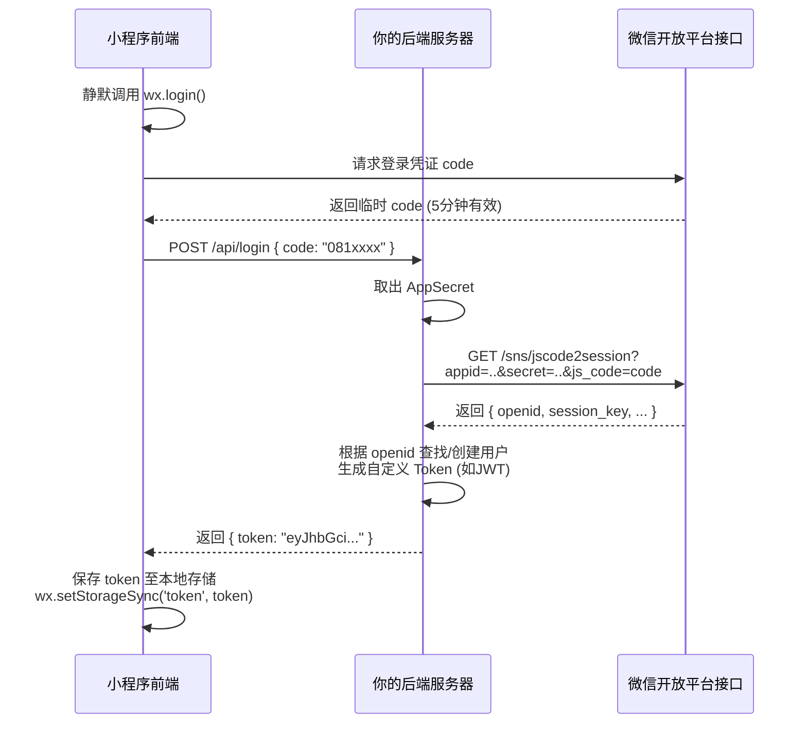

# 微信小程序登录机制深度解析与唯一值传递方案

## 1. 核心思想：唯一值传递是信任链的基石

微信小程序登录的本质不是简单的“输入账号密码”，而是一场在**微信、后端、前端**三方之间进行的、严密的**信任传递仪式**。这场仪式的唯一目的，就是后端安全地获得一个可信的、代表当前用户的唯一标识（`openid`），从而建立或识别用户身份。

整个流程围绕两个“唯一值”展开：
- **临时凭证 `code`**：由微信客户端签发，一次性使用，5分钟有效。它是前端能拿到的唯一“信物”。
- **用户唯一标识 `openid`**：由微信服务器签发，与用户微信号永久绑定且对于当前小程序全球唯一。它是后端需要获得的最终“身份证明”。

**核心原则**：前端只能拿到临时的 `code`，永远拿不到 `openid`。`openid` 的交换必须在后端的严格保密环境中进行。

## 2. 深度流程拆解

### 2.1 准备工作：获取 AppSecret 密钥
这是后端进行凭证交换的“钥匙”，**绝不能放在前端代码中，必须严格保密**。
1.  登录[微信公众平台](https://mp.weixin.qq.com/)。
2.  进入 `开发` -> `开发管理` -> `开发设置`。
3.  在 `开发者ID` 区域找到 `AppSecret (小程序密钥)`，点击 `重置` 或 `生成` 后妥善保管。

### 2.2 第一步：前端获取临时凭证 `code`
前端调用 `wx.login()`，这一步是**零成本**的，无需任何用户授权，可在 `App.onLaunch` 时静默完成。
```javascript
Page({
  login() {
    wx.login({
      success: (res) => {
        if (res.code) {
          this.sendCodeToBackend(res.code);
        } else {
          console.log('登录失败！' + res.errMsg);
        }
      }
    });
  },
  sendCodeToBackend(code) {
    wx.request({
      url: 'https://your-backend.com/api/login',
      method: 'POST',
      data: { code: code },
      success: (res) => {
        const token = res.data.token;
        wx.setStorageSync('userToken', token);
      }
    });
  }
});
```
**关键点**：`code` 仅能使用一次，获取后必须尽快发给后端，且不能重复使用。

### 2.3 第二步：后端用 `code` 换取 `openid`
后端收到 `code` 后，立即向微信官方接口 `jscode2session` 发起请求，参数包含 `appid`、`secret` 和 `js_code`。
```python
import requests

@app.route('/api/login', methods=['POST'])
def wechat_login():
    code = request.json.get('code')
    app_id = 'YOUR_APP_ID'
    app_secret = 'YOUR_APP_SECRET'
    url = 'https://api.weixin.qq.com/sns/jscode2session'
    params = {
        'appid': app_id,
        'secret': app_secret,
        'js_code': code,
        'grant_type': 'authorization_code'
    }
    result = requests.get(url, params=params).json()
    openid = result.get('openid')
    if not openid:
        return {'error': '登录失败'}, 401
    # 根据 openid 查找或创建用户，生成自定义登录态
    user = get_or_create_user(openid)
    token = generate_jwt(user.id)
    return {'token': token}
```
微信返回的字段含义：
- **`openid`**：用户在当前小程序的唯一标识。**这是需要持久化到数据库并与你的用户绑定的值。**
- **`session_key`**：会话密钥，用于解密敏感数据，**严禁返回给前端**。
- **`unionid`**：同一开放平台下多个应用的用户统一标识，仅在绑定了开放平台且用户关注了公众号等条件下返回。

### 2.4 第三步：后端再加工，返回自定义登录凭证
后端**绝不**将 `openid` 直接返回给前端，而是签发一个包含用户 ID（可与 `openid` 一对一关联）的 `JWT` 或其他 `token`。前端将此 `token` 保存在本地存储，后续所有请求都在 `Header` 中携带此 `token`。后端通过解析 `token` 获得用户身份，完成鉴权。

## 3. 深度答疑：为什么必须是这样的设计？

在本次技术讨论中，围绕这个标准流程，产生了一系列深刻的问题。以下是这些问题的系统解答，它们共同构成了对微信小程序登录机制的完整理解。

### 3.1 为什么不能我自己生成一个唯一 ID？
问题：“如果我不用微信的 openid，自己用邮箱或手机号让用户登录，是不是就不需要 openid 了？”

**回答**：从“标识用户”的功能看，你自己生成的 UUID 确实能充当唯一标识。但两者有本质区别：
- **信任担保人不同**：你的 UUID 是你自己声称的，没有第三方背书。而微信的 `openid` 是由微信平台用其整个生态担保的，不可伪造。
- **免密登录体验**：如果你用自己的邮箱/手机号体系，用户每次打开小程序，你必须要求他输入凭证，因为小程序没有浏览器那样稳健的持久化 Cookie 机制（后文会详述）。而 `openid` 实现了**完全静默的自动登录**，用户毫无感知。
- **生态强绑定**：微信支付、获取手机号、订阅消息等所有微信开放能力，均强制要求基于 `openid`。没有 `openid`，你的小程序在微信生态内寸步难行。

**结论**：你可以叠加自己的手机号/邮箱体系，但**不能舍弃 `openid`**。`openid` 是地基，你的自有体系是建在地基上的楼层。正确的做法是：用 `openid` 作为用户唯一主键，实现静默登录；在关键业务环节（如支付通知、高风险操作）再提示用户绑定手机号或邮箱。

### 3.2 清除了缓存怎么办？为什么 openid 不怕？
问题：“小程序没有像 Chrome 浏览器那样的 Cookie 和 Session 吗？用户清缓存不就丢了？”

这是对小程序存储机制的最大误解。小程序确实有类似 Cookie 的本地存储（`wx.setStorageSync`），你可以将 `token` 存在里面。**但是，微信的“清缓存”机制与浏览器完全不同：**

| 对比维度     | 浏览器 (Chrome)                                  | 微信小程序                                        |
| :----------- | :----------------------------------------------- | :------------------------------------------------ |
| **存储介质** | 硬盘上的 Cookie 文件，删除路径长                 | 微信划给每个小程序的独立沙箱存储                  |
| **清除操作** | 需要在设置中手动选择“清除浏览数据”，并勾选Cookie | 长按小程序删除，或点“设置-清除缓存”，一键彻底清空 |
| **凭证恢复** | 浏览器密码管理器可能记住账号密码，下次可自动填充 | 无任何密码管理器支持，本地 Token 完全消失         |
| **设计目的** | 用户偶发性清理浏览痕迹                           | **微信专门为保护隐私而设计的“强制遗忘”功能**      |

这意味着，用户主动“清缓存”的概率和彻底程度远高于浏览器。一旦清缓存，你存的 `token` 就灰飞烟灭。如果你用的是自己的邮箱登录，用户必须重新输入一遍账号密码验证码。

而 `openid` 的机制绕过了客户端存储：用户打开小程序，前端调用 `wx.login` 拿到新 `code`，后端拿 `code` 问微信“这人是谁”，微信回复“他是 `openid=oABC`”。整个过程后端直接与微信对话，**根本不依赖前端是否存有旧 Token**。因此，无论用户怎么清缓存，甚至换手机，只要还是同一个微信号，后端都能静默识别出老用户。

### 3.3 这样说来，openid 不就是个 UUID 吗？
问题：“那这个鸟货的本质是代替 UUID？”

是的，从技术功能上说，`openid` 就是一个由微信替你生成、担保的全局唯一 UUID。但它的价值在于这份“担保”：
- 你自己的 UUID，谁能证明这个 ID 背后是真实用户？可以伪造、冒用。
- 微信的 `openid`，意味着微信以整个平台的信誉证明：这个 ID 在当前小程序下，绑定了一个真实的、唯一的微信用户。这是一种**平台级的身份认证**。

## 4. 完整时序流程图

下面的 Mermaid 时序图精确展示了从用户打开小程序到获得登录凭证的全过程。



**流程图解析**：
- 步骤1-3是前端与微信的直接交互，获取一次性门票。
- 步骤4-6是后端拿着门票和密钥，去微信官方换证处换取真正的身份证明。
- 步骤7是后端在自己的系统里完成“身份登记”，并签发内部通行证（token）。
- 步骤8-9是前端保存通行证，此后所有业务请求均携带此证。

## 5. 安全最佳实践与常见误区

### 5.1 绝对禁止项
- **严禁前端直接调用 `jscode2session`**：会暴露 `AppSecret`，导致所有用户数据和功能被攻击者盗用。
- **严禁将 `openid` 返回给前端**：`openid` 应作为后端用户系统的关联键，不能泄露到客户端。
- **严禁将 `session_key` 泄露**：此密钥可用于解密手机号等敏感信息，一旦泄露用户隐私荡然无存。

### 5.2 推荐做法
- **Token 设计**：使用无状态的 JWT，其中存储自有的用户 ID（非 openid），设置合理的过期时间。
- **静默登录**：在 `App.onLaunch` 中完成整个 `wx.login`→后端换证→获取 Token 的流程，确保用户每次打开都是已登录状态。
- **自定义登录态刷新**：可以在 Token 临近过期时，用 `wx.checkSession` 检查微信侧会话是否有效，或静默重新执行登录流程。

## 6. 总结

微信小程序的登录流程，是一个精巧的**离线式三方认证**模型。它通过 `code` 换 `openid` 的机制，将用户身份认证的重担从脆弱的客户端存储，转移到了安全的后端与微信服务器之间的直接对话上。这就解释了为什么它能够实现用户无感知的持久登录，并且对缓存清除免疫。

理解这个模型，是安全、正确地开发一切微信小程序业务功能（支付、通知、获取手机号）的前提。任何试图绕过 `openid`、自行设计独立用户体系的尝试，不仅会破坏用户体验，更会因无法接入微信核心能力而举步维艰。