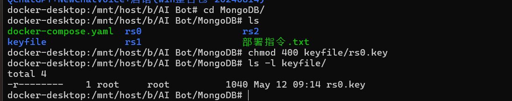
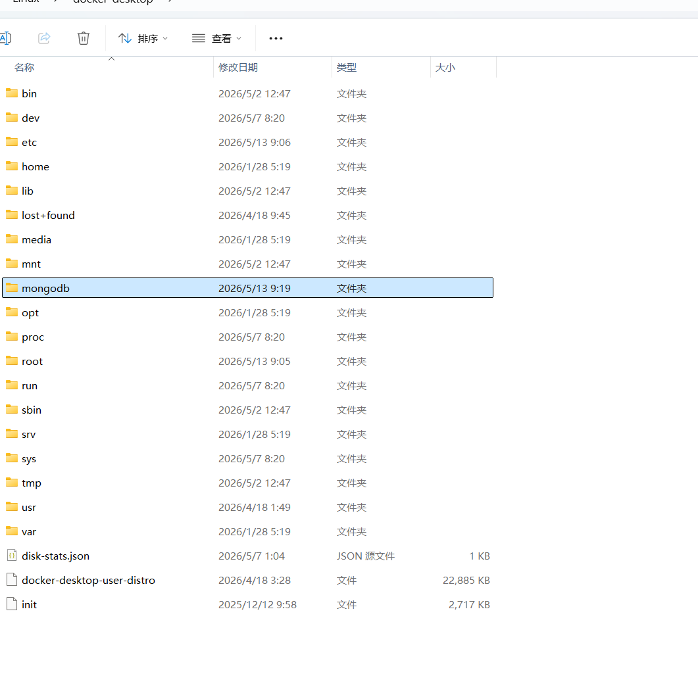
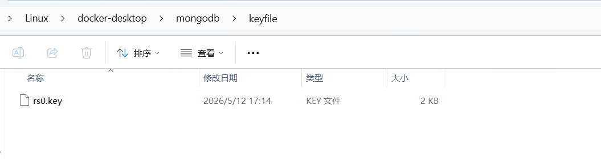
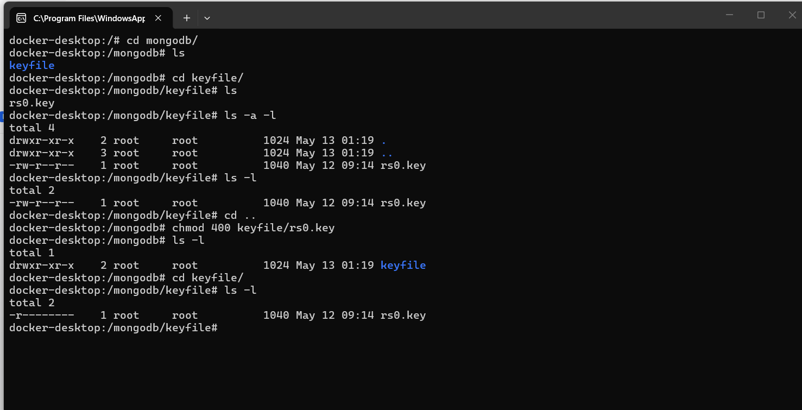

Windows11下docker部署的话用上keyfile会有问题
密钥文件有严格的权限限制，所以这个密钥文件不能挂载到windows目录下，因为即使在windows下这是了这个文件的权限或者进入wsl中给映射到Windows的这个密钥设置权限都是无效的（已经是实践过了）

```yaml
volumes:
    - ./rs0/db:/data/db            # 数据持久化
    - ./keyfile/rs0.key:/opt/keyfile/rs0.key:ro   # 副本集内部认证密钥（只读）
```
总结：无法用挂载密钥文件的方式在windows11下使用docker部署mongodb副本集


只能在Linux中配置密钥文件，去掉挂载的方式了
把windows下的密钥文件复制到wsl中




密钥权限设置
