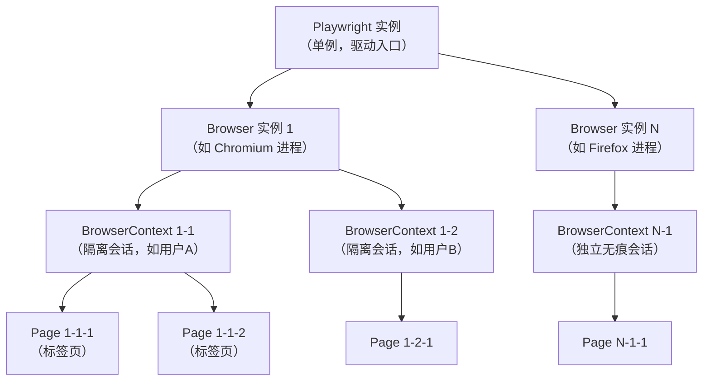
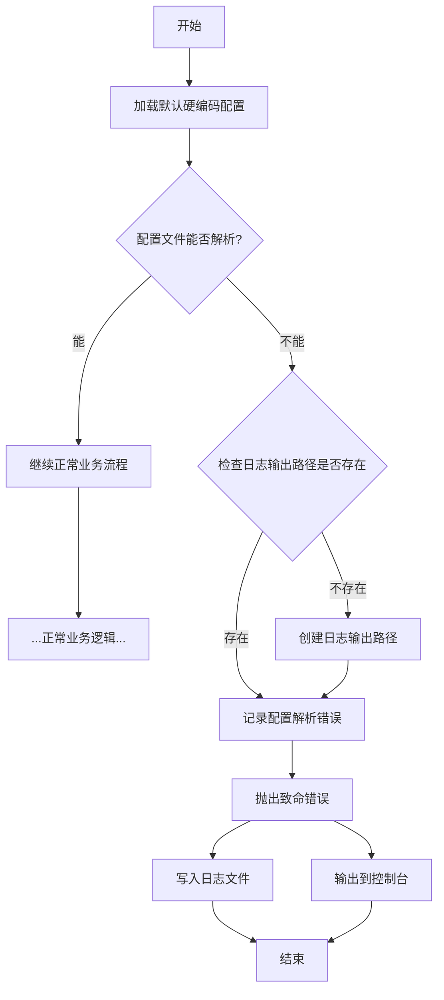
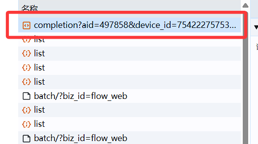
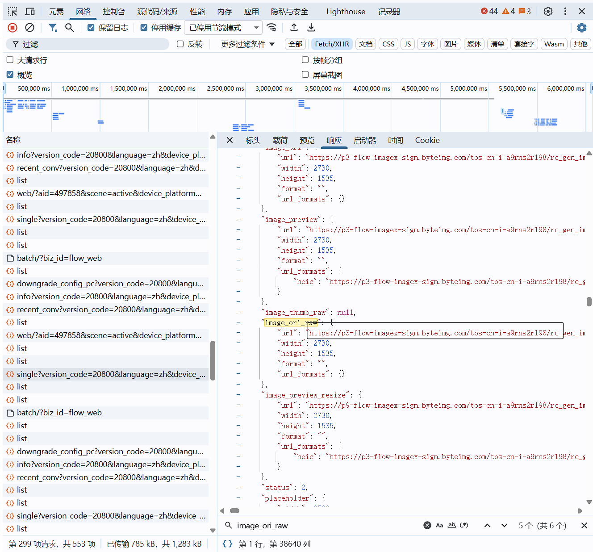

<h1>
    <center>
        WebAIPilot(网页AI导航者)
    </center>
</h1>

# **引言**
- 这个是基于一个PO模型构建的项目，用的是playwright框架实现的web端AI提问。
- 本质上项目可以迁移到其他任何地方，还有就是这个项目使用的是多种数据结构(我学习和认识不同的数据结构来配置文件)
- 理所当然的是这个项目工程结构设计可以直接迁移到deepseek、文心、Gemini等等(可以是视频sora、也可以是图片香蕉)
- 使用FastAPI供外部调用，通过网络请求实现与web端AI提问，提高通用性。
# **使用声明**

本项目仅供个人学习与研究使用。项目中所涉及的技术示例、代码结构、自动化流程等内容，均不保证适用于任何实际业务场景。使用者在使用本项目时应自行确保其行为符合相关法律法规、第三方平台（包括但不限于豆包、DeepSeek、文心等）的服务协议与使用政策。

本项目可能涉及对网页交互流程的自动化操作及技术研究，此类研究仅限用于学习测试环境。**禁止使用本项目以任何方式规避付费、绕过鉴权、突破平台限制、进行未授权访问、批量抓取内容或其他可能违反法律法规或平台政策的行为。**

由于第三方平台具有严格的安全审查机制，使用本项目可能导致账号受限、封禁或其他风险，**所有后果均由使用者自行承担，作者不承担任何责任。** 作者亦不对本项目可能引发的任何直接或间接损失、商业纠纷、平台处罚、法律风险等负责。

本项目以开源形式提供，使用者可自由复制、修改、再分发或基于本项目进行衍生开发，**但必须保留原作者署名，不得删除或隐藏版权信息；同时不得以任何方式暗示作者对使用者的产品、版本或用途提供背书或承担责任。** 若使用者将本项目用于商业用途（包括但不限于收费服务、集成到产品中等），因此产生的任何纠纷、法律问题或平台端处理，均与原作者无关。

<p style="font-weight: bold; color: red;">使用或分发本项目即视为完全理解并同意上述声明。</p>

**人话：使用Apache2.0，代码随便用但是作者不承担任何后果，还有分发带上作者名(开源作者基本的尊重)**

# 项目结构
```bash
Playwright个人研究成果/
├─ config/                        # 全局配置目录（环境、运行参数）
│  ├─ env.yaml                    # 环境级配置：base_url、运行环境、浏览器配置等
│  └─ settings.yaml               # 框架设置：重试、超时、报告格式、并发等
│
├─ data/                          # 测试输入数据（用例需要读取的）
│  ├─ user_settings.toml          # 默认用户数据 / 非敏感测试参数
│  └─ 测试数据/                   # 用例使用的测试样本数据（json/yaml/csv/xlsx）
│
├─ outputs/                       # 运行产物（自动生成，不应提交到 git）
│  ├─ logs/                       # 运行日志文件（程序执行输出）
│  ├─ reports/                    # 测试报告（HTML/Allure/JUnit 等）
│  ├─ screenshots/                # 失败截图、自动截图
│  ├─ traces/                     # Playwright trace 调试文件
│  └─ videos/                     # Playwright 自动录制的视频
│
├─ pages/                         # Page Object 层（页面类）
│  ├─ __init__.py                 # 声明 pages 为 Python 包
│  ├─ base_page.py                # 所有页面的基类，封装 click/fill/goto/wait 等通用方法
│  ├─ home_page.py                # 首页的页面对象（定位器 + 页面行为）
│  └─ login_page.py               # 登录页的页面对象（定位器 + login 逻辑）
│
├─ user_data/                     # 本地用户私有数据（不建议提交 git）
│  ├─ user_settings.toml          # 用户个人敏感配置（token、账号），建议加入 .gitignore
│  └─ logging_config.yaml         # 用户覆盖：级别、输出路径、是否打印到控制台等
│
├─ utils/                         # 工具库（公共方法、封装组件）
│  ├─ logger.py                   # 日志模块（格式化、输出、log rotate）
│  └─ playwright_factory.py       # Playwright 浏览器/上下文/page 工厂 & 管理封装
│
├─ 开发随笔/                      # 开发笔记、实验代码、调试记录（不影响主项目）
│
├─ LICENSES                       # 协议文件(Apache2.0)
└─ READE.md                      # 项目说明文档（运行方式、依赖、结构说明）
```

# Playwright 架构 
    Playwright：框架会话 / 类似驱动连接（入口），实际是node.js 
        Browser：一次启动的浏览器实例chromium/firefox/webkit（进程/连接）
            BrowserContext：隔离会话（像无痕窗口/独立用户）
                Page：标签页/页面

`sync_playwright()`只有`start`和`stop`         
<br>

##  **Playwright 架构层级全览**

## **代码样例**
单个谷歌浏览器单个上下文单个标签页的实现
```python
playwright = sync_playwright().start()
browser = playwright.chromium.launch(**launch_options.to_dict())
context = browser.new_context(**context_options.to_dict())
page1 = context.new_page()
page2 = context.new_page()
page3 = context.new_page()
page4 = context.new_page()
context.close()
browser.close()
playwright.stop()
```
## **设计原则**
1. **单例 Factory**：同一时刻只允许存在一个活跃的 `PlaywrightFactory` 实例（并发安全）；调用 `close()` 后会释放单例（`_instance=None`）

2. **显式关闭优先**：提供 `close()` 作为统一的幂等回收入口；业务代码应显式调用 `close()`（必要时可封装 `with` 管理，但当前实现未内置 `with`）。

3. **退出兜底**：在 Factory 初始化时注册 `atexit.register(self.close)`，在解释器正常退出时自动触发 `close()` 做兜底回收（不依赖 `__del__`）。

4. **Browser 复用由调用方决定，Factory 保留多策略扩展能力**：Factory 提供 `new_browser()` 创建并登记多个 Browser；同时提供 `get_browser_()` 返回已登记 Browser 的副本列表，调用方可自行选择复用哪一个 Browser。后续可扩展“默认复用单 Browser / 按 launch 策略复用”的策略方法，但当前默认不自动复用。

5. **所有权（ownership）严格**：Factory 仅管理并回收由自己创建并登记的 Browser/Context。`new_context(browser=...)` 要求传入的 browser 必须来自本 Factory（已登记），否则抛出异常；不支持对外部 browser/context 的隐式接管（后续若需要可新增显式 `adopt_*` 接口）。

6. **回收顺序固定且 stop 至多一次**：统一回收顺序为 `Contexts → Browsers → Playwright`。通过 `_playwright_flag` 保证 `close()` 幂等：一旦关闭完成，后续再调用 `close()` 不会重复 stop。

7. **注册表线程安全，关闭在锁外执行**：所有创建/登记/移除（Browser/Context registry）操作均在同一把可重入锁保护下完成；`close()` 在锁内完成“置状态 + 拷贝 + 清空 registry”，随后在锁外执行实际 `close()`/`stop()`，避免阻塞其他线程。

8. **Page 不纳入生命周期管理**：Factory 仅提供 `new_page(context)` 的便捷创建，不追踪 Page；Page 的回收依赖 `context.close()` 的级联行为，如需 Page 级别的特殊回收策略由上层业务实现。


# 配置管理
1. `ConfigManager`实现了线程安全的单例模式，采用了业界 认的双重检查锁定`DCL(Double-Checked Locking) `模式
2. 使用配置层叠（Configuration Cascading），设计让高优先级的配置文件去覆盖（Override）低优先级配置文件中的同名配置项。
<!-- $$\text{user\_settings.toml} \gg \text{env.yaml} \gg \text{settings.yaml}$$ -->
3. 硬编码写好默认的日志配置，防止日志配置文件`logging_config.yaml`错误导致日志记录器无法记录配置文件错误部分的崩溃日志。

## 日志配置
    
**流程说明**：
1. 无论配置是否解析成功，都会先加载硬编码默认配置
2. 配置解析失败时才检查/创建日志路径
3. 错误信息会同时写入日志和控制台
4. 配置解析成功则进入正常业务逻辑

### 流程步骤

#### 1. 初始阶段
- 加载默认的硬编码配置（程序内置配置）

#### 2. 配置文件处理
- 尝试解析外部配置文件
- 判断：配置文件能否成功解析？
  - **能解析** → 进入正常业务流程
  - **不能解析** → 进入错误处理流程

#### 3. 错误处理流程
- 检查日志输出路径是否存在
- 判断：日志路径是否存在？
  - **存在** → 直接记录错误
  - **不存在** → 创建日志输出路径

#### 4. 错误报告
- 抛出致命错误
- 同时执行两个操作：
  1. 将错误信息写入日志文件
  2. 将错误信息输出到控制台

#### 流程图

下面是一个 **清晰表格**，整理了 Python `logging.config.dictConfig()` 可以自动解析的常用字段及其作用（基于官方文档 logging.config.dictConfig 规范）。

#### 📘 dictConfig 可解析字段总表

#### **顶层字段（Root Level Keys）**

| 字段名                       | 类型   | 作用说明                                 |
| ---------------------------- | ------ | ---------------------------------------- |
| **version**                  | `int`  | **必需字段**。当前规范版本，必须为 `1`。 |
| **disable_existing_loggers** | `bool` | 是否禁用已有的 logger，默认 `True`。     |
| **formatters**               | `dict` | 定义 formatter 的集合。                  |
| **filters**                  | `dict` | 定义 filter 的集合。                     |
| **handlers**                 | `dict` | 定义 handler 的集合。                    |
| **loggers**                  | `dict` | 为每个非 root logger 进行配置。          |
| **root**                     | `dict` | 配置 root logger。                       |
| **incremental**              | `bool` | 是否为增量更新配置（一般用不到）。       |

---

#### 📗 formatters 字段

| 字段名       | 类型                  | 作用说明                               |
| ------------ | --------------------- | -------------------------------------- |
| **format**   | `str`                 | 格式化日志消息的格式字符串。           |
| **datefmt**  | `str`                 | 时间格式。                             |
| **style**    | `'%'` / `'{'` / `'$'` | 指定格式化风格（默认 `%`）。           |
| **class**    | `str`                 | 自定义 Formatter 类路径（可选）。      |
| **validate** | `bool`                | 是否验证参数（Python3.8+ 默认 True）。 |

---

#### 📘 handlers 字段

每个 handler 的字段如下：

| 字段名                     | 类型   | 作用说明                                                       |
| -------------------------- | ------ | -------------------------------------------------------------- |
| **class**                  | `str`  | **必填**。Handler 类路径，例如 `"logging.StreamHandler"`。     |
| **level**                  | `str`  | 设置 handler 级别，例如 `"INFO"`。                             |
| **formatter**              | `str`  | 指向 formatters 中的某个 formatter 名称。                      |
| **filters**                | `list` | 使用的 filter 名称列表。                                       |
| 其他参数（如 filename 等） | `any`  | handler 类本身要求的参数。例如 `FileHandler` 需要 `filename`。 |

示例：
`FileHandler` 会自动解析 `filename`、`mode` 等字段。

---

#### 📙 filters 字段

| 字段名    | 类型  | 作用说明                                                 |
| --------- | ----- | -------------------------------------------------------- |
| **class** | `str` | **必填**。Filter 的完整类路径，例如 `"logging.Filter"`。 |
| 其他参数  | `any` | 自定义 Filter 的参数。                                   |

---

#### 📕 loggers 字段（非 root）

| 字段名        | 类型   | 作用说明                   |
| ------------- | ------ | -------------------------- |
| **level**     | `str`  | logger 日志级别。          |
| **handlers**  | `list` | 使用的 handler 名称列表。  |
| **propagate** | `bool` | 是否向父 logger 传播消息。 |
| **filters**   | `list` | 绑定到 logger 的 filter。  |

---

#### 📙 root 字段

| 字段名       | 类型   | 作用说明                      |
| ------------ | ------ | ----------------------------- |
| **level**    | `str`  | root logger 的日志级别。      |
| **handlers** | `list` | root logger 使用的 handlers。 |

---

#### 📝 示例总览（简化版）

```python
{
    "version": 1,
    "formatters": {
        "simple": {
            "format": "%(levelname)s - %(message)s"
        }
    },
    "handlers": {
        "console": {
            "class": "logging.StreamHandler",
            "level": "DEBUG",
            "formatter": "simple"
        }
    },
    "root": {
        "level": "INFO",
        "handlers": ["console"]
    }
}
```
缺点是没法校验yaml配置路径等字段的有效性，仅仅能用默认配置好的路径（硬编码检查确保默认配置路径有效），必须结合`ConfigManager`使用，不结合使用设计的这个日志配置就没有什么意义了。
```python
# 导入配置管理模块
from utils import ConfigManager
# 创建配置管理器实例（这是个单例）
config_manager = ConfigManager()
# 层叠覆盖原来的日志配置
logger_manager.use_logging_config(config_manager)
```

如果真的仅仅用日志体系，但是不要层叠覆盖就得确保根目录下有`outputs/logs`这个文件夹路径(日志放置的地方)。
```python
from utils import logger_manager, info
info("第一条程序已经加载完成，日志记录器、全局异常捕获已完成")
```
***

# 工具包
## 路径封装

# 浏览器启动参数
## 📋 Chrome 驱动参数 (`add_argument`) 汇总表

| 参数名                                | 分类               | 描述 (中文)                                             |
| :------------------------------------ | :----------------- | :------------------------------------------------------ |
| `**--disable-logging**`               | **性能与日志**     | 禁用或减少浏览器内部的日志输出，减轻文件 I/O 负担。     |
| `**--mute-audio**`                    | **性能与日志**     | 确保浏览器静音，减少资源占用。                          |
| `**--disable-extensions**`            | **资源节约**       | 禁用浏览器扩展，减少资源消耗。                          |
| `**--disable-default-apps**`          | **资源节约**       | 禁用 Chrome 的默认应用程序。                            |
| `**--disable-background-networking**` | **资源节约**       | 阻止浏览器进行任何后台网络活动。                        |
| `**--disable-sync**`                  | **资源节约**       | 禁用 Chrome 的同步功能。                                |
| `**--disable-domain-reliability**`    | **资源节约**       | 禁用域名可靠性监测。                                    |
| `**--no-first-run**`                  | **资源节约**       | 跳过首次运行向导。                                      |
| `**--no-sandbox**`                    | **兼容性与稳定性** | 禁用沙盒模式（常用于 Linux/容器环境）。                 |
| `**--disable-setuid-sandbox**`        | **兼容性与稳定性** | 禁用 setuid 沙盒（用于解决 Linux 权限问题）。           |
| `**--disable-dev-shm-usage**`         | **兼容性与稳定性** | 禁用 `/dev/shm` 共享内存（优化内部内存使用）。          |
| `**--disable-popup-blocking**`        | **兼容性与稳定性** | 禁用弹出窗口阻止程序（提高稳定性）。                    |
| `**--disable-infobars**`              | **兼容性与稳定性** | 禁用顶部的“受自动化软件控制”信息条。                    |
| `**--disable-gpu**`                   | **兼容性与渲染**   | 禁用 GPU 硬件加速，避免图形相关 Bug，尤其在无头模式中。 |
| `**--disable-software-rasterizer**`   | **兼容性与渲染**   | 禁用了 CPU 上的备用渲染方案。                           |
| `**--headless=new**`                  | **无头模式**       | 启用新的无头模式（不渲染图形界面）。                    |

# 工作流
1. 启动playwright框架，使用配置创建1个浏览器，使用配置创建1个会话窗口。
2. 确保网页登陆成功（没有成功就让用户手动登陆）
3. 问题输入（包括文本、文件）
4. 发送请求
5. 拿到回复
## 工作流必要流程
1. 创建浏览器
2. 创建浏览器上下文
3. 对创建浏览器上下文清除 webdriver 标志
4. 对创建浏览器上下文注入自定义的js（可选）
5. 使用浏览器上下文创建标签页
6. 去到登录页面
   1. 检查是否登陆成功
   2. 保存登录状态
7. 创建主页面
8. 通过API实现各种操作(可选)


# 接口调用
我想要实现的东西究竟是什么？我想要的是通过给某个进程发送指令后他帮我完成任务，然后我这边接收任务的反馈，我要的是我客户端访问http://127.0.0.1:6666实现指令交互，就是一个进程通过这个url给他发送指令，并且我这边接受指令。我想要的是通过给某个进程发送指令后他帮我完成任务，然后我这边接收任务的反馈，可以给所有不同的语言调用


# 豆包
必须要有鼠标移动轨迹在发送的情况下
```python
# 鼠标从输入框移动到发送按钮(悬浮2个控件会自动移动)
self.page.get_by_placeholder("发消息或输入 / 选择技能").hover()
# self.page.get_by_test_id("chat_input_send_button").hover()
send_btn = self.page.get_by_test_id("chat_input_send_button")
box = send_btn.bounding_box()
self.page.mouse.move(box["x"] + box["width"] / 2, box["y"] + box["height"] / 2,steps=20)
```

test_id
问题输入前：asr_btn
问题输入后：chat_input_send_button
问题回复中：chat_input_local_break_button
问题回复后：sr_btn


flex-row flex w-full 我的问题标签
flex-row flex w-full justify-end AI的回答标签
`.message_content`能拿到当前AI与我的会话html窗口

## 图片下载解析
```
正常原图地址
https://p3-flow-imagex-sign.byteimg.com/tos-cn-i-a9rns2rl98/rc_gen_image/1cc0dae82c3c4b6cad70c6b6303d91c5preview.jpeg
附上了水印的图
https://p3-flow-imagex-sign.byteimg.com/tos-cn-i-a9rns2rl98/rc_gen_image/1cc0dae82c3c4b6cad70c6b6303d91c5preview.jpeg~tplv-a9rns2rl98-image_pre_watermark_1_6b.png?rcl=202512301847465774984230AE11391AD9&rk3s=8e244e95&rrcfp=827586d3&x-expires=2082451688&x-signature=lwqSV2GdJyhtcQJbmLb2MR9If8c%3D
```
URL 包含三个部分：基础路径 + 模板参数（Template） + 鉴权参数（Token）。

绕过 ImageX 的处理规则
如果你接截断 ~ 之后的所有内容，有时会因为 CDN 签名（Signature）失效而无法访问。
tos-cn... 这一段是文件在服务器上的唯一 ID。
x-expires 定义了链接的寿命。
x-signature 是必须带上的，否则会返回 403。

签名校验：ImageX 的签名 x-signature 是根据 ~tplv... 这一串规则计算出来的。如果你手动修改了模板（比如把 downsize 改掉），签名就会失效，导致链接打不开。

tplv 代表 Template View（模板视图）。
downsize 是压缩模板。
watermark 是水印模板。

实际上我也能理解，豆包把我自己发的图片也存到它的服务器去了还是ImageX的服务器。说他不拿你的图片数据训练我觉得是不可能的了。

### 图片机制
从网页端很容易理解，图片生成后返回实际是流式输出的且必须是异步处理

采用了 SSE (Server-Sent Events) 协议，即服务器像“挤牙膏”一样一小块一小块地推送 JSON 补丁（Patches）

它会对接可灵的接口然后生成图片并拿到返回的json数据，而这个数据就是ImageX返回的，为了速度它会拿到一张原始的图片然后在这个图片上打上水印，最后给我的是打上水印后的url（基础路径 + 模板参数（Template） + 鉴权参数（Token））

所以很明显我直接利用的给我直接返回原图链接的漏洞，本地拿到的json去解析出来用

### 具体实现
**实现“不带水印”或“高清原图”的抓取，思路通常不是靠“修图”，而是利用网页版大模型在前端展示和后端存储之间的策略差。**

字段名称,模板参数 (Template),含义
| 字段名称        | 模板参数 (Template)       | 含义                                                       |
| :-------------- | :------------------------ | :--------------------------------------------------------- |
| `image_thumb`   | `~downsize_watermark...`  | 缩略图（带水印，体积小）                                   |
| `image_preview` | `~image_pre_watermark...` | 预览图（带水印，网页显示用）                               |
| `image_ori`     | `~image_dld_watermark...` | 下载图（虽然是原尺寸，但通常被强行加了下载水印）           |
| `image_ori_raw` | `~image_raw_b.png`        | **核心目标**：这是原始生成的图像，通常水印最少或质量最高。 |

#### 非编程实现
**图片生成前大的实现方案：**
1. F12打开浏览器开发者工具 (Browser Developer Tools)
2. 上面导航栏选中网络(Network)
3. 点击保留日志
4. 点击Fetch/XHR这个选项框
5. 向豆包提出问题并等待它生成图片
6. 在DevTools的请求列表中找到类似`completion?aid=后面省略`列表

1. 点击后ctrl+F快捷键打开搜索功能，输入`image_ori_raws`
2. url后面的"http://内容太多省略"就是无水印的高清原图了


**生成图片后的实现方案**
1. F12打开浏览器开发者工具 (Browser Developer Tools)
2. 上面导航栏选中网络(Network)
3. 点击保留日志
4. 点击Fetch/XHR这个选项框
5. 然后F5刷新网页
6. 在DevTools的请求列表中找到类似 `singleversion_code=后面省略` 列表
7. 点击后ctrl+F快捷键打开搜索功能，输入`image_ori_raws`，这时候会出现6个，一般是第5个，找不到就如下图所示的结果。无脑的方案就是全部url都试试

#### 编程实现
js就直接hook这个api的数据然后解析
python实现

在拦截到`https://www.doubao.com/chat/completion?aid=任意字符`后里面有2个`image_ori_raw`字段，其中url结尾没有`\`就是需要提取的，url结尾有`\`是有水印的
```python
def img_hook(self, response):
    """从豆包对话中获取图片的没有水印下载链接

    :param response: 回调参数
    :return:
    """
    # 不看完整 URL，只看关键字
    if "https://www.doubao.com/chat/completion?aid=" in response.url:
        # 正则提取所有 image_ori_raw 下的 url 内容
        matches = re.findall(r'"image_ori_raw":\{"url":"(.*?)"', response.text())
        # 遍历所有匹配项
        for raw_url in matches:
            # 判定条件：过滤掉以反斜杠 \ 结尾的“中间态”或“假”URL
            if raw_url.endswith('\\'):
                continue
            # Unicode 解码并存储这个真实的无水印url
            self.img_hook_list.append(raw_url.encode().decode('unicode_escape'))
```

## 没用的笔记
```python
# # 记录当前AI的对话数量
# count = self.page.locator('.flex-row.flex.w-full.justify-end').count()
# info("点击发送")
# # 不可靠的等待回复加载完成（完成后，发送图标会变成语音图标）
# self.page.get_by_test_id("asr_btn").wait_for(timeout=0)
# # AI回复数增加1才算是回复完毕
# while self.page.locator('.flex-row.flex.w-full.justify-end').count() == count:
#     self.page.wait_for_timeout(1000)
# 等待回复完毕(等待停止按钮出现并消失)

// 初始化全局变量
window.tempCopyBuffer = ""; 
// 改变js行为
document.addEventListener('copy', (event) => {
    // 阻止原来的startMonitoring 运行
    event.stopImmediatePropagation();
    // 拦截行为：阻止事件冒泡和默认行为
    event.preventDefault();
    // 同步获取：直接从当前选区抓取文本
    const selection = document.getSelection().toString();
    // 存储到变量
    window.tempCopyBuffer = selection;
}, true);

# 遍历文件路径列表并发送
# for file_path in file_path_list:
#     # 点击按钮会触发 file chooser
#     with self.page.expect_file_chooser() as fc_info:
#         # 定位文件输入框
#         self.page.get_by_test_id("upload_file_button").click()
#         # 文件选择
#         file_chooser = fc_info.value
#         self.page.wait_for_timeout(3000)
#         # 上传单个文件
#         file_chooser.set_files(file_path)
#         self.page.wait_for_timeout(3000)
#         # 等待文件上传完毕
#         self.page.get_by_test_id("chat_input_send_button").is_enabled()
#         self.page.wait_for_timeout(3000)


document.addEventListener('copy', (event) => {
    // 获取用户当前选中的文本
    const selection = document.getSelection().toString();
    console.log('用户复制了内容：', selection);
    event.preventDefault(); // 阻止默认行为以应用你的修改
});


document.addEventListener('copy', () => {
  // 延迟一瞬确保剪贴板已更新，或者直接获取当前选区内容
  setTimeout(async () => {
    const text = await navigator.clipboard.readText();
    console.log(text);
  }, 10);
}, true);

// 改进版(没有数据输出)
const answer
document.addEventListener('copy', () => {
    const text = navigator.clipboard.readText();
    return text;
});


// 找到所有带有埋点定义的元素（没有html）
const telemetryElements = document.querySelectorAll('[data-copy-telemetry]');
telemetryElements.forEach(el => {
    console.log('目标元素:', el);
    console.log('对应的埋点值:', el.getAttribute('data-copy-telemetry'));
    // 你可以直接读取这些元素的 innerText，这就是它想保护或监控的内容
    console.log('元素内容:', el.innerText);
});
```

# 按键精灵
我想原生实现而不靠其他插件实现，我不会写插件，但是我会写接口，我可以通过htpp://127.0.0.1:6666端口去实现工具交互


