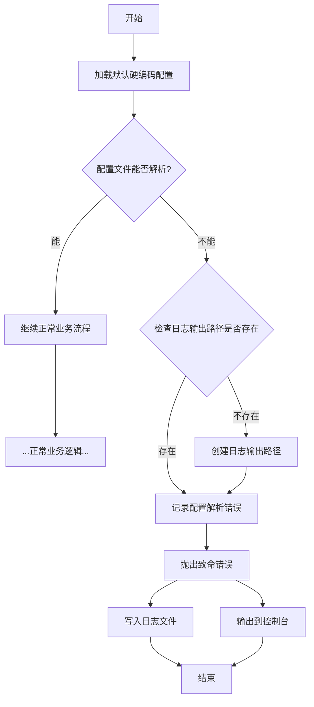

<h1>
    <center>
        WebAIPilot(网页AI导航者)
    </center>
</h1>

# **引言**
- 这个是基于一个完成PO模型构建的项目，用的是playwright框架实现的web端AI提问。
- 本质上项目可以迁移到其他任何地方，还有就是这个项目使用的是多种数据结构(我学习和认识不同的数据结构来配置文件)
- 理所当然的是这个项目工程结构设计可以直接迁移到deepseek、文心、Gemini等等(可以是视频sora、也可以是图片香蕉)
# **使用声明**

本项目仅供个人学习与研究使用。项目中所涉及的技术示例、代码结构、自动化流程等内容，均不保证适用于任何实际业务场景。使用者在使用本项目时应自行确保其行为符合相关法律法规、第三方平台（包括但不限于豆包、DeepSeek、文心等）的服务协议与使用政策。

本项目可能涉及对网页交互流程的自动化操作及技术研究，此类研究仅限用于学习测试环境。**禁止使用本项目以任何方式规避付费、绕过鉴权、突破平台限制、进行未授权访问、批量抓取内容或其他可能违反法律法规或平台政策的行为。**

由于第三方平台具有严格的安全审查机制，使用本项目可能导致账号受限、封禁或其他风险，**所有后果均由使用者自行承担，作者不承担任何责任。** 作者亦不对本项目可能引发的任何直接或间接损失、商业纠纷、平台处罚、法律风险等负责。

本项目以开源形式提供，使用者可自由复制、修改、再分发或基于本项目进行衍生开发，**但必须保留原作者署名，不得删除或隐藏版权信息；同时不得以任何方式暗示作者对使用者的产品、版本或用途提供背书或承担责任。** 若使用者将本项目用于商业用途（包括但不限于收费服务、集成到产品中等），因此产生的任何纠纷、法律问题或平台端处理，均与原作者无关。

<p style="font-weight: bold; color: red;">使用或分发本项目即视为完全理解并同意上述声明。</p>

**人话：使用Apache2.0，代码随便用但是作者不承担任何后果，还有分发带上作者名(开源作者基本的尊重)**

# 项目结构
```bash
Playwright个人研究成果/
├─ config/                        # 全局配置目录（环境、运行参数）
│  ├─ env.yaml                    # 环境级配置：base_url、运行环境、浏览器配置等
│  └─ settings.yaml               # 框架设置：重试、超时、报告格式、并发等
│
├─ data/                          # 测试输入数据（用例需要读取的）
│  ├─ user_settings.toml          # 默认用户数据 / 非敏感测试参数
│  └─ 测试数据/                   # 用例使用的测试样本数据（json/yaml/csv/xlsx）
│
├─ outputs/                       # 运行产物（自动生成，不应提交到 git）
│  ├─ logs/                       # 运行日志文件（程序执行输出）
│  ├─ reports/                    # 测试报告（HTML/Allure/JUnit 等）
│  ├─ screenshots/                # 失败截图、自动截图
│  ├─ traces/                     # Playwright trace 调试文件
│  └─ videos/                     # Playwright 自动录制的视频
│
├─ pages/                         # Page Object 层（页面类）
│  ├─ __init__.py                 # 声明 pages 为 Python 包
│  ├─ base_page.py                # 所有页面的基类，封装 click/fill/goto/wait 等通用方法
│  ├─ home_page.py                # 首页的页面对象（定位器 + 页面行为）
│  └─ login_page.py               # 登录页的页面对象（定位器 + login 逻辑）
│
├─ user_data/                     # 本地用户私有数据（不建议提交 git）
│  ├─ user_settings.toml          # 用户个人敏感配置（token、账号），建议加入 .gitignore
│  └─ logging_config.yaml         # 用户覆盖：级别、输出路径、是否打印到控制台等
│
├─ utils/                         # 工具库（公共方法、封装组件）
│  ├─ logger.py                   # 日志模块（格式化、输出、log rotate）
│  └─ playwright_factory.py       # Playwright 浏览器/上下文/page 工厂 & 管理封装
│
├─ 开发随笔/                      # 开发笔记、实验代码、调试记录（不影响主项目）
│
├─ LICENSES                       # 协议文件(Apache2.0)
└─ READE.md                      # 项目说明文档（运行方式、依赖、结构说明）
```

# 配置管理
1. `ConfigManager`实现了线程安全的单例模式，采用了业界 认的双重检查锁定`DCL(Double-Checked Locking) `模式
2. 使用配置层叠（Configuration Cascading），设计让高优先级的配置文件去覆盖（Override）低优先级配置文件中的同名配置项。
<!-- $$\text{user\_settings.toml} \gg \text{env.yaml} \gg \text{settings.yaml}$$ -->
3. 硬编码写好默认的日志配置，防止日志配置文件`logging_config.yaml`错误导致日志记录器无法记录配置文件错误部分的崩溃日志。

## 日志配置
    
**流程说明**：
1. 无论配置是否解析成功，都会先加载硬编码默认配置
2. 配置解析失败时才检查/创建日志路径
3. 错误信息会同时写入日志和控制台
4. 配置解析成功则进入正常业务逻辑

### 流程步骤

#### 1. 初始阶段
- 加载默认的硬编码配置（程序内置配置）

#### 2. 配置文件处理
- 尝试解析外部配置文件
- 判断：配置文件能否成功解析？
  - **能解析** → 进入正常业务流程
  - **不能解析** → 进入错误处理流程

#### 3. 错误处理流程
- 检查日志输出路径是否存在
- 判断：日志路径是否存在？
  - **存在** → 直接记录错误
  - **不存在** → 创建日志输出路径

#### 4. 错误报告
- 抛出致命错误
- 同时执行两个操作：
  1. 将错误信息写入日志文件
  2. 将错误信息输出到控制台

#### 流程图

下面是一个 **清晰表格**，整理了 Python `logging.config.dictConfig()` 可以自动解析的常用字段及其作用（基于官方文档 logging.config.dictConfig 规范）。

#### 📘 dictConfig 可解析字段总表

#### **顶层字段（Root Level Keys）**

| 字段名                       | 类型   | 作用说明                                 |
| ---------------------------- | ------ | ---------------------------------------- |
| **version**                  | `int`  | **必需字段**。当前规范版本，必须为 `1`。 |
| **disable_existing_loggers** | `bool` | 是否禁用已有的 logger，默认 `True`。     |
| **formatters**               | `dict` | 定义 formatter 的集合。                  |
| **filters**                  | `dict` | 定义 filter 的集合。                     |
| **handlers**                 | `dict` | 定义 handler 的集合。                    |
| **loggers**                  | `dict` | 为每个非 root logger 进行配置。          |
| **root**                     | `dict` | 配置 root logger。                       |
| **incremental**              | `bool` | 是否为增量更新配置（一般用不到）。       |

---

#### 📗 formatters 字段

| 字段名       | 类型                  | 作用说明                               |
| ------------ | --------------------- | -------------------------------------- |
| **format**   | `str`                 | 格式化日志消息的格式字符串。           |
| **datefmt**  | `str`                 | 时间格式。                             |
| **style**    | `'%'` / `'{'` / `'$'` | 指定格式化风格（默认 `%`）。           |
| **class**    | `str`                 | 自定义 Formatter 类路径（可选）。      |
| **validate** | `bool`                | 是否验证参数（Python3.8+ 默认 True）。 |

---

#### 📘 handlers 字段

每个 handler 的字段如下：

| 字段名                     | 类型   | 作用说明                                                       |
| -------------------------- | ------ | -------------------------------------------------------------- |
| **class**                  | `str`  | **必填**。Handler 类路径，例如 `"logging.StreamHandler"`。     |
| **level**                  | `str`  | 设置 handler 级别，例如 `"INFO"`。                             |
| **formatter**              | `str`  | 指向 formatters 中的某个 formatter 名称。                      |
| **filters**                | `list` | 使用的 filter 名称列表。                                       |
| 其他参数（如 filename 等） | `any`  | handler 类本身要求的参数。例如 `FileHandler` 需要 `filename`。 |

示例：
`FileHandler` 会自动解析 `filename`、`mode` 等字段。

---

#### 📙 filters 字段

| 字段名    | 类型  | 作用说明                                                 |
| --------- | ----- | -------------------------------------------------------- |
| **class** | `str` | **必填**。Filter 的完整类路径，例如 `"logging.Filter"`。 |
| 其他参数  | `any` | 自定义 Filter 的参数。                                   |

---

#### 📕 loggers 字段（非 root）

| 字段名        | 类型   | 作用说明                   |
| ------------- | ------ | -------------------------- |
| **level**     | `str`  | logger 日志级别。          |
| **handlers**  | `list` | 使用的 handler 名称列表。  |
| **propagate** | `bool` | 是否向父 logger 传播消息。 |
| **filters**   | `list` | 绑定到 logger 的 filter。  |

---

#### 📙 root 字段

| 字段名       | 类型   | 作用说明                      |
| ------------ | ------ | ----------------------------- |
| **level**    | `str`  | root logger 的日志级别。      |
| **handlers** | `list` | root logger 使用的 handlers。 |

---

#### 📝 示例总览（简化版）

```python
{
    "version": 1,
    "formatters": {
        "simple": {
            "format": "%(levelname)s - %(message)s"
        }
    },
    "handlers": {
        "console": {
            "class": "logging.StreamHandler",
            "level": "DEBUG",
            "formatter": "simple"
        }
    },
    "root": {
        "level": "INFO",
        "handlers": ["console"]
    }
}
```
缺点是没法校验yaml配置路径等字段的有效性，仅仅能用默认配置好的路径（硬编码检查确保默认配置路径有效），必须结合`ConfigManager`使用，不结合使用设计的这个日志配置就没有什么意义了。
```python
# 导入配置管理模块
from utils import ConfigManager
# 创建配置管理器实例（这是个单例）
config_manager = ConfigManager()
# 层叠覆盖原来的日志配置
logger_manager.use_logging_config(config_manager)
```

如果真的仅仅用日志体系，但是不要层叠覆盖就得确保根目录下有`outputs/logs`这个文件夹路径(日志放置的地方)。
```python
from utils import logger_manager, info
info("第一条程序已经加载完成，日志记录器、全局异常捕获已完成")
```
***

# 工具包
## 路径封装
